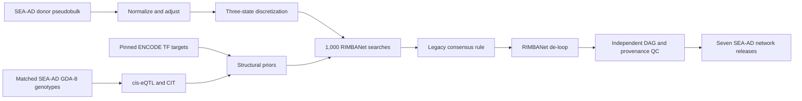

# SEA-AD Wang-Style RIMBANet Build Plan

## Execution status — September 4, 2026

**Step 3 — Build and validate the pinned Linux runtime is complete.** The
active work returns to **Steps 1–2 — freeze and audit production input
contracts** before Step 4 can begin.

- The Minerva work checkout started at commit
  b4486062ac77b3189e4f80a6b6a689c6b5952c0f.
- The scratch layout and pinned mw201608/BayesianNetwork checkout were created.
- Three runtime compatibility defects were diagnosed and corrected in the
  repository container recipes: Xerces-C++ 2.8 must build serially, and the
  RIMBANet C++ source must compile in gnu++98 mode. Container R commands must
  also ignore the bound checkout's `.Rprofile` so its host `renv` library does
  not mask packages installed in the image.
- Minerva LSF build job 268173456 completed successfully and produced the
  SIF SHA-256
  1df82906537e74c73fb331e7652c4057bac92182293d7d3739d0a015a4f25840.
- That checksum was independently recomputed on Minerva, matched, and was
  frozen in config/seaad_rimbanet_execution.yml. The first test from the work
  checkout activated its `renv` and reported edgeR, MatrixEQTL, and cit as
  missing; this tests the wrong R library and does not establish that the
  image packages are missing.
- The isolated image check then confirmed data.table 1.18.6.1, digest 0.6.39,
  edgeR 4.0.16, MatrixEQTL 2.4, yaml 2.3.12, and cit 2.3.2. The built-in image
  test passed, and `11_check_rimbanet_environment.py` reported
  `validated_complete` with zero failures at 2026-09-04T22:40:05Z.
- The original WGS-specific input contract has been superseded. The primary
  genotype source is now the locally available GDA-8 SNP-array VCF described
  below. ENCODE release/transformation/checksum selection and the repository
  genotype-import refactor remain incomplete.
- The formal VH11A audit at 2026-09-04T22:47:28Z used the superseded
  WGS-specific configuration and reported four failed checks: all 14 broad
  pseudobulk shards absent from scratch, a raw WGS PLINK trio absent, zero WGS
  crosswalk matches, and an unfrozen ENCODE TF-target input. Retain this as
  historical evidence; do not interpret its WGS failures as requirements of
  the revised plan.
- The validated 14-file broad pseudobulk bundle was synchronized through Git,
  staged in Minerva scratch, and independently matched all frozen SHA-256s.
  The rerun VH11A audit cleared the pseudobulk check. Its three remaining
  failures are stale WGS/crosswalk checks that must be replaced by generic
  genotype checks, plus the still-valid frozen ENCODE TF-target failure.
- The selected genotype source is the access-controlled shared archive
  `/sc/arion/projects/adineto/sea_ad/Data/SNP_Genomic_Variants/SEA_AD_SNPs_vcf.tar.gz`,
  identified by its Synapse metadata as `syn49430589`, assay `snpArray`,
  platform `Infinium Global Diversity Array-8`. The archive is 41,491,256
  bytes and contains `SEA_AD_SNPs_vcf/sea_ad.vcf` (798,973,180 bytes).
  The archive SHA-256 is
  `f9d60b00db44e6a4f7c96329b1b8bbc1998dc96b3f4b1c4d3d4d274812dc9459`;
  the 482-byte Synapse manifest SHA-256 is
  `c70b8452d0a913013584dd321b9bf97ce85f936108fa6dde4e450717e5b05c5a`;
  and the 10,169-byte GenomeStudio project SHA-256 is
  `dc4d3f4d29938cdd79008eceb6fd19cd6db0bdbed0862829dee89938789d68dd`.
- The official Illumina GDA-8 v1.0 D2 GRCh38 CSV package was downloaded by
  Minerva LSF job 268174443. The 200,759,541-byte ZIP has SHA-256
  `bba55d6b646491fc2794e6b56b524200d82db8e4ed0d5ca55b02a57c36073d7a`,
  contains only `GDA-8v1-0_D2.csv` (853,762,671 uncompressed bytes), and
  passed ZIP integrity validation.
- The matching official D1/GRCh37 CSV package is also frozen. Its
  200,164,599-byte ZIP has SHA-256
  `63286a4c03298188bf9502d66aef2ff8627ee06d4108c5504af09386ca663466`,
  contains only `GDA-8v1-0_D1.csv` (853,793,640 uncompressed bytes), and
  passed ZIP integrity validation. All 1,904,599 assay rows declare build 37,
  all marker `Name` values are populated and unique, and the D1/D2 manifests
  therefore provide the authoritative A/B and `RefStrand` bridge.
- Minerva LSF job 268176167 downloaded the GENCODE release 44 GRCh38 primary-
  assembly FASTA that matches the frozen v44 annotation. The 844,691,642-byte
  gzip passed integrity validation and the publisher MD5
  `9c3fc2ca260a767530dddb0f26721a6b`; its frozen SHA-256 is
  `e9a2d5a5cd225293646ae298998ad4ea8c11e8f22729bc2d6f5c3dcfefbf8ef8`.
- The reference was decompressed and indexed with samtools 1.21. The
  3,151,417,447-byte FASTA has SHA-256
  `e49b92b3e4f321bf254c042f25b726d9931c4d74c7523e8b6bb530e63b0cfd4b`;
  its 6,482-byte FAI has SHA-256
  `a2c323ea4cff34d7123ace4578f7e122b2d2f5a22f40dc23eb8b97d17723d169`.
  The index contains 194 sequences and matches the canonical chr1, chr22,
  chrX, chrY, and chrM lengths.
- Header audit found VCFv4.2, 95 samples, hard-called `GT`, chromosome names
  without `chr`, and unmapped `0:0:N:.` records. The associated
  `GDA-8v1-0_d1` manifest establishes GRCh37 source coordinates; the array
  must be mapped to GRCh38 and reference-normalized before PLINK2 import.
- A full D1-to-D2 identifier audit read all 1,904,599 source VCF rows and all
  1,904,599 D2 assay rows. Of 992,665 eligible, unique source marker IDs, all
  992,665 matched D2 `Name`, none matched `IlmnID`, and neither input had
  duplicate join identifiers. A total of 991,538 matches had a valid GRCh38
  target. The 1,127 invalid D2 targets are all unplaced (chromosome 0 and
  position 0). The 911,934 rejected source rows comprise 107 unplaced records,
  9,933 additional records lacking a reference allele, and 901,894 additional
  records lacking an alternate allele. These exclusions are deterministic;
  retain the 991,538 exact, unique, placed GRCh38 mapping candidates for the
  subsequent reference-allele and strand checks.
- The first three-way allele audit intentionally stopped before transformation.
  A genomic-plus interpretation of the source VCF aligned 527,231 markers but
  left 423,450 source-to-D1 allele mismatches and 38,798 source-to-D1
  coordinate mismatches; 32,684 aligned records also shared a normalized
  GRCh38 variant key. These are diagnostic counts, not an accepted marker set.
  Test the observed VCF against the D1 design-strand A/B convention and
  classify the coordinate differences before freezing the transformation.
- The follow-up convention diagnostic identified the VCF producer as PLINK
  1.90 and ruled out one global design- or plus-strand interpretation. Among
  990,375 biallelic SNVs, 331,782 matched both D1 design and plus allele sets,
  211,897 matched design only, 217,095 matched plus only, and 229,601 matched
  neither under that incomplete two-way test. All 38,798 coordinate failures
  were chromosome-code rather than position mismatches, consistent with PLINK
  numeric sex/mitochondrial chromosome codes requiring an explicit 23/X,
  24/Y, 25/XY, and 26/MT normalization audit. D1 and D2 retained identical
  `SNP` and `IlmnStrand` fields for all markers; `RefStrand` changed for 1,516.
  Resolve each non-palindromic SNV against the D1 A/B allele set or its reverse
  complement, then map the preserved A/B identity through D2 `RefStrand` and
  require the GRCh38 FASTA base. Conservatively exclude A/T and C/G SNPs,
  non-SNVs, unresolved alleles, invalid coordinates, and duplicate target
  variants rather than inferring ambiguous orientation.
- Corrected-allele audit job 268176695 exited before transformation because
  its generic CSV reader interpreted the Illumina manifest metadata preamble
  as the header and therefore observed zero D1 `Name` matches. All five frozen
  input checksums passed, and peak memory was only 483 MB. Manifest readers
  must seek the `[Assay]` section before constructing the CSV `DictReader`;
  apply the same rule to both D1 and D2 packages.
- Corrected-allele audit job 268176943 then classified all 992,665 eligible
  markers with no missing D1/D2 joins or residual D1 coordinate mismatch after
  PLINK chromosome normalization. It reference-aligned 878,270 provisional
  markers, comprising 433,685 direct-design and 444,585 reverse-complement
  mappings; 167,093 require genotype-index swapping and 711,177 do not. The
  conservative exclusions were 107,821 palindromic SNPs, 2,287 non-SNVs,
  1,127 invalid D2 locations, and 3,160 records addressed as `XY`, for which
  the FASTA intentionally has no `chrXY` contig. Removing 54,080 records at
  26,639 duplicate GRCh38 keys left an interim 824,190 unique markers. The D2
  scan count of 1,904,623 includes 24 post-assay/footer rows; production
  readers must stop at the next bracketed section after `[Assay]`.
- PLINK defines chromosome 25/`XY` as the X pseudoautosomal region and its
  `--merge-x` operation maps those records back to X without changing their
  positions. Before freezing the final count, repeat the reference audit with
  D2 `XY` targets mapped to `chrX`, require their positions to lie within the
  GRCh38 PAR boundaries (1–2,781,479 or 155,701,383–156,040,895), and apply
  the same FASTA and duplicate-key gates. Do not invent a `chrXY` contig.
- Final allele audit job 268176970 applied that rule and stopped the D2 parser
  at the next manifest section, yielding exactly 1,904,599 assay rows. Of
  3,160 otherwise eligible `XY` candidates, 2,501 fell within the declared
  GRCh38 PAR boundaries, mapped to chromosome X, and matched the reference;
  659 out-of-bound records were excluded. The final provisional aligned set is
  880,771 markers (434,913 direct-design and 445,858 reverse-complement;
  167,656 genotype-index swaps and 713,115 unchanged). Excluding every one of
  the 54,782 records at 26,978 duplicated GRCh38 variant keys leaves the frozen
  transformation set of 825,989 unique variants. The aggregate summary SHA-256
  is `a790274b1cfc151ebb45a37e6a95ce7d7dcbcf1c548eb1a71551ea2d83182e02`;
  no participant IDs or genotypes were written by the audit.
- A strict suffix-based identity audit established a one-to-one match for all
  78 primary expression donors: zero unmatched donors, zero ambiguous donors,
  zero duplicate sample assignments, and 17 VCF samples outside the primary
  cohort. All 95 VCF IDs have a numeric prefix followed by `_` and the SEA-AD
  donor ID. The resulting explicit crosswalk was written with mode 600 to the
  Git-ignored protected path
  `data/seaad_genotypes/syn49430589/sample_crosswalk.tsv`; its SHA-256 is
  `410e1ebd0ba6412d65d7c531db1654206fc3927401bdf7b219c6b665f0515956`.
  The corresponding protected keep and sex-update tables also have mode 600.
  Never rely on row order.
- The GDA-8 array is adopted as the primary genetics source. NG00174 WGS is
  not required for this build. The final methods and provenance must say
  **SNP-array-derived genetic priors**, never WGS-derived priors.
- The scientific/execution configs and VH11A input audit have been refactored
  to the frozen GDA-8 source, final remap summary, protected crosswalk, generic
  genotype terminology, and LSF project `acc_adineto`. The downstream
  genotype preparation wrapper still uses WGS-specific keys and must be
  replaced by the deterministic array importer before production genotype QC.
- Steps 4–12 have not started in production. No stochastic search array,
  including the Microglia pilot, has been submitted.

## Goal and end state

Build seven SEA-AD donor-level Bayesian networks—Astrocytes, Excitatory neurons, Inhibitory neurons, Microglia, OPCs, Oligodendrocytes, and Vasculature cells—using the full integrative Wang method selected for this project:



The terminal release for each cell type will contain:

- `result.links3.links.txt`: headerless `parent<TAB>child` final DAG, compatible with existing KDA readers.
- `edge_support.tsv.gz`: forward/reverse counts and proportions, adjacency support, selected direction, and de-loop status.
- `nodes.tsv`, `sample_manifest.tsv`, `gene_manifest.tsv`, `prior_summary.tsv`, `network_qc.tsv`, and `network_manifest.yml` with checksums, software/source commits, parameters, and cohort identity.
- Exactly 1,000 validated search outputs before consensus; no silent denominator reduction for missing jobs.
- Independent checks for acyclicity, no self-loops/duplicates/unknown genes, maximum in-degree ≤3, deterministic parsing, and complete provenance.

The compact, validated release will live persistently under
`/sc/arion/work/zhuane01/alzheimer/data/bayesian_network/SEAAD_A9_2024/<cell_type>/`.
All downloadable or reproducible bulk storage is rooted at
`/sc/arion/scratch/zhuane01/alzheimer/`: the external RIMBANet checkout,
Apptainer image, staged pseudobulk/genotype-array/ENCODE inputs, normalized matrices,
genotype/eQTL intermediates, RIMBANet inputs, 7,000 per-search graphs, consensus
intermediates, runtime scratch, and logs. These paths remain untracked except
for the explicitly approved 14-file, approximately 22-MB validated
`05_pseudobulk/direct_broad_counts/` transfer bundle. That Git copy exists only
to synchronize the seven count/sample pairs to Minerva; production still
stages and reads them from scratch.
Existing ROSMAP networks and current KDA outputs will not be overwritten.

### Minerva storage contract

- `/sc/arion/work/zhuane01/alzheimer` contains Git-tracked code, frozen
  configuration, documentation, compact manifests/checksums, and validated
  final network releases. The tracked direct-broad pseudobulk transfer bundle
  is the sole matrix exception. Do not stage container images, external source
  trees, protected genotype data, any other dense matrices, or search outputs
  there.
- `/sc/arion/scratch/zhuane01/alzheimer` contains material that can be
  downloaded again or regenerated deterministically. Scientific and execution
  configs carry absolute paths to this root, and every Apptainer invocation
  binds both the work and scratch roots.
- Scratch is disposable and may be purged. It must never contain the only copy
  of controlled source data or final releases. Source identities, checksums,
  parameters, and release artifacts remain in the work checkout so scratch can
  be rehydrated and the workflow resumed or rerun.
- Before submission, require both roots to be writable, verify available
  scratch capacity, and freeze the rebuilt image SHA-256. A missing/purged
  scratch artifact is a hard prerequisite or resume failure, never a reason to
  fall back to the work allocation.

The companion [scratch reproduction runbook](seaad-rimbanet-scratch-reproduction.md)
maps every scratch artifact class to its source and gives the recovery order
and verification commands.

## Step 1 — Freeze the method, inputs, and decision gates

- Maintain [docs/build_network/seaad-rimbanet-build.plan.md](docs/build_network/seaad-rimbanet-build.plan.md) as this plan and update [docs/build_network/seaad_bayesian_network_feasibility.md](docs/build_network/seaad_bayesian_network_feasibility.md) to remove the obsolete claim that the public RIMBANet construction code is unavailable.
- Add `config/seaad_rimbanet.yml` with schema version, seven-cell-type order, SEA-AD A9 input identities, cohort and profile thresholds, normalization/residualization formula, gene filters, random seeds, source commits, eQTL/CIT/TF-prior settings, 1,000-search requirement, and exact consensus thresholds.
- Add `config/seaad_rimbanet_execution.yml` with local-smoke and LSF production profiles, container/image digest, queue/resources, concurrency cap, retry policy, the absolute `/sc/arion/scratch/zhuane01/alzheimer` storage/log roots, and resume rules.
- Pin `mw201608/BayesianNetwork` commit `ebd5f4a6c31da22705622e71b6dc5f1eae195fdd`; do not vendor or redistribute its source/binary until its licensing is clarified.
- Declare hard gates: the checksum-frozen GDA-8 source, explicit 78-donor
  one-to-one crosswalk, validated GRCh37-to-GRCh38 marker mapping, and genotype
  QC must pass; expression-only fallback is not silently substituted;
  Microglia must pass the pilot gate before the remaining six networks run.

Repo changes: add the plan and two configs; change the feasibility document. No analysis output is produced yet.

## Step 2 — Audit SEA-AD expression, SNP-array, TF sources, and donor concordance

- Reuse the 78-donor authority in [results/validation_human/02_cohort/donor_cohort_primary.tsv](results/validation_human/02_cohort/donor_cohort_primary.tsv), the seven-type mapping in [results/validation_human/04_supertype_manifest/supertype_to_broad_network.tsv](results/validation_human/04_supertype_manifest/supertype_to_broad_network.tsv), and the frozen H5AD identity in [scripts/validation_human/seaad_deg_config.yml](scripts/validation_human/seaad_deg_config.yml).
- Use the shared `syn49430589` GDA-8 archive at
  `/sc/arion/projects/adineto/sea_ad/Data/SNP_Genomic_Variants/SEA_AD_SNPs_vcf.tar.gz`.
  Freeze its filename, byte count, SHA-256, Synapse identity, retrieval/source
  path, assay/platform metadata, access constraints, archive-member identity,
  and VCF header facts before copying or conversion. Stage generated working
  files only under
  `/sc/arion/scratch/zhuane01/alzheimer/data/seaad_genotypes/syn49430589/`;
  never add the archive, VCF, sample IDs, or derived genotypes to Git.
- Freeze the observed sample mapping rule: every selected VCF identifier must
  match exactly `^[0-9]+_(<donor_id>)$`, where `<donor_id>` is an exact
  `individualID` from the SEA-AD metadata and an exact primary-cohort
  `donor_id`. Require a one-to-one mapping, all 78 primary donors matched,
  zero ambiguity/duplication, and explicit exclusion of the 17 extra VCF
  samples. Materialize a protected crosswalk at
  `data/seaad_genotypes/syn49430589/sample_crosswalk.tsv` in the work checkout
  or another approved persistent controlled location; keep it untracked.
- Treat the source VCF as GRCh37 because the recorded GenomeStudio manifest is
  `GDA-8v1-0_d1`; do not infer the build from the VCF contig lengths. Freeze
  the matching Illumina GDA-8 v1.0 D2 GRCh38 manifest and checksum, join source
  markers to it by an exact unique marker identifier, and reject absent,
  duplicated, multiply mapped, chromosome-0/position-0, or missing-allele
  records. Normalize retained variants against the frozen GRCh38 reference,
  verify REF/ALT and strand orientation, and record every mapping/exclusion
  count before PLINK2 import. If the D1-to-D2 identity contract cannot be
  established, block rather than applying an undocumented coordinate change.
- The primary analysis uses measured hard-called array genotypes only; it does
  not silently perform reference-panel imputation. Mean-impute sporadic missing
  dosages only after the declared sample/variant QC. Any future panel
  imputation requires a separately approved, versioned analysis with a frozen
  panel, ancestry-aware quality thresholds, and data-governance review.
- Verify genotype sample identity and ancestry using documented sex checks,
  duplicate/relatedness checks, missingness, heterozygosity, ancestry PCs, and
  variant build/alleles. Report per-gene cis-marker coverage and sparse
  instrument coverage so array ascertainment is visible in the final release.
- Pin the ENCODE TF-target release and transformation rules. Store the bulk table under `/sc/arion/scratch/zhuane01/alzheimer/data/reference/rimbanet/`; keep only source metadata/checksums and permitted compact derived tables in Git.
- Require each cell-type sample set to be a subset of the 78 analysis donors with its nucleus threshold met. Record exclusions and final `N` separately for every network.

Repo changes: refactor `config/seaad_rimbanet.yml` and VH11 scripts from
WGS-specific keys/schema fields to generic genotype terms; add a deterministic
`scripts/validation_human/11_import_seaad_array.py` stage, source-build,
crosswalk, marker-remap, and exclusion tests; update
`scripts/validation_human/11_audit_rimbanet_inputs.py` and
`data/reference/rimbanet/sources.tsv`. Generated audit outputs go to
`$RIMBANET_OUTPUT_ROOT/11_seaad_rimbanet/11a_audit/`
(`donor_crosswalk.tsv`, `input_checks.tsv`, `artifacts.tsv`, `status.tsv`).
Raw and derived participant-level genotypes are never added to Git.

## Step 3 — Build and validate the pinned Linux runtime

- Add a Linux x86-64 container recipe for the pinned RIMBANet source, Xerces-C++ 2.8 compatibility, `g++`, Perl 5, bash, `bc`, GNU coreutils, R 4.3.3, PLINK2/bcftools, MatrixEQTL, and the validated CIT implementation.
- Keep the external checkout at `/sc/arion/scratch/zhuane01/alzheimer/external_tools/BayesianNetwork/` and the SIF at `/sc/arion/scratch/zhuane01/alzheimer/external_tools/containers/seaad-rimbanet.sif`; the build records its Git commit, binary SHA-256, and image SHA-256.
- Replace hard-coded `$HOME`, GNU `readlink -f`, and LSF-only assumptions through repository wrappers; do not patch the external source in place. Preserve a patch file only if source changes prove unavoidable.
- Add a synthetic 10–20-node smoke fixture that exercises input preparation, one search, parsing, consensus, and de-looping in the same runtime used on the cluster.

Minerva compatibility requirements established during the first production
build:

- Build the bundled Xerces-C++ 2.8 source with serial make. Its recursive
  makefiles are not parallel-safe; parallel header staging caused cascading
  AbstractDOMParser.cpp compilation errors.
- Compile the pinned RIMBANet source with -std=gnu++98. Modern compiler
  defaults expose std::round, which conflicts with the legacy global
  round(float) declaration.
- Run image R entry points with `Rscript --vanilla` and pass
  `R_PROFILE_USER=/dev/null` at the Apptainer boundary. Otherwise, running
  from the bound work checkout activates its `.Rprofile` and host `renv`
  library, masking the image's R packages.
- Keep the compatibility adjustments in the container recipes rather than
  patching the scratch source checkout in place.
- Legacy format and string-literal warnings are nonfatal. Any compiler error
  or nonzero make exit remains a hard failure.

Repo changes: add `containers/rimbanet/Dockerfile`, `containers/rimbanet/Apptainer.def`, `containers/rimbanet/README.md`, `requirements/seaad_rimbanet.txt`, `scripts/validation_human/11_check_rimbanet_environment.py`, and `scripts/validation_human/11_smoke_test_rimbanet_local.sh`; update `renv.lock` after MatrixEQTL/CIT are successfully resolved. Generated images and external source remain untracked.

## Step 4 — Prepare donor-level broad-cell expression

- Reuse the raw-UMI aggregation from [scripts/validation_human/05_stream_pseudobulk.py](scripts/validation_human/05_stream_pseudobulk.py): synchronize the explicitly tracked 14-file `results/validation_human/05_pseudobulk/direct_broad_counts/` bundle, then stage each reproducible `<cell_type>.counts.tsv.gz` and companion sample file under `/sc/arion/scratch/zhuane01/alzheimer/results/validation_human/05_pseudobulk/direct_broad_counts/`. Each matrix is genes × 78 donors with companion nuclei counts and covariates.
- Require VH05/VH06 validated-complete status and checksum every count/sample shard. Do not treat nuclei as independent network samples.
- For each cell type, retain donors meeting the prespecified primary nucleus threshold (initially the existing ≥20); report a ≥50-nucleus sensitivity set. Freeze sample order in `sample_manifest.tsv`.
- Filter genes using donor-level expression criteria declared in config (CPM threshold and minimum donor fraction), remove duplicated/unresolved symbols and genes with insufficient variability, and preserve a reason for every exclusion.
- TMM-normalize to log-CPM, then residualize declared nuisance variables (study, PMI, age, nuclei count, and configured technical terms) while retaining diagnosis, APOE, and sex biology. Produce an unresidualized sensitivity matrix to quantify dependence on this choice.
- Rank the robust gene universe by residual variance if a compute cap is required; the cap and any prespecified force-inclusion set must be fixed before network learning and cannot be selected from KDA outcomes.

Repo changes: add `scripts/validation_human/11_prepare_rimbanet_expression.R` and expression-contract tests. Generated per-cell-type `counts`, `normalized_expression`, `adjusted_expression`, `gene_manifest`, `sample_manifest`, and filter/QC files go to `$RIMBANET_OUTPUT_ROOT/11_seaad_rimbanet/11b_expression/`; the scratch copies are disposable, while permitted compact manifests/checks are retained with the release.

## Step 5 — Harmonize GDA-8 genotypes and run cell-type cis-eQTL mapping

- Import only the D2-mapped, GRCh38-reference-normalized, measured GDA-8
  variants; apply sample/variant QC, allele normalization, MAF/MAC thresholds,
  and genotype missingness rules from config. Exclude the 17 samples outside
  the frozen primary cohort before computing QC statistics or PCs.
- For each broad cell type, use only donors present in both its expression
  matrix and the explicit genotype crosswalk. Fit MatrixEQTL cis associations
  within the configured window (default ±1 Mb around the GENCODE v44 gene
  coordinates).
- Include ancestry PCs and prespecified technical/expression covariates; generate covariate-rank and sample-size checks to prevent singular models.
- Apply BH FDR <0.05 as stated in Wang’s paper. Preserve complete tested-pair
  counts, measured-array marker coverage, and significant instruments;
  explicitly report weak/sparse instrument coverage expected at N≈78 and do
  not imply sequence-level coverage.
- Gate progression if donor matching, genome build, allele orientation, or model rank fails. Sparse eQTL discovery is reported scientifically, not hidden by relaxing thresholds after results are seen.

Repo changes: add `scripts/validation_human/11_prepare_seaad_genotypes.sh` and `scripts/validation_human/11_run_celltype_eqtl.R`; add unit tests for donor order, variant normalization contracts, cis-window selection, and FDR output. Generated genotype/eQTL files go to `$RIMBANET_OUTPUT_ROOT/11_seaad_rimbanet/11c_genetics/` and remain in scratch except compact summaries, checks, and manifests retained with the release.

## Step 6 — Derive CIT directions and ENCODE structural priors

- For gene pairs linked to the same significant cis-eQTL instrument, run the validated CIT orientation workflow and retain direction, instrument, test components, probability/p-value, multiplicity adjustment, and exclusion reason.
- Map CIT and ENCODE identifiers through the frozen GENCODE/HGNC assets already used by this repository; reject ambiguous mappings and restrict priors to each cell type’s declared gene universe.
- Convert evidence to RIMBANet prior format only with a documented, frozen weight transform. Keep evidence sources separate in a long table before combining them; resolve conflicting directions deterministically and report conflicts.
- Generate the default expression-derived RIMBANet prior first, then apply CIT and ENCODE additions. This ordering is mandatory because the public `runBN.bsh` overwrites `prior.txt`.
- Generate `banned.txt` with self-loops prohibited and any genetically justified direction bans explicitly documented. Do not introduce pathway/PPI priors unless added through a later versioned config.

Repo changes: add `scripts/validation_human/11_build_rimbanet_priors.py` plus prior-format/conflict/weighting tests. Generated `cit_edges.tsv.gz`, `encode_edges.tsv.gz`, `combined_prior_evidence.tsv.gz`, `prior.txt`, `banned.txt`, and summaries go to `$RIMBANET_OUTPUT_ROOT/11_seaad_rimbanet/11d_priors/`; only permitted compact summaries/manifests are retained with the release.

## Step 7 — Discretize expression and assemble exact RIMBANet inputs

- For each gene, run one-dimensional k-means with k=3 using a fixed per-gene seed; order cluster centers so states are always low=0, middle=1, high=2. Reject genes that cannot form three nonempty states and update the final gene manifest before priors are remapped.
- Write `data.discretized.txt` with no header, one gene per row, the gene symbol first, then only integer 0/1/2 states in `sample_manifest.tsv` order; prohibit missing values and duplicate genes.
- Generate `node.xml` and the 10-line `bn.param.txt` explicitly rather than invoking the public caller’s preparation-and-submit side effects.
- Record number/order of genes and samples, checksums of data/prior/banned files, and dimensions of the banned matrix. Verify all prior genes exist in the final discretized universe.

Repo changes: add `scripts/validation_human/11_discretize_rimbanet_expression.R` and `scripts/validation_human/11_prepare_rimbanet_inputs.py`; add golden-format fixtures/tests. Generated inputs go to `$RIMBANET_OUTPUT_ROOT/11_seaad_rimbanet/11e_inputs/<cell_type>/` in scratch.

## Step 8 — Run and gate a Microglia production-scale pilot

- Start with Microglia because it is biologically central and has strong nucleus support in the current manifest.
- Run all 1,000 stochastic RIMBANet searches with job IDs 1–1000 and legacy seeds `1237 + job_id`; preserve Wang wrapper parameters (`qratio`, `alpha`, prior scaling, maximum three parents) in the frozen config rather than relying on shell defaults.
- Use an LSF array wrapper with scheduler-neutral task execution, bounded concurrency, per-task exit/status records, atomic output publication, retries only for technical failures, and no overwrite of a successful task with a different config hash.
- Require 1,000/1,000 nonempty, parseable outputs and final likelihood logs. Report runtime, memory, score distributions, edge-count distributions, and failed/retried tasks.
- Pilot gate: runtime/resources are feasible; prior coverage is reported; all searches pass; the final graph passes consensus/de-loop and independent QC; repeated fixture/pilot parsing is deterministic. Failure stops the six-network scale-out and triggers parameter/memory review, not threshold fishing.

Repo changes: add `scripts/validation_human/11_prepare_rimbanet_minerva.lsf`, `scripts/validation_human/11_run_rimbanet_task.sh`, `scripts/validation_human/11_submit_rimbanet_minerva.py`, `scripts/validation_human/11_submit_rimbanet_minerva.lsf`, and `scripts/validation_human/11_validate_rimbanet_runs.py`; add run-manifest and resume tests. Bulky outputs/logs go to `$RIMBANET_OUTPUT_ROOT/11_seaad_rimbanet/11f_runs/Microglia/` and `$RIMBANET_LOG_ROOT/` in scratch.

## Step 9 — Scale the validated search workflow to all seven cell types

- Freeze the pilot-approved runtime and scientific parameters; only per-cell-type gene/sample/prior files vary.
- Submit 1,000 searches for each remaining cell type, with per-network resource estimates and concurrency controls. Seven complete networks require 7,000 validated searches, not 9,000.
- Validate every network independently before consensus. Missing jobs are retried or block release; they never reduce the consensus denominator.
- Produce one run ledger with cell type, task ID, seed, config/input hashes, start/end, host, exit code, likelihood, edge count, retries, and output hash.

Repo changes: no new source files beyond Step 8; generated per-cell-type runs and compact ledgers populate the scratch-backed `11f_runs/`.

## Step 10 — Reproduce Wang’s consensus and de-loop logic exactly

- Preserve the legacy consensus rule, which is more specific than “directed edge in 30%”: for each pair calculate forward `r` and reverse `R`; retain the more frequent direction when `r≥0.15`, `r+R≥0.30`, and `r≥R` (with the mirrored rule for the opposite direction).
- Preserve and expose tie behavior, source commit, total denominator, and intermediate `result.links.3` / `result.linksMatrix.3`; unlike the public wrapper, do not delete these reproducibility intermediates.
- Run the pinned RIMBANet `testBN -c` de-loop/refinement step to produce `result.links3` and `result.links3.links.txt`.
- Export `edge_support.tsv.gz` so every final or removed edge can be traced to forward/reverse recurrence and de-loop outcome.

Repo changes: add `scripts/validation_human/11_build_rimbanet_consensus.sh` and consensus-rule golden tests, including direction ties and cycles. Generated consensus/intermediate files go to `$RIMBANET_OUTPUT_ROOT/11_seaad_rimbanet/11g_consensus/<cell_type>/` in scratch.

## Step 11 — Independently validate topology, stability, and biological limits

- Use NetworkX `DiGraph` strictly as an independent auditor: assert DAG, maximum in-degree ≤3, no self-loops, duplicate edges, reciprocal pairs, or nodes outside the gene manifest; summarize roots, leaves, components, degrees, density, and edge removals.
- Check that rerunning consensus on the same 1,000 outputs yields byte-identical edge/support files.
- Quantify search stability across disjoint subsets of runs and expression-processing sensitivity. Clearly distinguish the 1,000 stochastic searches from donor bootstraps—they measure search stability, not biological sampling uncertainty.
- For the Microglia pilot, add a prespecified donor-resampling sensitivity only if compute permits; report it separately and do not change the primary consensus rule.
- Label networks exploratory if genetic-prior coverage or stability is inadequate; completing computation alone is not sufficient for a causal claim.

Repo changes: add `scripts/validation_human/11_validate_publish_seaad_networks.py` and `tests/validation_human/test_seaad_rimbanet_network_contract.py`. Generated QC/status/artifact tables first go to the scratch-backed `11h_release_qc/`; the validated compact QC and provenance subset is copied into the persistent release.

## Step 12 — Publish the seven immutable network releases

- Atomically copy only validated release artifacts to `data/bayesian_network/SEAAD_A9_2024/<cell_type>/` and generate a root `release_manifest.tsv` containing every file’s SHA-256, byte count, cell type, donor N, node/edge count, release ID, and source/config commits.
- Update `.gitignore` so controlled data, external tools, container images, normalized matrices, priors containing restricted data, and per-search outputs remain ignored while the final permitted edge lists and compact provenance/QC files are tracked.
- Update [scripts/validation_human/README.md](scripts/validation_human/README.md) with exact audit, preparation, pilot, production, resume, consensus, validation, and release commands.
- Do not change [config/phase12_kda.yml](config/phase12_kda.yml), existing `data/bayesian_network/<ROSMAP_cell_type>/` files, or the current VH10 KDA workflow in this build. Connecting KDA to the SEA-AD release is a separate, checksum-frozen follow-up.

Repo changes: add seven network release directories and `data/bayesian_network/SEAAD_A9_2024/release_manifest.tsv`; change `.gitignore` and the validation README. No tracked files are removed.

## Local and Minerva command runbook

All commands below start at the repository root. The local command uses the
synthetic fixture and fake `testBN`; it does not attempt the 7,000 production
searches or require controlled SEA-AD data.

```bash
cd /path/to/alzheimer

git clone https://github.com/mw201608/BayesianNetwork.git \
  external_tools/BayesianNetwork
git -C external_tools/BayesianNetwork checkout \
  ebd5f4a6c31da22705622e71b6dc5f1eae195fdd
test "$(git -C external_tools/BayesianNetwork rev-parse HEAD)" = \
  "ebd5f4a6c31da22705622e71b6dc5f1eae195fdd"

python3 -m venv .venv
.venv/bin/pip install -r requirements/seaad_rimbanet.txt pytest
bash scripts/validation_human/11_smoke_test_rimbanet_local.sh
```

The smoke command performs Python, Bash, and R syntax checks, then runs the
contract, scheduler/resume, consensus, DAG, and synthetic end-to-end tests.
It is suitable for macOS development because it substitutes the fixture
runtime for the Linux x86-64 legacy binary.

### Build and freeze the Minerva runtime

Run these commands on an approved x86-64 Minerva build/compute node. Replace
`YOUR_MINERVA_ALLOCATION` below with the LSF project/allocation returned for
the study. The repository stays in the work allocation; the source checkout,
build context, and SIF stay in scratch.

Do not run the resource-intensive apptainer build process directly on a
Minerva login host. Submit it through LSF or enter an approved interactive
compute session first. Before submission, confirm that the recipe builds
Xerces serially and injects -std=gnu++98 into the copied RIMBANet Makefile.
These compatibility changes belong in the repository recipes; never modify the
scratch source checkout in place. A successful build is only a candidate
runtime until its checksum and full environment gate pass independently.

```bash
export PROJECT_ROOT=/sc/arion/work/zhuane01/alzheimer
export RIMBANET_STORAGE_ROOT=/sc/arion/scratch/zhuane01/alzheimer
export RIMBANET_OUTPUT_ROOT="$RIMBANET_STORAGE_ROOT/results/validation_human"
export RIMBANET_LOG_ROOT="$RIMBANET_OUTPUT_ROOT/11_seaad_rimbanet/logs"
export RIMBANET_SOURCE="$RIMBANET_STORAGE_ROOT/external_tools/BayesianNetwork"
export RIMBANET_IMAGE="$RIMBANET_STORAGE_ROOT/external_tools/containers/seaad-rimbanet.sif"
export APPTAINER_CACHEDIR="$RIMBANET_STORAGE_ROOT/cache/apptainer"
export APPTAINER_TMPDIR="$RIMBANET_STORAGE_ROOT/tmp/apptainer"

cd "$PROJECT_ROOT"
module load apptainer  # omit if `apptainer` is already on PATH
command -v apptainer
command -v bsub
test -w "$PROJECT_ROOT"
mkdir -p \
  "$RIMBANET_STORAGE_ROOT/external_tools/containers" \
  "$RIMBANET_STORAGE_ROOT/data/seaad_genotypes/syn49430589/source" \
  "$RIMBANET_STORAGE_ROOT/data/seaad_genotypes/syn49430589/derived" \
  "$RIMBANET_STORAGE_ROOT/data/reference/rimbanet" \
  "$RIMBANET_STORAGE_ROOT/results/validation_human/05_pseudobulk/direct_broad_counts" \
  "$APPTAINER_CACHEDIR" \
  "$APPTAINER_TMPDIR" \
  "$RIMBANET_LOG_ROOT/preparation"
test -w "$RIMBANET_STORAGE_ROOT"
df -h "$PROJECT_ROOT" "$RIMBANET_STORAGE_ROOT"

if [[ ! -d "$RIMBANET_SOURCE/.git" ]]; then
  git clone https://github.com/mw201608/BayesianNetwork.git "$RIMBANET_SOURCE"
fi
git -C "$RIMBANET_SOURCE" checkout \
  ebd5f4a6c31da22705622e71b6dc5f1eae195fdd
test "$(git -C "$RIMBANET_SOURCE" rev-parse HEAD)" = \
  "ebd5f4a6c31da22705622e71b6dc5f1eae195fdd"

grep -n 'make' "$PROJECT_ROOT/containers/rimbanet/Apptainer.def"
grep -n 'std=gnu++98' \
  "$PROJECT_ROOT/containers/rimbanet/Apptainer.def"

# Apptainer resolves %files sources from the current working directory.
cd "$RIMBANET_STORAGE_ROOT"
apptainer build --fakeroot "$RIMBANET_IMAGE" \
  "$PROJECT_ROOT/containers/rimbanet/Apptainer.def"
apptainer exec "$RIMBANET_IMAGE" Rscript --vanilla -e \
  'packages <- c("data.table","digest","edgeR","MatrixEQTL","yaml","cit"); stopifnot(all(vapply(packages, requireNamespace, logical(1), quietly=TRUE))); cat("OK: isolated R packages present\n")'
# Prevent a project .Rprofile from changing the library seen by an older
# image whose embedded test did not yet include Rscript --vanilla.
APPTAINERENV_R_PROFILE_USER=/dev/null \
  apptainer test "$RIMBANET_IMAGE"
IMAGE_SHA256="$(sha256sum "$RIMBANET_IMAGE" | awk '{print $1}')"
printf '%s\n' "$IMAGE_SHA256"

cd "$PROJECT_ROOT"
.venv/bin/python - "$IMAGE_SHA256" <<'PY'
from pathlib import Path
import sys

path = Path("config/seaad_rimbanet_execution.yml")
text = path.read_text()
old = "image_sha256: TO_BE_FROZEN"
if old not in text:
    raise SystemExit("image_sha256 is already frozen; verify it manually")
path.write_text(text.replace(old, f"image_sha256: {sys.argv[1]}", 1))
PY
```

If `apptainer build --fakeroot` is disabled, use an approved private x86-64
OCI builder and convert that private image to the configured scratch SIF path
on Minerva. Do not publish the image while the upstream RIMBANet license
remains unresolved. After a scratch purge, repeat this section and verify the
new SHA-256 before resuming any job.

### Audit and prepare production inputs on Minerva

Stage the reproducible H5AD-derived VH05 broad count/sample shards, import the
checksum-verified shared `syn49430589` GDA-8 archive through the frozen
GRCh37-to-GRCh38 marker map, and stage the frozen ENCODE TF-target table at the
absolute scratch paths in `config/seaad_rimbanet.yml`. Keep the small VH05/VH06
status and cohort manifests plus the protected donor/genotype crosswalk in an
approved persistent location. The command block below must not be run until
the planned generic genotype config/schema and deterministic array-import
stage are implemented and tested; the current checkout still enforces the
superseded NG00174 WGS contract. Then run:

```bash
export PROJECT_ROOT=/sc/arion/work/zhuane01/alzheimer
export RIMBANET_STORAGE_ROOT=/sc/arion/scratch/zhuane01/alzheimer
export RIMBANET_OUTPUT_ROOT="$RIMBANET_STORAGE_ROOT/results/validation_human"
export RIMBANET_LOG_ROOT="$RIMBANET_OUTPUT_ROOT/11_seaad_rimbanet/logs"
export SEAAD_RIMBANET_CONFIG=config/seaad_rimbanet.yml
export SEAAD_RIMBANET_EXECUTION=config/seaad_rimbanet_execution.yml
export RIMBANET_IMAGE="$RIMBANET_STORAGE_ROOT/external_tools/containers/seaad-rimbanet.sif"
export LSF_PROJECT=YOUR_MINERVA_ALLOCATION
cd "$PROJECT_ROOT"
RIMBANET_EXEC=(
  apptainer exec
  --bind "$PROJECT_ROOT:$PROJECT_ROOT"
  --bind "$RIMBANET_STORAGE_ROOT:$RIMBANET_STORAGE_ROOT"
  --env R_PROFILE_USER=/dev/null
  --pwd "$PROJECT_ROOT"
  "$RIMBANET_IMAGE"
)

# If the validated VH05 shards currently exist in the work checkout, stage
# them once in scratch and verify them through the VH11 audit below.
PSEUDOBULK_SOURCE="$PROJECT_ROOT/results/validation_human/05_pseudobulk/direct_broad_counts"
PSEUDOBULK_SCRATCH="$RIMBANET_STORAGE_ROOT/results/validation_human/05_pseudobulk/direct_broad_counts"
mkdir -p "$PSEUDOBULK_SCRATCH"
rsync -a --checksum "$PSEUDOBULK_SOURCE/" "$PSEUDOBULK_SCRATCH/"

.venv/bin/python scripts/validation_human/11_audit_rimbanet_inputs.py \
  --config "$SEAAD_RIMBANET_CONFIG"
"${RIMBANET_EXEC[@]}" \
  python scripts/validation_human/11_check_rimbanet_environment.py \
  --config "$SEAAD_RIMBANET_CONFIG" \
  --execution-config "$SEAAD_RIMBANET_EXECUTION"

mkdir -p "$RIMBANET_LOG_ROOT/preparation"
LSF_ENV="all,PROJECT_ROOT=$PROJECT_ROOT,CONFIG=$PROJECT_ROOT/$SEAAD_RIMBANET_CONFIG,RIMBANET_IMAGE=$RIMBANET_IMAGE,RIMBANET_STORAGE_ROOT=$RIMBANET_STORAGE_ROOT"

GENOTYPE_SUBMISSION="$(
  bsub -P "$LSF_PROJECT" -q premium -n 4 \
    -R "span[hosts=1]" -R "rusage[mem=64000]" -M 64000 -W 24:00 \
    -J seaad_genotypes \
    -o "$RIMBANET_LOG_ROOT/preparation/%J.out" \
    -e "$RIMBANET_LOG_ROOT/preparation/%J.err" \
    -env "$LSF_ENV,STAGE=genotypes" \
    < scripts/validation_human/11_prepare_rimbanet_minerva.lsf
)"
printf '%s\n' "$GENOTYPE_SUBMISSION"
GENOTYPE_JOB_ID="$(
  printf '%s\n' "$GENOTYPE_SUBMISSION" | awk -F '[<>]' '/Job </ {print $2}'
)"
test -n "$GENOTYPE_JOB_ID"

PREP_SUBMISSION="$(
  bsub -P "$LSF_PROJECT" -q premium -n 4 \
    -R "span[hosts=1]" -R "rusage[mem=64000]" -M 64000 -W 24:00 \
    -w "done($GENOTYPE_JOB_ID)" -J "seaad_prepare[1-7]%7" \
    -o "$RIMBANET_LOG_ROOT/preparation/%J.%I.out" \
    -e "$RIMBANET_LOG_ROOT/preparation/%J.%I.err" \
    -env "$LSF_ENV,STAGE=network" \
    < scripts/validation_human/11_prepare_rimbanet_minerva.lsf
)"
printf '%s\n' "$PREP_SUBMISSION"
PREP_JOB_ID="$(
  printf '%s\n' "$PREP_SUBMISSION" | awk -F '[<>]' '/Job </ {print $2}'
)"
test -n "$PREP_JOB_ID"
bjobs "$GENOTYPE_JOB_ID" "$PREP_JOB_ID"
```

Both initial checks must report `validated_complete`. A blocked audit means
that production submission must not proceed. The genotype job runs first; the
seven-network preparation array starts only if it exits successfully. Do not
submit searches until all preparation array tasks are `DONE`. After scratch
staging and checksum validation succeed, do not retain a second bulky
pseudobulk copy in the work allocation.

### Submit and gate the 1,000-search Microglia pilot

The Python submit wrapper reads queue, memory, wall time, array range, and
concurrency from `config/seaad_rimbanet_execution.yml`, creates LSF log
directories before submission, and passes absolute paths to the array job.

```bash
# Inspect the exact bsub command first.
.venv/bin/python scripts/validation_human/11_submit_rimbanet_minerva.py \
  --config "$SEAAD_RIMBANET_CONFIG" \
  --execution-config "$SEAAD_RIMBANET_EXECUTION" \
  --network Microglia --lsf-project "$LSF_PROJECT" --dry-run

# Submit tasks 1-1000 with the configured concurrency limit.
.venv/bin/python scripts/validation_human/11_submit_rimbanet_minerva.py \
  --config "$SEAAD_RIMBANET_CONFIG" \
  --execution-config "$SEAAD_RIMBANET_EXECUTION" \
  --network Microglia --lsf-project "$LSF_PROJECT"

bjobs -J seaad_Microglia
```

After the array has finished, validate all tasks, build consensus, and publish
the pilot:

```bash
.venv/bin/python scripts/validation_human/11_validate_rimbanet_runs.py \
  --config "$SEAAD_RIMBANET_CONFIG" --network Microglia

"${RIMBANET_EXEC[@]}" \
  bash scripts/validation_human/11_build_rimbanet_consensus.sh \
  --config "$SEAAD_RIMBANET_CONFIG" --network Microglia \
  --binary /usr/local/bin/testBN

"${RIMBANET_EXEC[@]}" \
  python scripts/validation_human/11_validate_publish_seaad_networks.py \
  --config "$SEAAD_RIMBANET_CONFIG" --network Microglia \
  --binary /usr/local/bin/testBN

cat "$RIMBANET_OUTPUT_ROOT/11_seaad_rimbanet/11f_runs/pilot_gate.tsv"
cat "$RIMBANET_OUTPUT_ROOT/11_seaad_rimbanet/11f_runs/Microglia/runtime_report.tsv"
```

The final pilot gate must say `passed`. Re-running the same submission command
is the resume/retry operation: tasks with matching validated outputs exit
without being overwritten, while incomplete technical failures rerun.

### Scale out after the pilot passes

The submit wrapper refuses these six networks until the final Microglia
consensus/release QC gate has passed.

```bash
for network in \
  Astrocytes Excitatory_neurons Inhibitory_neurons \
  OPCs Oligodendrocytes Vasculature_cells
do
  .venv/bin/python scripts/validation_human/11_submit_rimbanet_minerva.py \
    --config "$SEAAD_RIMBANET_CONFIG" \
    --execution-config "$SEAAD_RIMBANET_EXECUTION" \
    --network "$network" --lsf-project "$LSF_PROJECT"
done
```

After each array is finished:

```bash
for network in \
  Astrocytes Excitatory_neurons Inhibitory_neurons \
  OPCs Oligodendrocytes Vasculature_cells
do
  .venv/bin/python scripts/validation_human/11_validate_rimbanet_runs.py \
    --config "$SEAAD_RIMBANET_CONFIG" --network "$network"
  "${RIMBANET_EXEC[@]}" \
    bash scripts/validation_human/11_build_rimbanet_consensus.sh \
    --config "$SEAAD_RIMBANET_CONFIG" --network "$network" \
    --binary /usr/local/bin/testBN
  "${RIMBANET_EXEC[@]}" \
    python scripts/validation_human/11_validate_publish_seaad_networks.py \
    --config "$SEAAD_RIMBANET_CONFIG" --network "$network" \
    --binary /usr/local/bin/testBN
done
```

### Scratch purge and rehydration

Treat `/sc/arion/scratch/zhuane01/alzheimer` as a cache, not an archive. Keep
the frozen configs, source/input checksums, compact release manifests, and
final releases under the Git checkout in `/sc/arion/work/zhuane01/alzheimer`.
Use the [scratch reproduction runbook](seaad-rimbanet-scratch-reproduction.md)
for the complete path-by-path procedure and current recovery blockers. In
summary, if scratch is purged:

1. Recreate the scratch directory layout from the build section.
2. Reclone the pinned RIMBANet commit, re-import the checksum-verified shared
   GDA-8 archive and frozen GRCh38 marker map, restage ENCODE, and rebuild the
   SIF.
3. Freeze and verify the rebuilt image checksum. Do not reuse old task status
   records with a different image or input hash.
4. Rerun the audit/preparation stages, then use the normal submission command;
   only intact task outputs whose provenance hashes match may resume.

Successful publication copies the compact validated network bundle to the
work checkout before scratch cleanup or expiry. Large matrices, raw/staged
inputs, the SIF, source checkout, logs, and search outputs are intentionally
recreated rather than copied back into the work allocation.

## Planned repository file impact

Added source/config/documentation:

- `docs/build_network/seaad-rimbanet-build.plan.md`
- `docs/build_network/seaad-rimbanet-scratch-reproduction.md`
- `config/seaad_rimbanet.yml`, `config/seaad_rimbanet_execution.yml`
- `data/reference/rimbanet/sources.tsv`
- `containers/rimbanet/Dockerfile`, `containers/rimbanet/Apptainer.def`, `containers/rimbanet/README.md`
- `requirements/seaad_rimbanet.txt`
- `scripts/validation_human/11_audit_rimbanet_inputs.py`
- `scripts/validation_human/11_check_rimbanet_environment.py`
- `scripts/validation_human/11_prepare_rimbanet_expression.R`
- `scripts/validation_human/11_import_seaad_array.py`
- `scripts/validation_human/11_prepare_seaad_genotypes.sh`
- `scripts/validation_human/11_run_celltype_eqtl.R`
- `scripts/validation_human/11_build_rimbanet_priors.py`
- `scripts/validation_human/11_discretize_rimbanet_expression.R`
- `scripts/validation_human/11_prepare_rimbanet_inputs.py`
- `scripts/validation_human/11_prepare_rimbanet_minerva.lsf`
- `scripts/validation_human/11_run_rimbanet_task.sh`
- `scripts/validation_human/11_smoke_test_rimbanet_local.sh`
- `scripts/validation_human/11_submit_rimbanet_minerva.py`
- `scripts/validation_human/11_submit_rimbanet_minerva.lsf`
- `scripts/validation_human/11_validate_rimbanet_runs.py`
- `scripts/validation_human/11_build_rimbanet_consensus.sh`
- `scripts/validation_human/11_validate_publish_seaad_networks.py`
- Focused fixtures/tests under `tests/validation_human/`
- Validated final release files under `data/bayesian_network/SEAAD_A9_2024/`

Changed:

- `docs/build_network/seaad_bayesian_network_feasibility.md`
- `scripts/validation_human/README.md`
- `.gitignore`
- `renv.lock` only after dependency resolution succeeds

Removed:

- No tracked files. Existing ROSMAP networks, SEA-AD DEG/KDA scripts, and results remain intact.

## Acceptance criteria

- Full integrative inputs are provenance-frozen: donor-level expression,
  matched `syn49430589` GDA-8 genotypes, validated GRCh38 marker mapping,
  significant cis-eQTL/CIT evidence, and pinned ENCODE TF-targets.
- Microglia passes the production-scale gate before scale-out.
- Each of seven cell types has exactly 1,000 validated searches and an explicit denominator of 1,000.
- Consensus uses the verified forward/reverse adjacency rule, followed by pinned legacy de-looping.
- Every final network is a valid DAG, has maximum in-degree ≤3, and is fully traceable to samples, genes, priors, run outputs, software commits, and config hashes.
- Controlled and bulky artifacts remain untracked except for the explicitly approved 14-file direct-broad pseudobulk transfer bundle; release artifacts and compact provenance are reviewable in Git.
- Documentation states that directions are prior-constrained probabilistic hypotheses, not signed activation/repression or experimentally proven causality.
