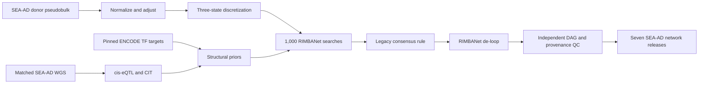

# SEA-AD Wang-Style RIMBANet Build Plan

## Goal and end state

Build seven SEA-AD donor-level Bayesian networks—Astrocytes, Excitatory neurons, Inhibitory neurons, Microglia, OPCs, Oligodendrocytes, and Vasculature cells—using the full integrative Wang method selected for this project:



The terminal release for each cell type will contain:

- `result.links3.links.txt`: headerless `parent<TAB>child` final DAG, compatible with existing KDA readers.
- `edge_support.tsv.gz`: forward/reverse counts and proportions, adjacency support, selected direction, and de-loop status.
- `nodes.tsv`, `sample_manifest.tsv`, `gene_manifest.tsv`, `prior_summary.tsv`, `network_qc.tsv`, and `network_manifest.yml` with checksums, software/source commits, parameters, and cohort identity.
- Exactly 1,000 validated search outputs before consensus; no silent denominator reduction for missing jobs.
- Independent checks for acyclicity, no self-loops/duplicates/unknown genes, maximum in-degree ≤3, deterministic parsing, and complete provenance.

The compact, validated release will live persistently under
`/sc/arion/work/zhuane01/alzheimer/data/bayesian_network/SEAAD_A9_2024/<cell_type>/`.
All downloadable or reproducible bulk storage is rooted at
`/sc/arion/scratch/zhuane01/alzheimer/`: the external RIMBANet checkout,
Apptainer image, staged pseudobulk/WGS/ENCODE inputs, normalized matrices,
genotype/eQTL intermediates, RIMBANet inputs, 7,000 per-search graphs, consensus
intermediates, runtime scratch, and logs. These paths remain untracked.
Existing ROSMAP networks and current KDA outputs will not be overwritten.

### Minerva storage contract

- `/sc/arion/work/zhuane01/alzheimer` contains Git-tracked code, frozen
  configuration, documentation, compact manifests/checksums, and validated
  final network releases only. Do not stage container images, external source
  trees, WGS, dense matrices, or search outputs there.
- `/sc/arion/scratch/zhuane01/alzheimer` contains material that can be
  downloaded again or regenerated deterministically. Scientific and execution
  configs carry absolute paths to this root, and every Apptainer invocation
  binds both the work and scratch roots.
- Scratch is disposable and may be purged. It must never contain the only copy
  of controlled source data or final releases. Source identities, checksums,
  parameters, and release artifacts remain in the work checkout so scratch can
  be rehydrated and the workflow resumed or rerun.
- Before submission, require both roots to be writable, verify available
  scratch capacity, and freeze the rebuilt image SHA-256. A missing/purged
  scratch artifact is a hard prerequisite or resume failure, never a reason to
  fall back to the work allocation.

The companion [scratch reproduction runbook](seaad-rimbanet-scratch-reproduction.md)
maps every scratch artifact class to its source and gives the recovery order
and verification commands.

## Step 1 — Freeze the method, inputs, and decision gates

- Maintain [docs/build_network/seaad-rimbanet-build.plan.md](docs/build_network/seaad-rimbanet-build.plan.md) as this plan and update [docs/build_network/seaad_bayesian_network_feasibility.md](docs/build_network/seaad_bayesian_network_feasibility.md) to remove the obsolete claim that the public RIMBANet construction code is unavailable.
- Add `config/seaad_rimbanet.yml` with schema version, seven-cell-type order, SEA-AD A9 input identities, cohort and profile thresholds, normalization/residualization formula, gene filters, random seeds, source commits, eQTL/CIT/TF-prior settings, 1,000-search requirement, and exact consensus thresholds.
- Add `config/seaad_rimbanet_execution.yml` with local-smoke and LSF production profiles, container/image digest, queue/resources, concurrency cap, retry policy, the absolute `/sc/arion/scratch/zhuane01/alzheimer` storage/log roots, and resume rules.
- Pin `mw201608/BayesianNetwork` commit `ebd5f4a6c31da22705622e71b6dc5f1eae195fdd`; do not vendor or redistribute its source/binary until its licensing is clarified.
- Declare hard gates: controlled WGS must be available for the full method; expression-only fallback is not silently substituted; Microglia must pass the pilot gate before the remaining six networks run.

Repo changes: add the plan and two configs; change the feasibility document. No analysis output is produced yet.

## Step 2 — Audit SEA-AD expression, WGS, TF sources, and donor concordance

- Reuse the 78-donor authority in [results/validation_human/02_cohort/donor_cohort_primary.tsv](results/validation_human/02_cohort/donor_cohort_primary.tsv), the seven-type mapping in [results/validation_human/04_supertype_manifest/supertype_to_broad_network.tsv](results/validation_human/04_supertype_manifest/supertype_to_broad_network.tsv), and the frozen H5AD identity in [scripts/validation_human/seaad_deg_config.yml](scripts/validation_human/seaad_deg_config.yml).
- Obtain controlled SEA-AD WGS from NIAGADS NG00174 outside Git and stage the downloadable copy under `/sc/arion/scratch/zhuane01/alzheimer/data/seaad_wgs/`; record source release, file checksums, genome build, sample IDs, consent/use constraints, and the 84-WGS-versus-83-expression donor reconciliation in the persistent checkout.
- Verify genotype sample identity and ancestry using documented sex checks, duplicate/relatedness checks, missingness, heterozygosity, ancestry PCs, and variant build/alleles. Preserve the compact, controlled donor crosswalk at `data/seaad_wgs/NG00174/sample_crosswalk.tsv` in the work checkout (untracked); it is not a disposable bulk artifact. Never infer donor matches from row order.
- Pin the ENCODE TF-target release and transformation rules. Store the bulk table under `/sc/arion/scratch/zhuane01/alzheimer/data/reference/rimbanet/`; keep only source metadata/checksums and permitted compact derived tables in Git.
- Require each cell-type sample set to be a subset of the 78 analysis donors with its nucleus threshold met. Record exclusions and final `N` separately for every network.

Repo changes: add `scripts/validation_human/11_audit_rimbanet_inputs.py`, `data/reference/rimbanet/sources.tsv`, and audit contract tests. Generated audit outputs go to `$RIMBANET_OUTPUT_ROOT/11_seaad_rimbanet/11a_audit/` (`donor_crosswalk.tsv`, `input_checks.tsv`, `artifacts.tsv`, `status.tsv`). Raw WGS is never added to Git or the work checkout.

## Step 3 — Build and validate the pinned Linux runtime

- Add a Linux x86-64 container recipe for the pinned RIMBANet source, Xerces-C++ 2.8 compatibility, `g++`, Perl 5, bash, `bc`, GNU coreutils, R 4.3.3, PLINK2/bcftools, MatrixEQTL, and the validated CIT implementation.
- Keep the external checkout at `/sc/arion/scratch/zhuane01/alzheimer/external_tools/BayesianNetwork/` and the SIF at `/sc/arion/scratch/zhuane01/alzheimer/external_tools/containers/seaad-rimbanet.sif`; the build records its Git commit, binary SHA-256, and image SHA-256.
- Replace hard-coded `$HOME`, GNU `readlink -f`, and LSF-only assumptions through repository wrappers; do not patch the external source in place. Preserve a patch file only if source changes prove unavoidable.
- Add a synthetic 10–20-node smoke fixture that exercises input preparation, one search, parsing, consensus, and de-looping in the same runtime used on the cluster.

Repo changes: add `containers/rimbanet/Dockerfile`, `containers/rimbanet/Apptainer.def`, `containers/rimbanet/README.md`, `requirements/seaad_rimbanet.txt`, `scripts/validation_human/11_check_rimbanet_environment.py`, and `scripts/validation_human/11_smoke_test_rimbanet_local.sh`; update `renv.lock` after MatrixEQTL/CIT are successfully resolved. Generated images and external source remain untracked.

## Step 4 — Prepare donor-level broad-cell expression

- Reuse the raw-UMI aggregation from [scripts/validation_human/05_stream_pseudobulk.py](scripts/validation_human/05_stream_pseudobulk.py): stage each reproducible `direct_broad_counts/<cell_type>.counts.tsv.gz` and companion sample file under `/sc/arion/scratch/zhuane01/alzheimer/results/validation_human/05_pseudobulk/direct_broad_counts/`. Each matrix is genes × 78 donors with companion nuclei counts and covariates.
- Require VH05/VH06 validated-complete status and checksum every count/sample shard. Do not treat nuclei as independent network samples.
- For each cell type, retain donors meeting the prespecified primary nucleus threshold (initially the existing ≥20); report a ≥50-nucleus sensitivity set. Freeze sample order in `sample_manifest.tsv`.
- Filter genes using donor-level expression criteria declared in config (CPM threshold and minimum donor fraction), remove duplicated/unresolved symbols and genes with insufficient variability, and preserve a reason for every exclusion.
- TMM-normalize to log-CPM, then residualize declared nuisance variables (study, PMI, age, nuclei count, and configured technical terms) while retaining diagnosis, APOE, and sex biology. Produce an unresidualized sensitivity matrix to quantify dependence on this choice.
- Rank the robust gene universe by residual variance if a compute cap is required; the cap and any prespecified force-inclusion set must be fixed before network learning and cannot be selected from KDA outcomes.

Repo changes: add `scripts/validation_human/11_prepare_rimbanet_expression.R` and expression-contract tests. Generated per-cell-type `counts`, `normalized_expression`, `adjusted_expression`, `gene_manifest`, `sample_manifest`, and filter/QC files go to `$RIMBANET_OUTPUT_ROOT/11_seaad_rimbanet/11b_expression/`; the scratch copies are disposable, while permitted compact manifests/checks are retained with the release.

## Step 5 — Harmonize WGS and run cell-type cis-eQTL mapping

- Normalize variants against the declared GRCh38 reference; apply sample/variant QC, allele normalization, MAF/MAC thresholds, and genotype missingness rules from config.
- For each broad cell type, use only donors present in both its expression matrix and the WGS crosswalk. Fit MatrixEQTL cis associations within the configured window (default ±1 Mb around the GENCODE v44 gene coordinates).
- Include ancestry PCs and prespecified technical/expression covariates; generate covariate-rank and sample-size checks to prevent singular models.
- Apply BH FDR <0.05 as stated in Wang’s paper. Preserve complete tested-pair counts and significant instruments; explicitly report weak/sparse instrument coverage expected at N≈78.
- Gate progression if donor matching, genome build, allele orientation, or model rank fails. Sparse eQTL discovery is reported scientifically, not hidden by relaxing thresholds after results are seen.

Repo changes: add `scripts/validation_human/11_prepare_seaad_genotypes.sh` and `scripts/validation_human/11_run_celltype_eqtl.R`; add unit tests for donor order, variant normalization contracts, cis-window selection, and FDR output. Generated genotype/eQTL files go to `$RIMBANET_OUTPUT_ROOT/11_seaad_rimbanet/11c_genetics/` and remain in scratch except compact summaries, checks, and manifests retained with the release.

## Step 6 — Derive CIT directions and ENCODE structural priors

- For gene pairs linked to the same significant cis-eQTL instrument, run the validated CIT orientation workflow and retain direction, instrument, test components, probability/p-value, multiplicity adjustment, and exclusion reason.
- Map CIT and ENCODE identifiers through the frozen GENCODE/HGNC assets already used by this repository; reject ambiguous mappings and restrict priors to each cell type’s declared gene universe.
- Convert evidence to RIMBANet prior format only with a documented, frozen weight transform. Keep evidence sources separate in a long table before combining them; resolve conflicting directions deterministically and report conflicts.
- Generate the default expression-derived RIMBANet prior first, then apply CIT and ENCODE additions. This ordering is mandatory because the public `runBN.bsh` overwrites `prior.txt`.
- Generate `banned.txt` with self-loops prohibited and any genetically justified direction bans explicitly documented. Do not introduce pathway/PPI priors unless added through a later versioned config.

Repo changes: add `scripts/validation_human/11_build_rimbanet_priors.py` plus prior-format/conflict/weighting tests. Generated `cit_edges.tsv.gz`, `encode_edges.tsv.gz`, `combined_prior_evidence.tsv.gz`, `prior.txt`, `banned.txt`, and summaries go to `$RIMBANET_OUTPUT_ROOT/11_seaad_rimbanet/11d_priors/`; only permitted compact summaries/manifests are retained with the release.

## Step 7 — Discretize expression and assemble exact RIMBANet inputs

- For each gene, run one-dimensional k-means with k=3 using a fixed per-gene seed; order cluster centers so states are always low=0, middle=1, high=2. Reject genes that cannot form three nonempty states and update the final gene manifest before priors are remapped.
- Write `data.discretized.txt` with no header, one gene per row, the gene symbol first, then only integer 0/1/2 states in `sample_manifest.tsv` order; prohibit missing values and duplicate genes.
- Generate `node.xml` and the 10-line `bn.param.txt` explicitly rather than invoking the public caller’s preparation-and-submit side effects.
- Record number/order of genes and samples, checksums of data/prior/banned files, and dimensions of the banned matrix. Verify all prior genes exist in the final discretized universe.

Repo changes: add `scripts/validation_human/11_discretize_rimbanet_expression.R` and `scripts/validation_human/11_prepare_rimbanet_inputs.py`; add golden-format fixtures/tests. Generated inputs go to `$RIMBANET_OUTPUT_ROOT/11_seaad_rimbanet/11e_inputs/<cell_type>/` in scratch.

## Step 8 — Run and gate a Microglia production-scale pilot

- Start with Microglia because it is biologically central and has strong nucleus support in the current manifest.
- Run all 1,000 stochastic RIMBANet searches with job IDs 1–1000 and legacy seeds `1237 + job_id`; preserve Wang wrapper parameters (`qratio`, `alpha`, prior scaling, maximum three parents) in the frozen config rather than relying on shell defaults.
- Use an LSF array wrapper with scheduler-neutral task execution, bounded concurrency, per-task exit/status records, atomic output publication, retries only for technical failures, and no overwrite of a successful task with a different config hash.
- Require 1,000/1,000 nonempty, parseable outputs and final likelihood logs. Report runtime, memory, score distributions, edge-count distributions, and failed/retried tasks.
- Pilot gate: runtime/resources are feasible; prior coverage is reported; all searches pass; the final graph passes consensus/de-loop and independent QC; repeated fixture/pilot parsing is deterministic. Failure stops the six-network scale-out and triggers parameter/memory review, not threshold fishing.

Repo changes: add `scripts/validation_human/11_prepare_rimbanet_minerva.lsf`, `scripts/validation_human/11_run_rimbanet_task.sh`, `scripts/validation_human/11_submit_rimbanet_minerva.py`, `scripts/validation_human/11_submit_rimbanet_minerva.lsf`, and `scripts/validation_human/11_validate_rimbanet_runs.py`; add run-manifest and resume tests. Bulky outputs/logs go to `$RIMBANET_OUTPUT_ROOT/11_seaad_rimbanet/11f_runs/Microglia/` and `$RIMBANET_LOG_ROOT/` in scratch.

## Step 9 — Scale the validated search workflow to all seven cell types

- Freeze the pilot-approved runtime and scientific parameters; only per-cell-type gene/sample/prior files vary.
- Submit 1,000 searches for each remaining cell type, with per-network resource estimates and concurrency controls. Seven complete networks require 7,000 validated searches, not 9,000.
- Validate every network independently before consensus. Missing jobs are retried or block release; they never reduce the consensus denominator.
- Produce one run ledger with cell type, task ID, seed, config/input hashes, start/end, host, exit code, likelihood, edge count, retries, and output hash.

Repo changes: no new source files beyond Step 8; generated per-cell-type runs and compact ledgers populate the scratch-backed `11f_runs/`.

## Step 10 — Reproduce Wang’s consensus and de-loop logic exactly

- Preserve the legacy consensus rule, which is more specific than “directed edge in 30%”: for each pair calculate forward `r` and reverse `R`; retain the more frequent direction when `r≥0.15`, `r+R≥0.30`, and `r≥R` (with the mirrored rule for the opposite direction).
- Preserve and expose tie behavior, source commit, total denominator, and intermediate `result.links.3` / `result.linksMatrix.3`; unlike the public wrapper, do not delete these reproducibility intermediates.
- Run the pinned RIMBANet `testBN -c` de-loop/refinement step to produce `result.links3` and `result.links3.links.txt`.
- Export `edge_support.tsv.gz` so every final or removed edge can be traced to forward/reverse recurrence and de-loop outcome.

Repo changes: add `scripts/validation_human/11_build_rimbanet_consensus.sh` and consensus-rule golden tests, including direction ties and cycles. Generated consensus/intermediate files go to `$RIMBANET_OUTPUT_ROOT/11_seaad_rimbanet/11g_consensus/<cell_type>/` in scratch.

## Step 11 — Independently validate topology, stability, and biological limits

- Use NetworkX `DiGraph` strictly as an independent auditor: assert DAG, maximum in-degree ≤3, no self-loops, duplicate edges, reciprocal pairs, or nodes outside the gene manifest; summarize roots, leaves, components, degrees, density, and edge removals.
- Check that rerunning consensus on the same 1,000 outputs yields byte-identical edge/support files.
- Quantify search stability across disjoint subsets of runs and expression-processing sensitivity. Clearly distinguish the 1,000 stochastic searches from donor bootstraps—they measure search stability, not biological sampling uncertainty.
- For the Microglia pilot, add a prespecified donor-resampling sensitivity only if compute permits; report it separately and do not change the primary consensus rule.
- Label networks exploratory if genetic-prior coverage or stability is inadequate; completing computation alone is not sufficient for a causal claim.

Repo changes: add `scripts/validation_human/11_validate_publish_seaad_networks.py` and `tests/validation_human/test_seaad_rimbanet_network_contract.py`. Generated QC/status/artifact tables first go to the scratch-backed `11h_release_qc/`; the validated compact QC and provenance subset is copied into the persistent release.

## Step 12 — Publish the seven immutable network releases

- Atomically copy only validated release artifacts to `data/bayesian_network/SEAAD_A9_2024/<cell_type>/` and generate a root `release_manifest.tsv` containing every file’s SHA-256, byte count, cell type, donor N, node/edge count, release ID, and source/config commits.
- Update `.gitignore` so controlled data, external tools, container images, normalized matrices, priors containing restricted data, and per-search outputs remain ignored while the final permitted edge lists and compact provenance/QC files are tracked.
- Update [scripts/validation_human/README.md](scripts/validation_human/README.md) with exact audit, preparation, pilot, production, resume, consensus, validation, and release commands.
- Do not change [config/phase12_kda.yml](config/phase12_kda.yml), existing `data/bayesian_network/<ROSMAP_cell_type>/` files, or the current VH10 KDA workflow in this build. Connecting KDA to the SEA-AD release is a separate, checksum-frozen follow-up.

Repo changes: add seven network release directories and `data/bayesian_network/SEAAD_A9_2024/release_manifest.tsv`; change `.gitignore` and the validation README. No tracked files are removed.

## Local and Minerva command runbook

All commands below start at the repository root. The local command uses the
synthetic fixture and fake `testBN`; it does not attempt the 7,000 production
searches or require controlled SEA-AD data.

```bash
cd /path/to/alzheimer

git clone https://github.com/mw201608/BayesianNetwork.git \
  external_tools/BayesianNetwork
git -C external_tools/BayesianNetwork checkout \
  ebd5f4a6c31da22705622e71b6dc5f1eae195fdd
test "$(git -C external_tools/BayesianNetwork rev-parse HEAD)" = \
  "ebd5f4a6c31da22705622e71b6dc5f1eae195fdd"

python3 -m venv .venv
.venv/bin/pip install -r requirements/seaad_rimbanet.txt pytest
bash scripts/validation_human/11_smoke_test_rimbanet_local.sh
```

The smoke command performs Python, Bash, and R syntax checks, then runs the
contract, scheduler/resume, consensus, DAG, and synthetic end-to-end tests.
It is suitable for macOS development because it substitutes the fixture
runtime for the Linux x86-64 legacy binary.

### Build and freeze the Minerva runtime

Run these commands on an approved x86-64 Minerva build/compute node. Replace
`YOUR_MINERVA_ALLOCATION` below with the LSF project/allocation returned for
the study. The repository stays in the work allocation; the source checkout,
build context, and SIF stay in scratch.

```bash
export PROJECT_ROOT=/sc/arion/work/zhuane01/alzheimer
export RIMBANET_STORAGE_ROOT=/sc/arion/scratch/zhuane01/alzheimer
export RIMBANET_OUTPUT_ROOT="$RIMBANET_STORAGE_ROOT/results/validation_human"
export RIMBANET_LOG_ROOT="$RIMBANET_OUTPUT_ROOT/11_seaad_rimbanet/logs"
export RIMBANET_SOURCE="$RIMBANET_STORAGE_ROOT/external_tools/BayesianNetwork"
export RIMBANET_IMAGE="$RIMBANET_STORAGE_ROOT/external_tools/containers/seaad-rimbanet.sif"
export APPTAINER_CACHEDIR="$RIMBANET_STORAGE_ROOT/cache/apptainer"
export APPTAINER_TMPDIR="$RIMBANET_STORAGE_ROOT/tmp/apptainer"

cd "$PROJECT_ROOT"
module load apptainer  # omit if `apptainer` is already on PATH
command -v apptainer
command -v bsub
test -w "$PROJECT_ROOT"
mkdir -p \
  "$RIMBANET_STORAGE_ROOT/external_tools/containers" \
  "$RIMBANET_STORAGE_ROOT/data/seaad_wgs/NG00174/source" \
  "$RIMBANET_STORAGE_ROOT/data/seaad_wgs/NG00174/derived" \
  "$RIMBANET_STORAGE_ROOT/data/reference/rimbanet" \
  "$RIMBANET_STORAGE_ROOT/results/validation_human/05_pseudobulk/direct_broad_counts" \
  "$APPTAINER_CACHEDIR" \
  "$APPTAINER_TMPDIR" \
  "$RIMBANET_LOG_ROOT/preparation"
test -w "$RIMBANET_STORAGE_ROOT"
df -h "$PROJECT_ROOT" "$RIMBANET_STORAGE_ROOT"

if [[ ! -d "$RIMBANET_SOURCE/.git" ]]; then
  git clone https://github.com/mw201608/BayesianNetwork.git "$RIMBANET_SOURCE"
fi
git -C "$RIMBANET_SOURCE" checkout \
  ebd5f4a6c31da22705622e71b6dc5f1eae195fdd
test "$(git -C "$RIMBANET_SOURCE" rev-parse HEAD)" = \
  "ebd5f4a6c31da22705622e71b6dc5f1eae195fdd"

# Apptainer resolves %files sources from the current working directory.
cd "$RIMBANET_STORAGE_ROOT"
apptainer build --fakeroot "$RIMBANET_IMAGE" \
  "$PROJECT_ROOT/containers/rimbanet/Apptainer.def"
apptainer test "$RIMBANET_IMAGE"
IMAGE_SHA256="$(sha256sum "$RIMBANET_IMAGE" | awk '{print $1}')"
printf '%s\n' "$IMAGE_SHA256"

cd "$PROJECT_ROOT"
.venv/bin/python - "$IMAGE_SHA256" <<'PY'
from pathlib import Path
import sys

path = Path("config/seaad_rimbanet_execution.yml")
text = path.read_text()
old = "image_sha256: TO_BE_FROZEN"
if old not in text:
    raise SystemExit("image_sha256 is already frozen; verify it manually")
path.write_text(text.replace(old, f"image_sha256: {sys.argv[1]}", 1))
PY
```

If `apptainer build --fakeroot` is disabled, use an approved private x86-64
OCI builder and convert that private image to the configured scratch SIF path
on Minerva. Do not publish the image while the upstream RIMBANet license
remains unresolved. After a scratch purge, repeat this section and verify the
new SHA-256 before resuming any job.

### Audit and prepare production inputs on Minerva

Stage the reproducible H5AD-derived VH05 broad count/sample shards, the
downloadable controlled NG00174 PLINK/WGS files, and the frozen ENCODE
TF-target table at the absolute scratch paths in `config/seaad_rimbanet.yml`.
Keep the small VH05/VH06 status and cohort manifests plus the controlled donor
crosswalk in the work checkout. Then run:

```bash
export PROJECT_ROOT=/sc/arion/work/zhuane01/alzheimer
export RIMBANET_STORAGE_ROOT=/sc/arion/scratch/zhuane01/alzheimer
export RIMBANET_OUTPUT_ROOT="$RIMBANET_STORAGE_ROOT/results/validation_human"
export RIMBANET_LOG_ROOT="$RIMBANET_OUTPUT_ROOT/11_seaad_rimbanet/logs"
export SEAAD_RIMBANET_CONFIG=config/seaad_rimbanet.yml
export SEAAD_RIMBANET_EXECUTION=config/seaad_rimbanet_execution.yml
export RIMBANET_IMAGE="$RIMBANET_STORAGE_ROOT/external_tools/containers/seaad-rimbanet.sif"
export LSF_PROJECT=YOUR_MINERVA_ALLOCATION
cd "$PROJECT_ROOT"
RIMBANET_EXEC=(
  apptainer exec
  --bind "$PROJECT_ROOT:$PROJECT_ROOT"
  --bind "$RIMBANET_STORAGE_ROOT:$RIMBANET_STORAGE_ROOT"
  --pwd "$PROJECT_ROOT"
  "$RIMBANET_IMAGE"
)

# If the validated VH05 shards currently exist in the work checkout, stage
# them once in scratch and verify them through the VH11 audit below.
PSEUDOBULK_SOURCE="$PROJECT_ROOT/results/validation_human/05_pseudobulk/direct_broad_counts"
PSEUDOBULK_SCRATCH="$RIMBANET_STORAGE_ROOT/results/validation_human/05_pseudobulk/direct_broad_counts"
mkdir -p "$PSEUDOBULK_SCRATCH"
rsync -a --checksum "$PSEUDOBULK_SOURCE/" "$PSEUDOBULK_SCRATCH/"

.venv/bin/python scripts/validation_human/11_audit_rimbanet_inputs.py \
  --config "$SEAAD_RIMBANET_CONFIG"
"${RIMBANET_EXEC[@]}" \
  python scripts/validation_human/11_check_rimbanet_environment.py \
  --config "$SEAAD_RIMBANET_CONFIG" \
  --execution-config "$SEAAD_RIMBANET_EXECUTION"

mkdir -p "$RIMBANET_LOG_ROOT/preparation"
LSF_ENV="all,PROJECT_ROOT=$PROJECT_ROOT,CONFIG=$PROJECT_ROOT/$SEAAD_RIMBANET_CONFIG,RIMBANET_IMAGE=$RIMBANET_IMAGE,RIMBANET_STORAGE_ROOT=$RIMBANET_STORAGE_ROOT"

GENOTYPE_SUBMISSION="$(
  bsub -P "$LSF_PROJECT" -q premium -n 4 \
    -R "span[hosts=1]" -R "rusage[mem=64000]" -M 64000 -W 24:00 \
    -J seaad_genotypes \
    -o "$RIMBANET_LOG_ROOT/preparation/%J.out" \
    -e "$RIMBANET_LOG_ROOT/preparation/%J.err" \
    -env "$LSF_ENV,STAGE=genotypes" \
    < scripts/validation_human/11_prepare_rimbanet_minerva.lsf
)"
printf '%s\n' "$GENOTYPE_SUBMISSION"
GENOTYPE_JOB_ID="$(
  printf '%s\n' "$GENOTYPE_SUBMISSION" | awk -F '[<>]' '/Job </ {print $2}'
)"
test -n "$GENOTYPE_JOB_ID"

PREP_SUBMISSION="$(
  bsub -P "$LSF_PROJECT" -q premium -n 4 \
    -R "span[hosts=1]" -R "rusage[mem=64000]" -M 64000 -W 24:00 \
    -w "done($GENOTYPE_JOB_ID)" -J "seaad_prepare[1-7]%7" \
    -o "$RIMBANET_LOG_ROOT/preparation/%J.%I.out" \
    -e "$RIMBANET_LOG_ROOT/preparation/%J.%I.err" \
    -env "$LSF_ENV,STAGE=network" \
    < scripts/validation_human/11_prepare_rimbanet_minerva.lsf
)"
printf '%s\n' "$PREP_SUBMISSION"
PREP_JOB_ID="$(
  printf '%s\n' "$PREP_SUBMISSION" | awk -F '[<>]' '/Job </ {print $2}'
)"
test -n "$PREP_JOB_ID"
bjobs "$GENOTYPE_JOB_ID" "$PREP_JOB_ID"
```

Both initial checks must report `validated_complete`. A blocked audit means
that production submission must not proceed. The genotype job runs first; the
seven-network preparation array starts only if it exits successfully. Do not
submit searches until all preparation array tasks are `DONE`. After scratch
staging and checksum validation succeed, do not retain a second bulky
pseudobulk copy in the work allocation.

### Submit and gate the 1,000-search Microglia pilot

The Python submit wrapper reads queue, memory, wall time, array range, and
concurrency from `config/seaad_rimbanet_execution.yml`, creates LSF log
directories before submission, and passes absolute paths to the array job.

```bash
# Inspect the exact bsub command first.
.venv/bin/python scripts/validation_human/11_submit_rimbanet_minerva.py \
  --config "$SEAAD_RIMBANET_CONFIG" \
  --execution-config "$SEAAD_RIMBANET_EXECUTION" \
  --network Microglia --lsf-project "$LSF_PROJECT" --dry-run

# Submit tasks 1-1000 with the configured concurrency limit.
.venv/bin/python scripts/validation_human/11_submit_rimbanet_minerva.py \
  --config "$SEAAD_RIMBANET_CONFIG" \
  --execution-config "$SEAAD_RIMBANET_EXECUTION" \
  --network Microglia --lsf-project "$LSF_PROJECT"

bjobs -J seaad_Microglia
```

After the array has finished, validate all tasks, build consensus, and publish
the pilot:

```bash
.venv/bin/python scripts/validation_human/11_validate_rimbanet_runs.py \
  --config "$SEAAD_RIMBANET_CONFIG" --network Microglia

"${RIMBANET_EXEC[@]}" \
  bash scripts/validation_human/11_build_rimbanet_consensus.sh \
  --config "$SEAAD_RIMBANET_CONFIG" --network Microglia \
  --binary /usr/local/bin/testBN

"${RIMBANET_EXEC[@]}" \
  python scripts/validation_human/11_validate_publish_seaad_networks.py \
  --config "$SEAAD_RIMBANET_CONFIG" --network Microglia \
  --binary /usr/local/bin/testBN

cat "$RIMBANET_OUTPUT_ROOT/11_seaad_rimbanet/11f_runs/pilot_gate.tsv"
cat "$RIMBANET_OUTPUT_ROOT/11_seaad_rimbanet/11f_runs/Microglia/runtime_report.tsv"
```

The final pilot gate must say `passed`. Re-running the same submission command
is the resume/retry operation: tasks with matching validated outputs exit
without being overwritten, while incomplete technical failures rerun.

### Scale out after the pilot passes

The submit wrapper refuses these six networks until the final Microglia
consensus/release QC gate has passed.

```bash
for network in \
  Astrocytes Excitatory_neurons Inhibitory_neurons \
  OPCs Oligodendrocytes Vasculature_cells
do
  .venv/bin/python scripts/validation_human/11_submit_rimbanet_minerva.py \
    --config "$SEAAD_RIMBANET_CONFIG" \
    --execution-config "$SEAAD_RIMBANET_EXECUTION" \
    --network "$network" --lsf-project "$LSF_PROJECT"
done
```

After each array is finished:

```bash
for network in \
  Astrocytes Excitatory_neurons Inhibitory_neurons \
  OPCs Oligodendrocytes Vasculature_cells
do
  .venv/bin/python scripts/validation_human/11_validate_rimbanet_runs.py \
    --config "$SEAAD_RIMBANET_CONFIG" --network "$network"
  "${RIMBANET_EXEC[@]}" \
    bash scripts/validation_human/11_build_rimbanet_consensus.sh \
    --config "$SEAAD_RIMBANET_CONFIG" --network "$network" \
    --binary /usr/local/bin/testBN
  "${RIMBANET_EXEC[@]}" \
    python scripts/validation_human/11_validate_publish_seaad_networks.py \
    --config "$SEAAD_RIMBANET_CONFIG" --network "$network" \
    --binary /usr/local/bin/testBN
done
```

### Scratch purge and rehydration

Treat `/sc/arion/scratch/zhuane01/alzheimer` as a cache, not an archive. Keep
the frozen configs, source/input checksums, compact release manifests, and
final releases under the Git checkout in `/sc/arion/work/zhuane01/alzheimer`.
Use the [scratch reproduction runbook](seaad-rimbanet-scratch-reproduction.md)
for the complete path-by-path procedure and current recovery blockers. In
summary, if scratch is purged:

1. Recreate the scratch directory layout from the build section.
2. Reclone the pinned RIMBANet commit, restage the checksum-verified WGS and
   ENCODE inputs, and rebuild the SIF.
3. Freeze and verify the rebuilt image checksum. Do not reuse old task status
   records with a different image or input hash.
4. Rerun the audit/preparation stages, then use the normal submission command;
   only intact task outputs whose provenance hashes match may resume.

Successful publication copies the compact validated network bundle to the
work checkout before scratch cleanup or expiry. Large matrices, raw/staged
inputs, the SIF, source checkout, logs, and search outputs are intentionally
recreated rather than copied back into the work allocation.

## Planned repository file impact

Added source/config/documentation:

- `docs/build_network/seaad-rimbanet-build.plan.md`
- `docs/build_network/seaad-rimbanet-scratch-reproduction.md`
- `config/seaad_rimbanet.yml`, `config/seaad_rimbanet_execution.yml`
- `data/reference/rimbanet/sources.tsv`
- `containers/rimbanet/Dockerfile`, `containers/rimbanet/Apptainer.def`, `containers/rimbanet/README.md`
- `requirements/seaad_rimbanet.txt`
- `scripts/validation_human/11_audit_rimbanet_inputs.py`
- `scripts/validation_human/11_check_rimbanet_environment.py`
- `scripts/validation_human/11_prepare_rimbanet_expression.R`
- `scripts/validation_human/11_prepare_seaad_genotypes.sh`
- `scripts/validation_human/11_run_celltype_eqtl.R`
- `scripts/validation_human/11_build_rimbanet_priors.py`
- `scripts/validation_human/11_discretize_rimbanet_expression.R`
- `scripts/validation_human/11_prepare_rimbanet_inputs.py`
- `scripts/validation_human/11_prepare_rimbanet_minerva.lsf`
- `scripts/validation_human/11_run_rimbanet_task.sh`
- `scripts/validation_human/11_smoke_test_rimbanet_local.sh`
- `scripts/validation_human/11_submit_rimbanet_minerva.py`
- `scripts/validation_human/11_submit_rimbanet_minerva.lsf`
- `scripts/validation_human/11_validate_rimbanet_runs.py`
- `scripts/validation_human/11_build_rimbanet_consensus.sh`
- `scripts/validation_human/11_validate_publish_seaad_networks.py`
- Focused fixtures/tests under `tests/validation_human/`
- Validated final release files under `data/bayesian_network/SEAAD_A9_2024/`

Changed:

- `docs/build_network/seaad_bayesian_network_feasibility.md`
- `scripts/validation_human/README.md`
- `.gitignore`
- `renv.lock` only after dependency resolution succeeds

Removed:

- No tracked files. Existing ROSMAP networks, SEA-AD DEG/KDA scripts, and results remain intact.

## Acceptance criteria

- Full integrative inputs are provenance-frozen: donor-level expression, matched WGS, significant cis-eQTL/CIT evidence, and pinned ENCODE TF-targets.
- Microglia passes the production-scale gate before scale-out.
- Each of seven cell types has exactly 1,000 validated searches and an explicit denominator of 1,000.
- Consensus uses the verified forward/reverse adjacency rule, followed by pinned legacy de-looping.
- Every final network is a valid DAG, has maximum in-degree ≤3, and is fully traceable to samples, genes, priors, run outputs, software commits, and config hashes.
- Controlled and bulky artifacts remain untracked; release artifacts and compact provenance are reviewable in Git.
- Documentation states that directions are prior-constrained probabilistic hypotheses, not signed activation/repression or experimentally proven causality.
