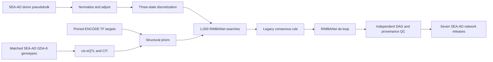

# SEA-AD Wang-Style RIMBANet Build Plan

## Execution status — September 6, 2026

**Steps 1–5 are complete for the Microglia pilot.** The source and identity
contracts, production input audit, pinned Linux runtime, corrected pilot
expression matrix, final 75-donor genotype matrix, and Microglia cis-eQTL
results have passed their gates. The Step 6 CIT direction analysis and Step 7
discretization gate are also complete. Active work is **assembling the exact
RIMBANet input contract and the combined CIT/ENCODE prior** before Step 8.

- The Minerva work checkout started at commit
  b4486062ac77b3189e4f80a6b6a689c6b5952c0f.
- The scratch layout and pinned mw201608/BayesianNetwork checkout were created.
- Three runtime compatibility defects were diagnosed and corrected in the
  repository container recipes: Xerces-C++ 2.8 must build serially, and the
  RIMBANet C++ source must compile in gnu++98 mode. Container R commands must
  also ignore the bound checkout's `.Rprofile` so its host `renv` library does
  not mask packages installed in the image.
- Minerva LSF build job 268173456 completed successfully and produced the
  SIF SHA-256
  1df82906537e74c73fb331e7652c4057bac92182293d7d3739d0a015a4f25840.
- That checksum was independently recomputed on Minerva, matched, and was
  frozen in config/seaad_rimbanet_execution.yml. The first test from the work
  checkout activated its `renv` and reported edgeR, MatrixEQTL, and cit as
  missing; this tests the wrong R library and does not establish that the
  image packages are missing.
- The isolated image check then confirmed data.table 1.18.6.1, digest 0.6.39,
  edgeR 4.0.16, MatrixEQTL 2.4, yaml 2.3.12, and cit 2.3.2. The built-in image
  test passed, and `11_check_rimbanet_environment.py` reported
  `validated_complete` with zero failures at 2026-09-04T22:40:05Z.
- The original WGS-specific input contract has been superseded. The primary
  genotype source is now the locally available GDA-8 SNP-array VCF described
  below. The generic GDA-8 input audit and ENCODE transformation are frozen;
  the production genotype importer and genotype QC remain incomplete.
- The formal VH11A audit at 2026-09-04T22:47:28Z used the superseded
  WGS-specific configuration and reported four failed checks: all 14 broad
  pseudobulk shards absent from scratch, a raw WGS PLINK trio absent, zero WGS
  crosswalk matches, and an unfrozen ENCODE TF-target input. Retain this as
  historical evidence; do not interpret its WGS failures as requirements of
  the revised plan.
- The validated 14-file broad pseudobulk bundle was synchronized through Git,
  staged in Minerva scratch, and independently matched all frozen SHA-256s.
  The historical rerun cleared the pseudobulk check before the audit was
  refactored to generic GDA-8 terms.
- The selected genotype source is the access-controlled shared archive
  `/sc/arion/projects/adineto/sea_ad/Data/SNP_Genomic_Variants/SEA_AD_SNPs_vcf.tar.gz`,
  identified by its Synapse metadata as `syn49430589`, assay `snpArray`,
  platform `Infinium Global Diversity Array-8`. The archive is 41,491,256
  bytes and contains `SEA_AD_SNPs_vcf/sea_ad.vcf` (798,973,180 bytes).
  The archive SHA-256 is
  `f9d60b00db44e6a4f7c96329b1b8bbc1998dc96b3f4b1c4d3d4d274812dc9459`;
  the 482-byte Synapse manifest SHA-256 is
  `c70b8452d0a913013584dd321b9bf97ce85f936108fa6dde4e450717e5b05c5a`;
  and the 10,169-byte GenomeStudio project SHA-256 is
  `dc4d3f4d29938cdd79008eceb6fd19cd6db0bdbed0862829dee89938789d68dd`.
- The official Illumina GDA-8 v1.0 D2 GRCh38 CSV package was downloaded by
  Minerva LSF job 268174443. The 200,759,541-byte ZIP has SHA-256
  `bba55d6b646491fc2794e6b56b524200d82db8e4ed0d5ca55b02a57c36073d7a`,
  contains only `GDA-8v1-0_D2.csv` (853,762,671 uncompressed bytes), and
  passed ZIP integrity validation.
- The matching official D1/GRCh37 CSV package is also frozen. Its
  200,164,599-byte ZIP has SHA-256
  `63286a4c03298188bf9502d66aef2ff8627ee06d4108c5504af09386ca663466`,
  contains only `GDA-8v1-0_D1.csv` (853,793,640 uncompressed bytes), and
  passed ZIP integrity validation. All 1,904,599 assay rows declare build 37,
  all marker `Name` values are populated and unique, and the D1/D2 manifests
  therefore provide the authoritative A/B and `RefStrand` bridge.
- Minerva LSF job 268176167 downloaded the GENCODE release 44 GRCh38 primary-
  assembly FASTA that matches the frozen v44 annotation. The 844,691,642-byte
  gzip passed integrity validation and the publisher MD5
  `9c3fc2ca260a767530dddb0f26721a6b`; its frozen SHA-256 is
  `e9a2d5a5cd225293646ae298998ad4ea8c11e8f22729bc2d6f5c3dcfefbf8ef8`.
- The reference was decompressed and indexed with samtools 1.21. The
  3,151,417,447-byte FASTA has SHA-256
  `e49b92b3e4f321bf254c042f25b726d9931c4d74c7523e8b6bb530e63b0cfd4b`;
  its 6,482-byte FAI has SHA-256
  `a2c323ea4cff34d7123ace4578f7e122b2d2f5a22f40dc23eb8b97d17723d169`.
  The index contains 194 sequences and matches the canonical chr1, chr22,
  chrX, chrY, and chrM lengths.
- Header audit found VCFv4.2, 95 samples, hard-called `GT`, chromosome names
  without `chr`, and unmapped `0:0:N:.` records. The associated
  `GDA-8v1-0_d1` manifest establishes GRCh37 source coordinates; the array
  must be mapped to GRCh38 and reference-normalized before PLINK2 import.
- A full D1-to-D2 identifier audit read all 1,904,599 source VCF rows and all
  1,904,599 D2 assay rows. Of 992,665 eligible, unique source marker IDs, all
  992,665 matched D2 `Name`, none matched `IlmnID`, and neither input had
  duplicate join identifiers. A total of 991,538 matches had a valid GRCh38
  target. The 1,127 invalid D2 targets are all unplaced (chromosome 0 and
  position 0). The 911,934 rejected source rows comprise 107 unplaced records,
  9,933 additional records lacking a reference allele, and 901,894 additional
  records lacking an alternate allele. These exclusions are deterministic;
  retain the 991,538 exact, unique, placed GRCh38 mapping candidates for the
  subsequent reference-allele and strand checks.
- The first three-way allele audit intentionally stopped before transformation.
  A genomic-plus interpretation of the source VCF aligned 527,231 markers but
  left 423,450 source-to-D1 allele mismatches and 38,798 source-to-D1
  coordinate mismatches; 32,684 aligned records also shared a normalized
  GRCh38 variant key. These are diagnostic counts, not an accepted marker set.
  Test the observed VCF against the D1 design-strand A/B convention and
  classify the coordinate differences before freezing the transformation.
- The follow-up convention diagnostic identified the VCF producer as PLINK
  1.90 and ruled out one global design- or plus-strand interpretation. Among
  990,375 biallelic SNVs, 331,782 matched both D1 design and plus allele sets,
  211,897 matched design only, 217,095 matched plus only, and 229,601 matched
  neither under that incomplete two-way test. All 38,798 coordinate failures
  were chromosome-code rather than position mismatches, consistent with PLINK
  numeric sex/mitochondrial chromosome codes requiring an explicit 23/X,
  24/Y, 25/XY, and 26/MT normalization audit. D1 and D2 retained identical
  `SNP` and `IlmnStrand` fields for all markers; `RefStrand` changed for 1,516.
  Resolve each non-palindromic SNV against the D1 A/B allele set or its reverse
  complement, then map the preserved A/B identity through D2 `RefStrand` and
  require the GRCh38 FASTA base. Conservatively exclude A/T and C/G SNPs,
  non-SNVs, unresolved alleles, invalid coordinates, and duplicate target
  variants rather than inferring ambiguous orientation.
- Corrected-allele audit job 268176695 exited before transformation because
  its generic CSV reader interpreted the Illumina manifest metadata preamble
  as the header and therefore observed zero D1 `Name` matches. All five frozen
  input checksums passed, and peak memory was only 483 MB. Manifest readers
  must seek the `[Assay]` section before constructing the CSV `DictReader`;
  apply the same rule to both D1 and D2 packages.
- Corrected-allele audit job 268176943 then classified all 992,665 eligible
  markers with no missing D1/D2 joins or residual D1 coordinate mismatch after
  PLINK chromosome normalization. It reference-aligned 878,270 provisional
  markers, comprising 433,685 direct-design and 444,585 reverse-complement
  mappings; 167,093 require genotype-index swapping and 711,177 do not. The
  conservative exclusions were 107,821 palindromic SNPs, 2,287 non-SNVs,
  1,127 invalid D2 locations, and 3,160 records addressed as `XY`, for which
  the FASTA intentionally has no `chrXY` contig. Removing 54,080 records at
  26,639 duplicate GRCh38 keys left an interim 824,190 unique markers. The D2
  scan count of 1,904,623 includes 24 post-assay/footer rows; production
  readers must stop at the next bracketed section after `[Assay]`.
- PLINK defines chromosome 25/`XY` as the X pseudoautosomal region and its
  `--merge-x` operation maps those records back to X without changing their
  positions. Before freezing the final count, repeat the reference audit with
  D2 `XY` targets mapped to `chrX`, require their positions to lie within the
  GRCh38 PAR boundaries (1–2,781,479 or 155,701,383–156,040,895), and apply
  the same FASTA and duplicate-key gates. Do not invent a `chrXY` contig.
- Final allele audit job 268176970 applied that rule and stopped the D2 parser
  at the next manifest section, yielding exactly 1,904,599 assay rows. Of
  3,160 otherwise eligible `XY` candidates, 2,501 fell within the declared
  GRCh38 PAR boundaries, mapped to chromosome X, and matched the reference;
  659 out-of-bound records were excluded. The final provisional aligned set is
  880,771 markers (434,913 direct-design and 445,858 reverse-complement;
  167,656 genotype-index swaps and 713,115 unchanged). Excluding every one of
  the 54,782 records at 26,978 duplicated GRCh38 variant keys leaves the frozen
  transformation set of 825,989 unique variants. The aggregate summary SHA-256
  is `a790274b1cfc151ebb45a37e6a95ce7d7dcbcf1c548eb1a71551ea2d83182e02`;
  no participant IDs or genotypes were written by the audit.
- A strict suffix-based identity audit established a one-to-one match for all
  78 primary expression donors: zero unmatched donors, zero ambiguous donors,
  zero duplicate sample assignments, and 17 VCF samples outside the primary
  cohort. All 95 VCF IDs have a numeric prefix followed by `_` and the SEA-AD
  donor ID. The resulting explicit crosswalk was written with mode 600 to the
  Git-ignored protected path
  `data/seaad_genotypes/syn49430589/sample_crosswalk.tsv`; its SHA-256 is
  `410e1ebd0ba6412d65d7c531db1654206fc3927401bdf7b219c6b665f0515956`.
  The corresponding protected keep and sex-update tables also have mode 600.
  Never rely on row order.
- The GDA-8 array is adopted as the primary genetics source. NG00174 WGS is
  not required for this build. The final methods and provenance must say
  **SNP-array-derived genetic priors**, never WGS-derived priors.
- The scientific/execution configs and VH11A input audit have been refactored
  to the frozen GDA-8 source, final remap summary, protected crosswalk, generic
  genotype terminology, and LSF project `acc_adineto`. The production
  genotype wrapper now calls the deterministic GDA-8 importer, reproduces the
  frozen transformation audit before publishing genotypes, uses generic
  genotype keys and VH11A `array_keep.tsv`/`array_sex.tsv` artifacts, and
  binds the shared controlled source read-only.
- Revised GDA-8 VH11A LSF job 268209222 completed on 2026-09-05. It passed
  every pseudobulk, genotype-source, D1/D2 manifest, GRCh38 reference,
  transformation-summary, protected-crosswalk, 78-donor identity, sex-update,
  RIMBANet commit, and source-manifest check. Its only failure was the expected
  missing ENCODE artifact, so the job ended with the controlled state
  `blocked_missing_prerequisites` and audit exit code 2 rather than a runtime
  error.
- The ENCODE structural prior is now frozen to the original 2012 Gerstein
  ENCODE filtered proximal TIP network, `enets2.Proximal_filtered.txt`. The
  784,996-byte source has SHA-256
  `ee34cb261c989746d6eecd89e477ab1c8b9f8982d0a5aaea17f221aece2f94d0`
  and exactly 26,070 unique TF-target rows from 115 TFs. The repository-native
  transformer maps exact approved, unique previous/alias HGNC 2026-06-05
  symbols and exact GENCODE v44 symbols; rejects unresolved or ambiguous
  symbols and self-loops; collapses mapped duplicates; sorts by parent and
  child; and writes a version-independent stored-block gzip stream. The frozen
  result contains 25,105 unique directed edges, 115 TFs, and 8,738 targets;
  963 source rows are rejected (including 27 self-loops), and two mapped
  duplicates are collapsed. The 1,551,481-byte output SHA-256 is
  `3604241c4f1765046f151f0394e9d74b49467c233ee0963ff9553dab968410fe`.
  Minerva LSF job 268213013 created and verified this exact artifact in
  scratch; its gzip integrity check passed and stderr was empty.
- VH11A attempt 268214790 verified the staged ENCODE prior but could not see
  the controlled source archive because its Apptainer invocation omitted the
  shared SEA-AD project bind. Retry 268220366 then stopped before the audit
  with exit code 127 because the compute-node environment did not resolve the
  bare `apptainer` command. Final retry 268231984 used the absolute Apptainer
  1.4.5 executable and mounted `/sc/arion/projects/adineto/sea_ad` read-only.
  It completed successfully at 2026-09-05T15:19:20Z: VH11A reported
  `validated_complete`, zero failed checks, and all 78 genotype donors
  matched. Containerized source audits and imports must retain the read-only
  controlled-data bind, and LSF jobs must use the absolute runtime path or
  load its module within the job.
- Step 4 began with the Microglia expression-preparation job 268232687. It
  exited before creating any stage output because `data.table::fread()` tried
  to load the optional `R.utils` package for a gzipped count matrix. Retry
  268232747 confirmed that external decompression fixed the read, then exited
  after writing `sample_manifest.tsv` and `gene_manifest.tsv` because the
  image's `data.table` was compiled without zlib-backed `fwrite()`
  compression. VH11 compressed readers now stream through `gzip -dc`; writers
  create an uncompressed same-directory temporary file, compress it with
  deterministic `gzip -n`, and atomically rename the result. The same fix is
  applied to the downstream eQTL/CIT and discretization scripts. Compressed
  input/output smoke tests pass without changing or rebuilding the frozen
  image, and the runtime gate now checks that `gzip` is available. Both failed
  jobs are rejected technical attempts; neither produced `status.tsv`.
- Step 4 production retry 268232774 completed successfully on Minerva under
  the original expression contract: LSF state `DONE`, empty stderr,
  `validated_complete`, 78 donors, 5,000 genes, zero then-defined failed
  checks, and valid gzip streams for all four compressed expression artifacts.
  It proved the runtime and matrix-writing path, but is now superseded because
  the downstream position audit showed that the original contract had not
  removed unresolved GENCODE symbols before the variance cap.
- Five rejected technical Step 5 attempts exposed and corrected runtime
  contracts without producing an accepted genotype stage. Job 268232982 did
  not inherit `PROJECT_ROOT`; all LSF preparation submissions now attach
  required variables directly with `env`. Job 268233045 detected that the
  production importer classified 153 palindromic and three non-SNV records
  before their higher-priority invalid-D2-location reason; restoring the
  frozen rejection precedence reproduced all 30 audit metrics. Job 268233190
  passed that audit and produced exactly 825,989 variants, then the image's
  February 2022 PLINK2 rejected X records separated by former-XY PAR records;
  the importer now writes final GRCh38 coordinate order. Job 268234296 passed
  import and initial PLINK filtering, retaining 76 of 78 matched donors after
  the prespecified `--mind 0.02` gate, then stopped because that PLINK2 build
  predates `--check-sex`.
- Production genotype QC now uses the checksum-pinned official PLINK
  v2.0.0-a.6.35LM 64-bit Intel build dated 18 August 2026. Its 7,454,470-byte
  package SHA-256 is
  `cdbade483347678b4f5ddbd8f199b2c1b9c822f7ab6a9345d30505cf3a2e2b00`;
  the 24,682,184-byte executable SHA-256 is
  `29a14752a5e8a8e5212e3ffa1b2e69c258f85516f405478c5dbf8ab00a54c03f`.
  Sex checking uses LD-pruned markers with explicit chrX F thresholds
  max-female=0.2 and min-male=0.8. Donors failing the frozen missingness gate
  are explicitly recorded and excluded; downstream eQTL code intersects the
  post-QC genotype donors with expression and still requires at least 50.
- Job 268247093 completed the deterministic import and every PLINK operation
  with the pinned runtime, retaining 76 donors and 546,632 variants after the
  frozen missingness, MAF/MAC, and HWE filters. It then exited because PLINK2
  appends `.sexcheck` to the `--out` prefix while the wrapper tried to read the
  prefix itself. The wrapper now reads the generated `.sexcheck.sexcheck`
  report. Protected review showed that PLINK identified one borderline female
  call (`PEDSEX=2`, `SNPSEX=NA`, chrX F=0.214177), not a male/female reversal.
  The fixed thresholds remain unchanged. `exclude_sexcheck_failures: true`
  conservatively excludes that donor, records the reason in the protected QC
  exclusions, and reruns sex checking, relatedness, PCA, and dosage generation
  on the expected 75 retained donors. The final retained cohort must still
  have zero sex-check failures.
- Step 5 genotype job 268262591 is accepted: LSF `DONE`; deterministic import
  `validated_complete` with 95 source samples and 825,989 variants; all 30
  final-allele-audit metrics reproduced; 75 donors retained after two
  missingness and one borderline sex-check exclusions; zero final sex-check
  failures; zero related pairs; 546,632 variants; 28,595 missing dosages
  mean-imputed to zero remaining; pinned PLINK version/checksum recorded; and
  all compressed artifacts passed integrity checks. Its sole stderr line was
  a nonfatal pandas mixed-type warning for the chromosome-label column, which
  necessarily contains numeric autosomes and string sex/mitochondrial labels.
  The reader now declares that column as string with whole-file type inference,
  so reproductions do not emit the warning; no genotype rerun is required.
- The first Microglia eQTL attempt, job 268268580, is rejected. Its in-job
  expression refresh again produced 78 donors and 5,000 genes, but the eQTL
  stage exited before MatrixEQTL because exact GTF `gene_name` matching could
  not position 2,224 selected source symbols. The corrected expression stage
  now freezes and validates `gene_annotation_master.tsv` and GENCODE v44,
  requires each retained feature to have a conflict-free, one-to-one Ensembl
  stable ID with a unique GENCODE gene record, and applies that filter before
  residual-variance ranking. The eQTL stage joins those stable IDs to GTF
  `gene_id` coordinates while retaining source symbols as network node names.
  A local full Microglia preparation retained 16,540 genes after the combined
  expression/annotation filters, selected 5,000 unique mapped genes, passed
  all six VH11B checks, and mapped all 5,000 to unique GENCODE coordinates.
- Microglia eQTL retry 268268600 is accepted. LSF reported `DONE`; the
  corrected VH11B refresh retained 78 donors, 16,540 genes after combined
  expression/annotation filtering, and 5,000 variance-ranked genes; all six
  expression checks passed. MatrixEQTL matched all 5,000 genes and all
  546,632 SNPs, used 75 intersected donors and a full-rank 10-covariate
  matrix, tested 2,051,340 cis pairs, and found 2,244 BH-significant pairs
  spanning 280 eGenes and 1,842 instruments. Both eQTL gzip streams passed
  integrity checks. The stderr file contains only MatrixEQTL's expected
  progress messages and no warning or error; this is accepted diagnostic
  output rather than a technical failure.
- The protected-data-safe CIT workload audit found 1,842 unique significant
  instruments and 280 eGenes. Of those instruments, 378 link at least two
  genes, no instrument links more than three genes, and the fixed algorithm
  will run 852 ordered CIT direction tests.
- Microglia CIT job 268268645 is accepted. LSF reported `DONE` with empty
  stderr and only 1,025 MB peak memory. All 852 ordered tests completed with
  valid p-values, zero per-test errors, and 26 significant directions; both
  CIT checks passed and both compressed artifacts passed integrity checks.
  Final Step 6 CIT/ENCODE prior assembly waits for the Step 7 discretization
  gate so evidence is restricted to the actual final node universe.
- Microglia discretization job 268268661 is accepted. Although the completed
  job had aged out of `bjobs -a`, `bhist` recorded a successful exit; its
  stderr is empty and peak memory was 121 MB. All 5,000 input genes were
  retained across 78 samples, all four checks passed, every gene contains
  states 0/1/2, and the matrix has zero inconsistent rows or invalid states.
  Its frozen data SHA-256 is
  `df081b9ca880e7244a21918cc2ec1d8d6ac4f6e0c25094e2aa2a8c0e04a91769`.
- Exact input and combined-prior assembly are now active. Steps 8–12 and every stochastic search array,
  including the Microglia pilot, remain unsubmitted.

## Goal and end state

Build seven SEA-AD donor-level Bayesian networks—Astrocytes, Excitatory neurons, Inhibitory neurons, Microglia, OPCs, Oligodendrocytes, and Vasculature cells—using the full integrative Wang method selected for this project:



The terminal release for each cell type will contain:

- `result.links3.links.txt`: headerless `parent<TAB>child` final DAG, compatible with existing KDA readers.
- `edge_support.tsv.gz`: forward/reverse counts and proportions, adjacency support, selected direction, and de-loop status.
- `nodes.tsv`, `sample_manifest.tsv`, `gene_manifest.tsv`, `prior_summary.tsv`, `network_qc.tsv`, and `network_manifest.yml` with checksums, software/source commits, parameters, and cohort identity.
- Exactly 1,000 validated search outputs before consensus; no silent denominator reduction for missing jobs.
- Independent checks for acyclicity, no self-loops/duplicates/unknown genes, maximum in-degree ≤3, deterministic parsing, and complete provenance.

The compact, validated release will live persistently under
`/sc/arion/work/zhuane01/alzheimer/data/bayesian_network/SEAAD_A9_2024/<cell_type>/`.
All downloadable or reproducible bulk storage is rooted at
`/sc/arion/scratch/zhuane01/alzheimer/`: the external RIMBANet checkout,
Apptainer image, staged pseudobulk/genotype-array/ENCODE inputs, normalized matrices,
genotype/eQTL intermediates, RIMBANet inputs, 7,000 per-search graphs, consensus
intermediates, runtime scratch, and logs. These paths remain untracked except
for the explicitly approved 14-file, approximately 22-MB validated
`05_pseudobulk/direct_broad_counts/` transfer bundle. That Git copy exists only
to synchronize the seven count/sample pairs to Minerva; production still
stages and reads them from scratch.
Existing ROSMAP networks and current KDA outputs will not be overwritten.

### Minerva storage contract

- `/sc/arion/work/zhuane01/alzheimer` contains Git-tracked code, frozen
  configuration, documentation, compact manifests/checksums, and validated
  final network releases. The tracked direct-broad pseudobulk transfer bundle
  is the sole matrix exception. Do not stage container images, external source
  trees, protected genotype data, any other dense matrices, or search outputs
  there.
- `/sc/arion/scratch/zhuane01/alzheimer` contains material that can be
  downloaded again or regenerated deterministically. Scientific and execution
  configs carry absolute paths to this root, and every Apptainer invocation
  binds both the work and scratch roots. Any invocation that reads the shared
  genotype source must also bind `/sc/arion/projects/adineto/sea_ad` to the
  same container path read-only.
- Scratch is disposable and may be purged. It must never contain the only copy
  of controlled source data or final releases. Source identities, checksums,
  parameters, and release artifacts remain in the work checkout so scratch can
  be rehydrated and the workflow resumed or rerun.
- Before submission, require both roots to be writable, verify available
  scratch capacity, and freeze the rebuilt image SHA-256. A missing/purged
  scratch artifact is a hard prerequisite or resume failure, never a reason to
  fall back to the work allocation.

The companion [scratch reproduction runbook](seaad-rimbanet-scratch-reproduction.md)
maps every scratch artifact class to its source and gives the recovery order
and verification commands.

## Step 1 — Freeze the method, inputs, and decision gates

- Maintain [docs/build_network/seaad-rimbanet-build.plan.md](docs/build_network/seaad-rimbanet-build.plan.md) as this plan and update [docs/build_network/seaad_bayesian_network_feasibility.md](docs/build_network/seaad_bayesian_network_feasibility.md) to remove the obsolete claim that the public RIMBANet construction code is unavailable.
- Add `config/seaad_rimbanet.yml` with schema version, seven-cell-type order, SEA-AD A9 input identities, cohort and profile thresholds, normalization/residualization formula, gene filters, random seeds, source commits, eQTL/CIT/TF-prior settings, 1,000-search requirement, and exact consensus thresholds.
- Add `config/seaad_rimbanet_execution.yml` with local-smoke and LSF production profiles, container/image digest, queue/resources, concurrency cap, retry policy, the absolute `/sc/arion/scratch/zhuane01/alzheimer` storage/log roots, and resume rules.
- Pin `mw201608/BayesianNetwork` commit `ebd5f4a6c31da22705622e71b6dc5f1eae195fdd`; do not vendor or redistribute its source/binary until its licensing is clarified.
- Declare hard gates: the checksum-frozen GDA-8 source, explicit 78-donor
  one-to-one crosswalk, validated GRCh37-to-GRCh38 marker mapping, and genotype
  QC must pass; expression-only fallback is not silently substituted;
  Microglia must pass the pilot gate before the remaining six networks run.

Repo changes: add the plan and two configs; change the feasibility document. No analysis output is produced yet.

## Step 2 — Audit SEA-AD expression, SNP-array, TF sources, and donor concordance

- Reuse the 78-donor authority in [results/validation_human/02_cohort/donor_cohort_primary.tsv](results/validation_human/02_cohort/donor_cohort_primary.tsv), the seven-type mapping in [results/validation_human/04_supertype_manifest/supertype_to_broad_network.tsv](results/validation_human/04_supertype_manifest/supertype_to_broad_network.tsv), and the frozen H5AD identity in [scripts/validation_human/seaad_deg_config.yml](scripts/validation_human/seaad_deg_config.yml).
- Use the shared `syn49430589` GDA-8 archive at
  `/sc/arion/projects/adineto/sea_ad/Data/SNP_Genomic_Variants/SEA_AD_SNPs_vcf.tar.gz`.
  Freeze its filename, byte count, SHA-256, Synapse identity, retrieval/source
  path, assay/platform metadata, access constraints, archive-member identity,
  and VCF header facts before copying or conversion. Stage generated working
  files only under
  `/sc/arion/scratch/zhuane01/alzheimer/data/seaad_genotypes/syn49430589/`;
  never add the archive, VCF, sample IDs, or derived genotypes to Git.
- Freeze the observed sample mapping rule: every selected VCF identifier must
  match exactly `^[0-9]+_(<donor_id>)$`, where `<donor_id>` is an exact
  `individualID` from the SEA-AD metadata and an exact primary-cohort
  `donor_id`. Require a one-to-one mapping, all 78 primary donors matched,
  zero ambiguity/duplication, and explicit exclusion of the 17 extra VCF
  samples. Materialize a protected crosswalk at
  `data/seaad_genotypes/syn49430589/sample_crosswalk.tsv` in the work checkout
  or another approved persistent controlled location; keep it untracked.
- Treat the source VCF as GRCh37 because the recorded GenomeStudio manifest is
  `GDA-8v1-0_d1`; do not infer the build from the VCF contig lengths. Freeze
  the matching Illumina GDA-8 v1.0 D2 GRCh38 manifest and checksum, join source
  markers to it by an exact unique marker identifier, and reject absent,
  duplicated, multiply mapped, chromosome-0/position-0, or missing-allele
  records. Normalize retained variants against the frozen GRCh38 reference,
  verify REF/ALT and strand orientation, and record every mapping/exclusion
  count before PLINK2 import. If the D1-to-D2 identity contract cannot be
  established, block rather than applying an undocumented coordinate change.
- The primary analysis uses measured hard-called array genotypes only; it does
  not silently perform reference-panel imputation. Mean-impute sporadic missing
  dosages only after the declared sample/variant QC. Any future panel
  imputation requires a separately approved, versioned analysis with a frozen
  panel, ancestry-aware quality thresholds, and data-governance review.
- Verify genotype sample identity and ancestry using documented sex checks,
  duplicate/relatedness checks, missingness, heterozygosity, ancestry PCs, and
  variant build/alleles. Report per-gene cis-marker coverage and sparse
  instrument coverage so array ascertainment is visible in the final release.
- Use the checksum-frozen 2012 Gerstein ENCODE filtered proximal TIP network
  and the repository transformer declared above. Store its normalized bulk
  table under `/sc/arion/scratch/zhuane01/alzheimer/data/reference/rimbanet/`;
  keep only source metadata/checksums and permitted compact derived tables in
  Git.
- Require each cell-type sample set to be a subset of the 78 analysis donors with its nucleus threshold met. Record exclusions and final `N` separately for every network.

Repo changes: refactor `config/seaad_rimbanet.yml` and VH11 scripts from
WGS-specific keys/schema fields to generic genotype terms; add a deterministic
`scripts/validation_human/11_import_seaad_array.py` stage, source-build,
crosswalk, marker-remap, and exclusion tests; update
`scripts/validation_human/11_audit_rimbanet_inputs.py` and
`data/reference/rimbanet/sources.tsv`. Generated audit outputs go to
`$RIMBANET_OUTPUT_ROOT/11_seaad_rimbanet/11a_audit/`
(`donor_crosswalk.tsv`, `checks.tsv`, `artifacts.tsv`, `status.tsv`).
Raw and derived participant-level genotypes are never added to Git.

## Step 3 — Build and validate the pinned Linux runtime

- Add a Linux x86-64 container recipe for the pinned RIMBANet source, Xerces-C++ 2.8 compatibility, `g++`, Perl 5, bash, `bc`, GNU coreutils, R 4.3.3, PLINK2/bcftools, MatrixEQTL, and the validated CIT implementation.
- Keep the external checkout at `/sc/arion/scratch/zhuane01/alzheimer/external_tools/BayesianNetwork/` and the SIF at `/sc/arion/scratch/zhuane01/alzheimer/external_tools/containers/seaad-rimbanet.sif`; the build records its Git commit, binary SHA-256, and image SHA-256.
- Replace hard-coded `$HOME`, GNU `readlink -f`, and LSF-only assumptions through repository wrappers; do not patch the external source in place. Preserve a patch file only if source changes prove unavoidable.
- Add a synthetic 10–20-node smoke fixture that exercises input preparation, one search, parsing, consensus, and de-looping in the same runtime used on the cluster.

Minerva compatibility requirements established during the first production
build:

- Build the bundled Xerces-C++ 2.8 source with serial make. Its recursive
  makefiles are not parallel-safe; parallel header staging caused cascading
  AbstractDOMParser.cpp compilation errors.
- Compile the pinned RIMBANet source with -std=gnu++98. Modern compiler
  defaults expose std::round, which conflicts with the legacy global
  round(float) declaration.
- Run image R entry points with `Rscript --vanilla` and pass
  `R_PROFILE_USER=/dev/null` at the Apptainer boundary. Otherwise, running
  from the bound work checkout activates its `.Rprofile` and host `renv`
  library, masking the image's R packages.
- Keep the compatibility adjustments in the container recipes rather than
  patching the scratch source checkout in place.
- Legacy format and string-literal warnings are nonfatal. Any compiler error
  or nonzero make exit remains a hard failure.

Repo changes: add `containers/rimbanet/Dockerfile`, `containers/rimbanet/Apptainer.def`, `containers/rimbanet/README.md`, `requirements/seaad_rimbanet.txt`, `scripts/validation_human/11_check_rimbanet_environment.py`, and `scripts/validation_human/11_smoke_test_rimbanet_local.sh`; update `renv.lock` after MatrixEQTL/CIT are successfully resolved. Generated images and external source remain untracked.

## Step 4 — Prepare donor-level broad-cell expression

- Reuse the raw-UMI aggregation from [scripts/validation_human/05_stream_pseudobulk.py](scripts/validation_human/05_stream_pseudobulk.py): synchronize the explicitly tracked 14-file `results/validation_human/05_pseudobulk/direct_broad_counts/` bundle, then stage each reproducible `<cell_type>.counts.tsv.gz` and companion sample file under `/sc/arion/scratch/zhuane01/alzheimer/results/validation_human/05_pseudobulk/direct_broad_counts/`. Each matrix is genes × 78 donors with companion nuclei counts and covariates.
- Require VH05/VH06 validated-complete status and checksum every count/sample shard. Do not treat nuclei as independent network samples.
- For each cell type, retain donors meeting the prespecified primary nucleus threshold (initially the existing ≥20); report a ≥50-nucleus sensitivity set. Freeze sample order in `sample_manifest.tsv`.
- Filter genes using donor-level expression criteria declared in config (CPM
  threshold and minimum donor fraction), then require a conflict-free,
  one-to-one Ensembl stable ID present exactly once among GENCODE v44 gene
  records before applying the variance cap. Remove duplicated/unresolved
  symbols and genes with insufficient variability, and preserve a reason for
  every exclusion.
- TMM-normalize to log-CPM, then residualize declared nuisance variables (study, PMI, age, nuclei count, and configured technical terms) while retaining diagnosis, APOE, and sex biology. Produce an unresidualized sensitivity matrix to quantify dependence on this choice.
- Rank the robust gene universe by residual variance if a compute cap is required; the cap and any prespecified force-inclusion set must be fixed before network learning and cannot be selected from KDA outcomes.
- Stream gzipped TSV inputs through the runtime's `gzip -dc` executable before
  `data.table::fread()` parses them. Write compressed artifacts to a plain
  same-directory temporary file, compress it with `gzip -n`, and atomically
  rename the result. This avoids optional `R.utils` and zlib-backed
  `data.table` features while retaining the frozen runtime; the environment
  gate must confirm that `gzip` is present.

Repo changes: add `scripts/validation_human/11_prepare_rimbanet_expression.R` and expression-contract tests. Generated per-cell-type `counts`, `normalized_expression`, `adjusted_expression`, `gene_manifest`, `sample_manifest`, and filter/QC files go to `$RIMBANET_OUTPUT_ROOT/11_seaad_rimbanet/11b_expression/`; the scratch copies are disposable, while permitted compact manifests/checks are retained with the release.

## Step 5 — Harmonize GDA-8 genotypes and run cell-type cis-eQTL mapping

- Import only the D2-mapped, GRCh38-reference-normalized, measured GDA-8
  variants; apply sample/variant QC, allele normalization, MAF/MAC thresholds,
  and genotype missingness rules from config. Exclude the 17 samples outside
  the frozen primary cohort before computing QC statistics or PCs.
- For each broad cell type, use only donors present in both its expression
  matrix and the explicit genotype crosswalk. Map source symbols through the
  frozen annotation master's Ensembl stable ID to GENCODE v44 `gene_id`
  coordinates, then fit MatrixEQTL cis associations within the configured
  window (default ±1 Mb around the gene coordinates).
- Include ancestry PCs and prespecified technical/expression covariates; generate covariate-rank and sample-size checks to prevent singular models.
- Apply BH FDR <0.05 as stated in Wang’s paper. Preserve complete tested-pair
  counts, measured-array marker coverage, and significant instruments;
  explicitly report weak/sparse instrument coverage expected at N≈78 and do
  not imply sequence-level coverage.
- Gate progression if donor matching, genome build, allele orientation, or model rank fails. Sparse eQTL discovery is reported scientifically, not hidden by relaxing thresholds after results are seen.

Repo changes: add `scripts/validation_human/11_prepare_seaad_genotypes.sh` and `scripts/validation_human/11_run_celltype_eqtl.R`; add unit tests for donor order, variant normalization contracts, cis-window selection, and FDR output. Generated genotype/eQTL files go to `$RIMBANET_OUTPUT_ROOT/11_seaad_rimbanet/11c_genetics/` and remain in scratch except compact summaries, checks, and manifests retained with the release.

## Step 6 — Derive CIT directions and ENCODE structural priors

- For gene pairs linked to the same significant cis-eQTL instrument, run the validated CIT orientation workflow and retain direction, instrument, test components, probability/p-value, multiplicity adjustment, and exclusion reason.
- Map CIT and ENCODE identifiers through the frozen GENCODE/HGNC assets already used by this repository; reject ambiguous mappings and restrict priors to each cell type’s declared gene universe.
- Convert evidence to RIMBANet prior format only with a documented, frozen weight transform. Keep evidence sources separate in a long table before combining them; resolve conflicting directions deterministically and report conflicts.
- Generate the default expression-derived RIMBANet prior first, then apply CIT and ENCODE additions. This ordering is mandatory because the public `runBN.bsh` overwrites `prior.txt`.
- Generate `banned.txt` with self-loops prohibited and any genetically justified direction bans explicitly documented. Do not introduce pathway/PPI priors unless added through a later versioned config.

Repo changes: add `scripts/validation_human/11_build_rimbanet_priors.py` plus prior-format/conflict/weighting tests. Generated `cit_edges.tsv.gz`, `encode_edges.tsv.gz`, `combined_prior_evidence.tsv.gz`, `prior.txt`, `banned.txt`, and summaries go to `$RIMBANET_OUTPUT_ROOT/11_seaad_rimbanet/11d_priors/`; only permitted compact summaries/manifests are retained with the release.

## Step 7 — Discretize expression and assemble exact RIMBANet inputs

- For each gene, run one-dimensional k-means with k=3 using a fixed per-gene seed; order cluster centers so states are always low=0, middle=1, high=2. Reject genes that cannot form three nonempty states and update the final gene manifest before priors are remapped.
- Write `data.discretized.txt` with no header, one gene per row, the gene symbol first, then only integer 0/1/2 states in `sample_manifest.tsv` order; prohibit missing values and duplicate genes.
- Generate `node.xml` and the 10-line `bn.param.txt` explicitly rather than invoking the public caller’s preparation-and-submit side effects.
- Record number/order of genes and samples, checksums of data/prior/banned files, and dimensions of the banned matrix. Verify all prior genes exist in the final discretized universe.

Repo changes: add `scripts/validation_human/11_discretize_rimbanet_expression.R` and `scripts/validation_human/11_prepare_rimbanet_inputs.py`; add golden-format fixtures/tests. Generated inputs go to `$RIMBANET_OUTPUT_ROOT/11_seaad_rimbanet/11e_inputs/<cell_type>/` in scratch.

## Step 8 — Run and gate a Microglia production-scale pilot

- Start with Microglia because it is biologically central and has strong nucleus support in the current manifest.
- Run all 1,000 stochastic RIMBANet searches with job IDs 1–1000 and legacy seeds `1237 + job_id`; preserve Wang wrapper parameters (`qratio`, `alpha`, prior scaling, maximum three parents) in the frozen config rather than relying on shell defaults.
- Use an LSF array wrapper with scheduler-neutral task execution, bounded concurrency, per-task exit/status records, atomic output publication, retries only for technical failures, and no overwrite of a successful task with a different config hash.
- Require 1,000/1,000 nonempty, parseable outputs and final likelihood logs. Report runtime, memory, score distributions, edge-count distributions, and failed/retried tasks.
- Pilot gate: runtime/resources are feasible; prior coverage is reported; all searches pass; the final graph passes consensus/de-loop and independent QC; repeated fixture/pilot parsing is deterministic. Failure stops the six-network scale-out and triggers parameter/memory review, not threshold fishing.

Repo changes: add `scripts/validation_human/11_prepare_rimbanet_minerva.lsf`, `scripts/validation_human/11_run_rimbanet_task.sh`, `scripts/validation_human/11_submit_rimbanet_minerva.py`, `scripts/validation_human/11_submit_rimbanet_minerva.lsf`, and `scripts/validation_human/11_validate_rimbanet_runs.py`; add run-manifest and resume tests. Bulky outputs/logs go to `$RIMBANET_OUTPUT_ROOT/11_seaad_rimbanet/11f_runs/Microglia/` and `$RIMBANET_LOG_ROOT/` in scratch.

## Step 9 — Scale the validated search workflow to all seven cell types

- Freeze the pilot-approved runtime and scientific parameters; only per-cell-type gene/sample/prior files vary.
- Submit 1,000 searches for each remaining cell type, with per-network resource estimates and concurrency controls. Seven complete networks require 7,000 validated searches, not 9,000.
- Validate every network independently before consensus. Missing jobs are retried or block release; they never reduce the consensus denominator.
- Produce one run ledger with cell type, task ID, seed, config/input hashes, start/end, host, exit code, likelihood, edge count, retries, and output hash.

Repo changes: no new source files beyond Step 8; generated per-cell-type runs and compact ledgers populate the scratch-backed `11f_runs/`.

## Step 10 — Reproduce Wang’s consensus and de-loop logic exactly

- Preserve the legacy consensus rule, which is more specific than “directed edge in 30%”: for each pair calculate forward `r` and reverse `R`; retain the more frequent direction when `r≥0.15`, `r+R≥0.30`, and `r≥R` (with the mirrored rule for the opposite direction).
- Preserve and expose tie behavior, source commit, total denominator, and intermediate `result.links.3` / `result.linksMatrix.3`; unlike the public wrapper, do not delete these reproducibility intermediates.
- Run the pinned RIMBANet `testBN -c` de-loop/refinement step to produce `result.links3` and `result.links3.links.txt`.
- Export `edge_support.tsv.gz` so every final or removed edge can be traced to forward/reverse recurrence and de-loop outcome.

Repo changes: add `scripts/validation_human/11_build_rimbanet_consensus.sh` and consensus-rule golden tests, including direction ties and cycles. Generated consensus/intermediate files go to `$RIMBANET_OUTPUT_ROOT/11_seaad_rimbanet/11g_consensus/<cell_type>/` in scratch.

## Step 11 — Independently validate topology, stability, and biological limits

- Use NetworkX `DiGraph` strictly as an independent auditor: assert DAG, maximum in-degree ≤3, no self-loops, duplicate edges, reciprocal pairs, or nodes outside the gene manifest; summarize roots, leaves, components, degrees, density, and edge removals.
- Check that rerunning consensus on the same 1,000 outputs yields byte-identical edge/support files.
- Quantify search stability across disjoint subsets of runs and expression-processing sensitivity. Clearly distinguish the 1,000 stochastic searches from donor bootstraps—they measure search stability, not biological sampling uncertainty.
- For the Microglia pilot, add a prespecified donor-resampling sensitivity only if compute permits; report it separately and do not change the primary consensus rule.
- Label networks exploratory if genetic-prior coverage or stability is inadequate; completing computation alone is not sufficient for a causal claim.

Repo changes: add `scripts/validation_human/11_validate_publish_seaad_networks.py` and `tests/validation_human/test_seaad_rimbanet_network_contract.py`. Generated QC/status/artifact tables first go to the scratch-backed `11h_release_qc/`; the validated compact QC and provenance subset is copied into the persistent release.

## Step 12 — Publish the seven immutable network releases

- Atomically copy only validated release artifacts to `data/bayesian_network/SEAAD_A9_2024/<cell_type>/` and generate a root `release_manifest.tsv` containing every file’s SHA-256, byte count, cell type, donor N, node/edge count, release ID, and source/config commits.
- Update `.gitignore` so controlled data, external tools, container images, normalized matrices, priors containing restricted data, and per-search outputs remain ignored while the final permitted edge lists and compact provenance/QC files are tracked.
- Update [scripts/validation_human/README.md](scripts/validation_human/README.md) with exact audit, preparation, pilot, production, resume, consensus, validation, and release commands.
- Do not change [config/phase12_kda.yml](config/phase12_kda.yml), existing `data/bayesian_network/<ROSMAP_cell_type>/` files, or the current VH10 KDA workflow in this build. Connecting KDA to the SEA-AD release is a separate, checksum-frozen follow-up.

Repo changes: add seven network release directories and `data/bayesian_network/SEAAD_A9_2024/release_manifest.tsv`; change `.gitignore` and the validation README. No tracked files are removed.

## Local and Minerva command runbook

All commands below start at the repository root. The local command uses the
synthetic fixture and fake `testBN`; it does not attempt the 7,000 production
searches or require controlled SEA-AD data.

```bash
cd /path/to/alzheimer

git clone https://github.com/mw201608/BayesianNetwork.git \
  external_tools/BayesianNetwork
git -C external_tools/BayesianNetwork checkout \
  ebd5f4a6c31da22705622e71b6dc5f1eae195fdd
test "$(git -C external_tools/BayesianNetwork rev-parse HEAD)" = \
  "ebd5f4a6c31da22705622e71b6dc5f1eae195fdd"

python3 -m venv .venv
.venv/bin/pip install -r requirements/seaad_rimbanet.txt pytest
bash scripts/validation_human/11_smoke_test_rimbanet_local.sh
```

The smoke command performs Python, Bash, and R syntax checks, then runs the
contract, scheduler/resume, consensus, DAG, and synthetic end-to-end tests.
It is suitable for macOS development because it substitutes the fixture
runtime for the Linux x86-64 legacy binary.

### Step 1 rerun — synchronize and verify frozen contracts

Run this lightweight preflight on a Minerva login node. The subshell keeps a
failed check from enabling `set -e` in, or exiting, the interactive shell.
For a complete scratch loss, use the operational order Step 1, Step 3, then
Step 2 because the successful Step 2 audit runs inside the Step 3 image.

```bash
(
set -euo pipefail

export PROJECT_ROOT=/sc/arion/work/zhuane01/alzheimer
export RIMBANET_STORAGE_ROOT=/sc/arion/scratch/zhuane01/alzheimer
export SEAAD_CONTROLLED_ROOT=/sc/arion/projects/adineto/sea_ad
export APPTAINER_BIN=/hpc/packages/minerva-rocky9/apptainer/1.4.5/bin/apptainer
export LSF_PROJECT=acc_adineto
export RIMBANET_IMAGE="$RIMBANET_STORAGE_ROOT/external_tools/containers/seaad-rimbanet.sif"

cd "$PROJECT_ROOT"
test -d .git
test -z "$(git status --porcelain --untracked-files=no)"
git fetch origin main
git merge --ff-only origin/main

test "$LSF_PROJECT" = acc_adineto
test -x "$APPTAINER_BIN"
test -r "$SEAAD_CONTROLLED_ROOT/Data/SNP_Genomic_Variants/SEA_AD_SNPs_vcf.tar.gz"

test "$(git check-ignore data/seaad_genotypes/syn49430589/sample_crosswalk.tsv)" = \
  data/seaad_genotypes/syn49430589/sample_crosswalk.tsv
test "$(stat -c '%a' data/seaad_genotypes/syn49430589/sample_crosswalk.tsv)" = 600
test "$(sha256sum data/seaad_genotypes/syn49430589/sample_crosswalk.tsv | awk '{print $1}')" = \
  410e1ebd0ba6412d65d7c531db1654206fc3927401bdf7b219c6b665f0515956

PSEUDOBULK_SOURCE="$PROJECT_ROOT/results/validation_human/05_pseudobulk/direct_broad_counts"
test "$(find "$PSEUDOBULK_SOURCE" -maxdepth 1 -type f | wc -l)" -eq 14
test "$(git ls-files "$PSEUDOBULK_SOURCE" | wc -l)" -eq 14

if grep -En 'TO_BE_FROZEN|YOUR_MINERVA_ALLOCATION|NG00174' \
  config/seaad_rimbanet.yml config/seaad_rimbanet_execution.yml
then
  echo "ERROR: unresolved or obsolete production configuration" >&2
  false
fi

grep -q 'project: acc_adineto' config/seaad_rimbanet_execution.yml
grep -q 'image_sha256: 1df82906537e74c73fb331e7652c4057bac92182293d7d3739d0a015a4f25840' \
  config/seaad_rimbanet_execution.yml
grep -q 'genotype_source_sha256: f9d60b00db44e6a4f7c96329b1b8bbc1998dc96b3f4b1c4d3d4d274812dc9459' \
  config/seaad_rimbanet.yml
grep -q 'output_sha256: 3604241c4f1765046f151f0394e9d74b49467c233ee0963ff9553dab968410fe' \
  config/seaad_rimbanet.yml

echo "Step 1 contract preflight: validated_complete"
)
```

Do not continue from a dirty checkout, a missing/changed protected crosswalk,
an unfrozen configuration, or a controlled archive that is unreadable.

### Step 3 rerun — build and validate the pinned Minerva runtime

Submit the build from a Minerva login node to LSF project `acc_adineto`; the
resource-intensive work itself runs on the assigned compute node. The
repository stays in the work allocation, while the source checkout, build
context, and SIF stay in scratch.

Do not run the resource-intensive apptainer build process directly on a
Minerva login host. Submit it through LSF or enter an approved interactive
compute session first. Before submission, confirm that the recipe builds
Xerces serially and injects -std=gnu++98 into the copied RIMBANet Makefile.
These compatibility changes belong in the repository recipes; never modify the
scratch source checkout in place. A successful build is only a candidate
runtime until its checksum and full environment gate pass independently.

```bash
export PROJECT_ROOT=/sc/arion/work/zhuane01/alzheimer
export RIMBANET_STORAGE_ROOT=/sc/arion/scratch/zhuane01/alzheimer
export RIMBANET_OUTPUT_ROOT="$RIMBANET_STORAGE_ROOT/results/validation_human"
export RIMBANET_LOG_ROOT="$RIMBANET_OUTPUT_ROOT/11_seaad_rimbanet/logs"
export RIMBANET_SOURCE="$RIMBANET_STORAGE_ROOT/external_tools/BayesianNetwork"
export RIMBANET_IMAGE="$RIMBANET_STORAGE_ROOT/external_tools/containers/seaad-rimbanet.sif"
export APPTAINER_CACHEDIR="$RIMBANET_STORAGE_ROOT/cache/apptainer"
export APPTAINER_TMPDIR="$RIMBANET_STORAGE_ROOT/tmp/apptainer"
export APPTAINER_BIN=/hpc/packages/minerva-rocky9/apptainer/1.4.5/bin/apptainer
export LSF_PROJECT=acc_adineto
export BUILD_LOG_ROOT="$RIMBANET_LOG_ROOT/build"

cd "$PROJECT_ROOT"
test -x "$APPTAINER_BIN"
command -v bsub >/dev/null
test -w "$PROJECT_ROOT"
mkdir -p \
  "$RIMBANET_STORAGE_ROOT/external_tools/containers" \
  "$RIMBANET_STORAGE_ROOT/data/seaad_genotypes/syn49430589/source" \
  "$RIMBANET_STORAGE_ROOT/data/seaad_genotypes/syn49430589/derived" \
  "$RIMBANET_STORAGE_ROOT/data/reference/rimbanet" \
  "$RIMBANET_STORAGE_ROOT/results/validation_human/05_pseudobulk/direct_broad_counts" \
  "$APPTAINER_CACHEDIR" \
  "$APPTAINER_TMPDIR" \
  "$BUILD_LOG_ROOT"
test -w "$RIMBANET_STORAGE_ROOT"
df -h "$PROJECT_ROOT" "$RIMBANET_STORAGE_ROOT"
module load proxies/1

if [[ ! -d "$RIMBANET_SOURCE/.git" ]]; then
  git clone https://github.com/mw201608/BayesianNetwork.git "$RIMBANET_SOURCE"
fi
git -C "$RIMBANET_SOURCE" checkout --detach \
  ebd5f4a6c31da22705622e71b6dc5f1eae195fdd
test "$(git -C "$RIMBANET_SOURCE" rev-parse HEAD)" = \
  "ebd5f4a6c31da22705622e71b6dc5f1eae195fdd"

grep -n 'make' "$PROJECT_ROOT/containers/rimbanet/Apptainer.def"
grep -n 'std=gnu++98' \
  "$PROJECT_ROOT/containers/rimbanet/Apptainer.def"

# Apptainer resolves %files sources from the build working directory.
# If the configured image already exists, this job revalidates it without
# overwriting it. If scratch was purged, it rebuilds the missing image.
cd "$PROJECT_ROOT"
BUILD_SUBMISSION="$(
  bsub \
    -P "$LSF_PROJECT" \
    -J seaad_rimbanet_build \
    -q premium \
    -n 8 \
    -W 08:00 \
    -R 'rusage[mem=8000]' \
    -R 'span[hosts=1]' \
    -M 8000 \
    -o "$BUILD_LOG_ROOT/build.%J.out" \
    -e "$BUILD_LOG_ROOT/build.%J.err" \
    -L /bin/bash <<'LSF'
#!/usr/bin/env bash
set -euo pipefail
umask 022

module load proxies/1

PROJECT_ROOT=/sc/arion/work/zhuane01/alzheimer
STORAGE_ROOT=/sc/arion/scratch/zhuane01/alzheimer
IMAGE="$STORAGE_ROOT/external_tools/containers/seaad-rimbanet.sif"
APPTAINER_BIN=/hpc/packages/minerva-rocky9/apptainer/1.4.5/bin/apptainer
EXPECTED_IMAGE_SHA256=1df82906537e74c73fb331e7652c4057bac92182293d7d3739d0a015a4f25840
EXPECTED_BINARY_SHA256=c04cf68e2823750ca7943a238bc4d2e4de1a107422fcedfc21968e0aad5d9183

export APPTAINER_CACHEDIR="$STORAGE_ROOT/cache/apptainer"
export APPTAINER_TMPDIR="$STORAGE_ROOT/tmp/apptainer"
mkdir -p "$APPTAINER_CACHEDIR" "$APPTAINER_TMPDIR" "$(dirname "$IMAGE")"

if [[ ! -s "$IMAGE" ]]; then
  cd "$STORAGE_ROOT"
  "$APPTAINER_BIN" build --fakeroot "$IMAGE" \
    "$PROJECT_ROOT/containers/rimbanet/Apptainer.def"
else
  echo "Existing image found; rebuilding is skipped."
fi

IMAGE_SHA256="$(sha256sum "$IMAGE" | awk '{print $1}')"
if [[ "$IMAGE_SHA256" != "$EXPECTED_IMAGE_SHA256" ]]; then
  echo "ERROR: image SHA-256 mismatch" >&2
  echo "expected=$EXPECTED_IMAGE_SHA256" >&2
  echo "observed=$IMAGE_SHA256" >&2
  exit 2
fi

"$APPTAINER_BIN" exec \
  --env R_PROFILE_USER=/dev/null \
  "$IMAGE" \
  Rscript --vanilla -e \
  'packages <- c("data.table","digest","edgeR","MatrixEQTL","yaml","cit"); stopifnot(all(vapply(packages, requireNamespace, logical(1), quietly=TRUE))); cat("OK: isolated R packages present\n")'

APPTAINERENV_R_PROFILE_USER=/dev/null "$APPTAINER_BIN" test "$IMAGE"

BINARY_SHA256="$(
  "$APPTAINER_BIN" exec "$IMAGE" sha256sum /usr/local/bin/testBN |
  awk '{print $1}'
)"
if [[ "$BINARY_SHA256" != "$EXPECTED_BINARY_SHA256" ]]; then
  echo "ERROR: testBN SHA-256 mismatch" >&2
  echo "expected=$EXPECTED_BINARY_SHA256" >&2
  echo "observed=$BINARY_SHA256" >&2
  exit 2
fi

"$APPTAINER_BIN" exec \
  --bind "$PROJECT_ROOT:$PROJECT_ROOT" \
  --bind "$STORAGE_ROOT:$STORAGE_ROOT" \
  --env R_PROFILE_USER=/dev/null \
  --pwd "$PROJECT_ROOT" \
  "$IMAGE" \
  python scripts/validation_human/11_check_rimbanet_environment.py \
    --config config/seaad_rimbanet.yml \
    --execution-config config/seaad_rimbanet_execution.yml

echo "image_sha256=$IMAGE_SHA256"
echo "binary_sha256=$BINARY_SHA256"
echo "Step 3 runtime: validated_complete"
LSF
)"

printf '%s\n' "$BUILD_SUBMISSION"
BUILD_JOB_ID="$(
  printf '%s\n' "$BUILD_SUBMISSION" |
  awk -F '[<>]' '/Job </ {print $2}'
)"
printf '%s\n' "$BUILD_JOB_ID" > "$BUILD_LOG_ROOT/latest_job_id.txt"
printf 'BUILD_JOB_ID=%s\n' "$BUILD_JOB_ID"
```

After the job finishes, verify both the scheduler record and the persisted
environment gate:

```bash
export RIMBANET_STORAGE_ROOT=/sc/arion/scratch/zhuane01/alzheimer
export RIMBANET_OUTPUT_ROOT="$RIMBANET_STORAGE_ROOT/results/validation_human"
export RIMBANET_IMAGE="$RIMBANET_STORAGE_ROOT/external_tools/containers/seaad-rimbanet.sif"
export BUILD_LOG_ROOT="$RIMBANET_OUTPUT_ROOT/11_seaad_rimbanet/logs/build"
export ENV_ROOT="$RIMBANET_OUTPUT_ROOT/11_seaad_rimbanet/11a_environment"

BUILD_JOB_ID="$(cat "$BUILD_LOG_ROOT/latest_job_id.txt")"
echo "BUILD_JOB_ID=$BUILD_JOB_ID"
bjobs -a "$BUILD_JOB_ID"

echo "=== job result ==="
tail -n 50 "$BUILD_LOG_ROOT/build.$BUILD_JOB_ID.out"

echo "=== job errors ==="
if test -s "$BUILD_LOG_ROOT/build.$BUILD_JOB_ID.err"; then
  tail -n 100 "$BUILD_LOG_ROOT/build.$BUILD_JOB_ID.err"
else
  echo "none"
fi

echo "=== frozen image ==="
sha256sum "$RIMBANET_IMAGE"

echo "=== environment status ==="
cat "$ENV_ROOT/status.tsv"

echo "=== failed environment checks ==="
awk -F $'\t' 'NR == 1 || $2 == "False" {print}' "$ENV_ROOT/checks.tsv"
```

The accepted reference build is job 268173456, image SHA-256
`1df82906537e74c73fb331e7652c4057bac92182293d7d3739d0a015a4f25840`,
binary SHA-256
`c04cf68e2823750ca7943a238bc4d2e4de1a107422fcedfc21968e0aad5d9183`,
and environment state `validated_complete`. A new image with different bytes
must be reviewed and frozen as a new runtime before downstream outputs can be
resumed.

If `apptainer build --fakeroot` is disabled, use an approved private x86-64
OCI builder and convert that private image to the configured scratch SIF path
on Minerva. Do not publish the image while the upstream RIMBANet license
remains unresolved. After a scratch purge, repeat this section and verify the
new SHA-256 before resuming any job.

### Step 2 rerun — restage and audit production inputs on Minerva

Stage the reproducible H5AD-derived VH05 broad count/sample shards, verify the
checksum-frozen shared `syn49430589` GDA-8 archive and final mapping audit, and
stage the frozen ENCODE TF-target table at the
absolute scratch paths in `config/seaad_rimbanet.yml`. Keep the small VH05/VH06
status and cohort manifests plus the protected donor/genotype crosswalk in an
approved persistent location. The generic GDA-8 input audit is active; the
deterministic array importer and genotype-QC stage remain gated work after the
input audit.
This rerun command validates the currently frozen Step 2 artifacts; it does not
silently regenerate a missing genotype transformation. If a scratch checksum
target is absent, first follow the matching source-restoration section in the
[scratch reproduction runbook](seaad-rimbanet-scratch-reproduction.md). A
complete loss of the final allele-audit artifact remains a hard stop until the
repository-native array importer is implemented; do not substitute an ad hoc
coordinate conversion.

Run:

```bash
export PROJECT_ROOT=/sc/arion/work/zhuane01/alzheimer
export RIMBANET_STORAGE_ROOT=/sc/arion/scratch/zhuane01/alzheimer
export SEAAD_CONTROLLED_ROOT=/sc/arion/projects/adineto/sea_ad
export APPTAINER_BIN=/hpc/packages/minerva-rocky9/apptainer/1.4.5/bin/apptainer
export RIMBANET_OUTPUT_ROOT="$RIMBANET_STORAGE_ROOT/results/validation_human"
export RIMBANET_LOG_ROOT="$RIMBANET_OUTPUT_ROOT/11_seaad_rimbanet/logs"
export SEAAD_RIMBANET_CONFIG=config/seaad_rimbanet.yml
export RIMBANET_IMAGE="$RIMBANET_STORAGE_ROOT/external_tools/containers/seaad-rimbanet.sif"
export LSF_PROJECT=acc_adineto
cd "$PROJECT_ROOT"

# If the validated VH05 shards currently exist in the work checkout, stage
# them once in scratch and verify them through the VH11 audit below.
PSEUDOBULK_SOURCE="$PROJECT_ROOT/results/validation_human/05_pseudobulk/direct_broad_counts"
PSEUDOBULK_SCRATCH="$RIMBANET_STORAGE_ROOT/results/validation_human/05_pseudobulk/direct_broad_counts"
mkdir -p "$PSEUDOBULK_SCRATCH"
rsync -a --checksum "$PSEUDOBULK_SOURCE/" "$PSEUDOBULK_SCRATCH/"

AUDIT_LOG_ROOT="$RIMBANET_LOG_ROOT/audit"
mkdir -p "$AUDIT_LOG_ROOT"

if (
  set -euo pipefail
  test "$(find "$PSEUDOBULK_SCRATCH" -maxdepth 1 -type f | wc -l)" -eq 14
  cd "$PROJECT_ROOT"
  sha256sum -c <<'SHA256'
f9d60b00db44e6a4f7c96329b1b8bbc1998dc96b3f4b1c4d3d4d274812dc9459  /sc/arion/projects/adineto/sea_ad/Data/SNP_Genomic_Variants/SEA_AD_SNPs_vcf.tar.gz
63286a4c03298188bf9502d66aef2ff8627ee06d4108c5504af09386ca663466  /sc/arion/scratch/zhuane01/alzheimer/data/seaad_genotypes/syn49430589/source/infinium-global-diversity-array-8-v1-0-D1-manifest-file-csv.zip
bba55d6b646491fc2794e6b56b524200d82db8e4ed0d5ca55b02a57c36073d7a  /sc/arion/scratch/zhuane01/alzheimer/data/seaad_genotypes/syn49430589/source/infinium-global-diversity-array-8-v1-0-D2-manifest-file-csv.zip
e49b92b3e4f321bf254c042f25b726d9931c4d74c7523e8b6bb530e63b0cfd4b  /sc/arion/scratch/zhuane01/alzheimer/data/reference/gencode/v44/GRCh38.primary_assembly.genome.fa
a2c323ea4cff34d7123ace4578f7e122b2d2f5a22f40dc23eb8b97d17723d169  /sc/arion/scratch/zhuane01/alzheimer/data/reference/gencode/v44/GRCh38.primary_assembly.genome.fa.fai
a790274b1cfc151ebb45a37e6a95ce7d7dcbcf1c548eb1a71551ea2d83182e02  /sc/arion/scratch/zhuane01/alzheimer/data/seaad_genotypes/syn49430589/derived/final_allele_audit/summary.tsv
410e1ebd0ba6412d65d7c531db1654206fc3927401bdf7b219c6b665f0515956  data/seaad_genotypes/syn49430589/sample_crosswalk.tsv
3604241c4f1765046f151f0394e9d74b49467c233ee0963ff9553dab968410fe  /sc/arion/scratch/zhuane01/alzheimer/data/reference/rimbanet/encode_tf_targets.tsv.gz
SHA256
); then
  AUDIT_SUBMISSION="$(
    bsub \
      -P "$LSF_PROJECT" \
      -J seaad_vh11a_final \
      -q premium \
      -n 1 \
      -W 02:00 \
      -R 'rusage[mem=8000]' \
      -R 'span[hosts=1]' \
      -o "$AUDIT_LOG_ROOT/vh11a.%J.out" \
      -e "$AUDIT_LOG_ROOT/vh11a.%J.err" \
      -L /bin/bash \
      "$APPTAINER_BIN" exec \
        --bind "$PROJECT_ROOT:$PROJECT_ROOT" \
        --bind "$RIMBANET_STORAGE_ROOT:$RIMBANET_STORAGE_ROOT" \
        --bind "$SEAAD_CONTROLLED_ROOT:$SEAAD_CONTROLLED_ROOT:ro" \
        --env R_PROFILE_USER=/dev/null \
        --pwd "$PROJECT_ROOT" \
        "$RIMBANET_IMAGE" \
        python scripts/validation_human/11_audit_rimbanet_inputs.py \
          --config "$SEAAD_RIMBANET_CONFIG"
  )"

  printf '%s\n' "$AUDIT_SUBMISSION"
  VH11A_JOB_ID="$(
    printf '%s\n' "$AUDIT_SUBMISSION" |
    awk -F '[<>]' '/Job </ {print $2}'
  )"
  printf '%s\n' "$VH11A_JOB_ID" > "$AUDIT_LOG_ROOT/latest_job_id.txt"
  printf 'VH11A_JOB_ID=%s\n' "$VH11A_JOB_ID"
else
  echo "Step 2 input checksum preflight failed; audit was not submitted." >&2
fi

```

After the LSF job finishes, verify the persisted scientific gate rather than
relying only on the scheduler state:

```bash
export RIMBANET_STORAGE_ROOT=/sc/arion/scratch/zhuane01/alzheimer
export RIMBANET_OUTPUT_ROOT="$RIMBANET_STORAGE_ROOT/results/validation_human"
export AUDIT_ROOT="$RIMBANET_OUTPUT_ROOT/11_seaad_rimbanet/11a_audit"
export AUDIT_LOG_ROOT="$RIMBANET_OUTPUT_ROOT/11_seaad_rimbanet/logs/audit"

VH11A_JOB_ID="$(cat "$AUDIT_LOG_ROOT/latest_job_id.txt")"
echo "VH11A_JOB_ID=$VH11A_JOB_ID"
bjobs -a "$VH11A_JOB_ID"

echo "=== job output ==="
tail -n 40 "$AUDIT_LOG_ROOT/vh11a.$VH11A_JOB_ID.out"

echo "=== job errors ==="
if test -s "$AUDIT_LOG_ROOT/vh11a.$VH11A_JOB_ID.err"; then
  cat "$AUDIT_LOG_ROOT/vh11a.$VH11A_JOB_ID.err"
else
  echo "none"
fi

echo "=== VH11A status ==="
cat "$AUDIT_ROOT/status.tsv"

echo "=== failed checks ==="
awk -F $'\t' 'NR == 1 || $2 == "False" {print}' "$AUDIT_ROOT/checks.tsv"

VH11A_STATE="$(
  awk -F $'\t' 'NR == 2 {print $3}' "$AUDIT_ROOT/status.tsv"
)"
if test "$VH11A_STATE" = validated_complete; then
  echo "Step 2 input audit: validated_complete"
else
  echo "Step 2 remains blocked: state=$VH11A_STATE"
fi
```

The accepted reference run is job 268231984: LSF `DONE`, VH11A
`validated_complete`, zero failed checks, and 78 matched genotype donors.
An LSF `EXIT` with audit exit code 2 denotes a blocked scientific gate; exit
127 with `apptainer: command not found` means the absolute runtime path was
omitted. The genotype importer and combined preparation jobs belong to Steps
5–7 and must not be launched from this Steps 1–3 rerun section.

### Step 4 execution — prepare and gate Microglia expression

Run this from a Minerva login node after Steps 1–3 are
`validated_complete`. The resource-intensive R job runs through LSF. The
subshell prevents a failed preflight or submission from exiting the
interactive terminal, and the job ID is persisted outside the shell.

```bash
(
set -euo pipefail

export PROJECT_ROOT=/sc/arion/work/zhuane01/alzheimer
export RIMBANET_STORAGE_ROOT=/sc/arion/scratch/zhuane01/alzheimer
export RIMBANET_OUTPUT_ROOT="$RIMBANET_STORAGE_ROOT/results/validation_human"
export RIMBANET_IMAGE="$RIMBANET_STORAGE_ROOT/external_tools/containers/seaad-rimbanet.sif"
export APPTAINER_BIN=/hpc/packages/minerva-rocky9/apptainer/1.4.5/bin/apptainer
export LSF_PROJECT=acc_adineto
export PREP_LOG_ROOT="$RIMBANET_OUTPUT_ROOT/11_seaad_rimbanet/logs/preparation"
export AUDIT_ROOT="$RIMBANET_OUTPUT_ROOT/11_seaad_rimbanet/11a_audit"

cd "$PROJECT_ROOT"
test -z "$(git status --porcelain --untracked-files=no)"
git pull --ff-only origin main
test "$(awk -F $'\t' 'NR == 2 {print $3}' "$AUDIT_ROOT/status.tsv")" = \
  validated_complete
test -x "$APPTAINER_BIN"
test "$(sha256sum "$RIMBANET_IMAGE" | awk '{print $1}')" = \
  1df82906537e74c73fb331e7652c4057bac92182293d7d3739d0a015a4f25840
"$APPTAINER_BIN" exec "$RIMBANET_IMAGE" sh -c \
  'command -v gzip >/dev/null && gzip --version | head -n 1'

mkdir -p "$PREP_LOG_ROOT"
SUBMISSION="$(
  bsub \
    -P "$LSF_PROJECT" \
    -J seaad_vh11b_microglia \
    -q premium \
    -n 1 \
    -W 02:00 \
    -R 'rusage[mem=16000]' \
    -R 'span[hosts=1]' \
    -M 16000 \
    -o "$PREP_LOG_ROOT/vh11b_microglia.%J.out" \
    -e "$PREP_LOG_ROOT/vh11b_microglia.%J.err" \
    -L /bin/bash \
    "$APPTAINER_BIN" exec \
      --bind "$PROJECT_ROOT:$PROJECT_ROOT" \
      --bind "$RIMBANET_STORAGE_ROOT:$RIMBANET_STORAGE_ROOT" \
      --env R_PROFILE_USER=/dev/null \
      --pwd "$PROJECT_ROOT" \
      "$RIMBANET_IMAGE" \
      Rscript --vanilla \
        scripts/validation_human/11_prepare_rimbanet_expression.R \
        --config config/seaad_rimbanet.yml \
        --network Microglia
)"

printf '%s\n' "$SUBMISSION"
VH11B_JOB_ID="$(
  printf '%s\n' "$SUBMISSION" |
  awk -F '[<>]' '/Job </ {print $2}'
)"
test -n "$VH11B_JOB_ID"
printf '%s\n' "$VH11B_JOB_ID" > \
  "$PREP_LOG_ROOT/latest_vh11b_microglia_job_id.txt"
printf 'VH11B_JOB_ID=%s\n' "$VH11B_JOB_ID"
)
```

After the job finishes, verify both LSF and the persisted VH11B scientific
gate:

```bash
export RIMBANET_STORAGE_ROOT=/sc/arion/scratch/zhuane01/alzheimer
export RIMBANET_OUTPUT_ROOT="$RIMBANET_STORAGE_ROOT/results/validation_human"
export PREP_LOG_ROOT="$RIMBANET_OUTPUT_ROOT/11_seaad_rimbanet/logs/preparation"
export EXPRESSION_ROOT="$RIMBANET_OUTPUT_ROOT/11_seaad_rimbanet/11b_expression/Microglia"

VH11B_JOB_ID="$(cat "$PREP_LOG_ROOT/latest_vh11b_microglia_job_id.txt")"
echo "VH11B_JOB_ID=$VH11B_JOB_ID"
bjobs -a "$VH11B_JOB_ID"

echo "=== job output ==="
tail -n 50 "$PREP_LOG_ROOT/vh11b_microglia.$VH11B_JOB_ID.out"

echo "=== job errors ==="
if test -s "$PREP_LOG_ROOT/vh11b_microglia.$VH11B_JOB_ID.err"; then
  cat "$PREP_LOG_ROOT/vh11b_microglia.$VH11B_JOB_ID.err"
else
  echo "none"
fi

echo "=== expression status ==="
cat "$EXPRESSION_ROOT/status.tsv"

echo "=== failed expression checks ==="
awk -F $'\t' 'NR == 1 || $2 == "FALSE" || $2 == "False" {print}' \
  "$EXPRESSION_ROOT/checks.tsv"
```

The accepted Step 4 run must be LSF `DONE`, have empty stderr, report
`validated_complete` in `status.tsv`, and contain no failed check rows. Jobs
268232687 and 268232747 are rejected technical attempts. The latter's two
uncompressed manifests do not constitute a completed stage and are replaced
atomically by accepted job 268232774; manual cleanup is not required.

### Step 5 execution — harmonize and QC the GDA-8 genotypes

First install the checksum-pinned PLINK2 executable from the official dated
package. Run this once from a Minerva login node:

```bash
(
set -euo pipefail
umask 077

export PLINK2_ROOT=/sc/arion/scratch/zhuane01/alzheimer/external_tools/plink2/20260818
export PLINK2_ZIP="$PLINK2_ROOT/plink2_linux_x86_64_20260818.zip"
export PLINK2_BIN="$PLINK2_ROOT/plink2"
export PLINK2_URL=https://s3.amazonaws.com/plink2-assets/alpha6/plink2_linux_x86_64_20260818.zip

mkdir -p "$PLINK2_ROOT"
module load proxies/1

if ! test -f "$PLINK2_ZIP"; then
  wget --timeout=60 --tries=5 -O "$PLINK2_ZIP.part.$$" "$PLINK2_URL"
  mv "$PLINK2_ZIP.part.$$" "$PLINK2_ZIP"
fi

test "$(stat -c '%s' "$PLINK2_ZIP")" = 7454470
test "$(sha256sum "$PLINK2_ZIP" | awk '{print $1}')" = \
  cdbade483347678b4f5ddbd8f199b2c1b9c822f7ab6a9345d30505cf3a2e2b00

unzip -p "$PLINK2_ZIP" plink2 > "$PLINK2_BIN.part.$$"
chmod 700 "$PLINK2_BIN.part.$$"
test "$(stat -c '%s' "$PLINK2_BIN.part.$$")" = 24682184
test "$(sha256sum "$PLINK2_BIN.part.$$" | awk '{print $1}')" = \
  29a14752a5e8a8e5212e3ffa1b2e69c258f85516f405478c5dbf8ab00a54c03f
mv "$PLINK2_BIN.part.$$" "$PLINK2_BIN"

"$PLINK2_BIN" --version
"$PLINK2_BIN" --help check-sex | grep -F -- '--check-sex'
echo "pinned_plink2_status=validated_complete"
)
```

The version line must be
`PLINK v2.0.0-a.6.35LM 64-bit Intel (18 Aug 2026)`, and the final status must
be `validated_complete`.

Then run the submission block below from the Minerva login node. It verifies
the completed VH11A and Microglia VH11B gates, then submits the
controlled-data transformation and
PLINK2 QC to LSF. The production importer independently reproduces every
metric in the frozen final allele audit before it writes a normalized VCF.
It first retains only the 78 explicitly matched primary donors, applies the
frozen missingness, MAF/MAC, and HWE thresholds, and performs the initial sex
check on the resulting 76 donors. The configured exclusion removes the one
borderline call, after which the final 75-donor cohort is rechecked and used
for relatedness, heterozygosity, ancestry-PC, and dosage calculations. The
read-only controlled-data bind and absolute Apptainer executable are mandatory.

```bash
(
set -euo pipefail

export PROJECT_ROOT=/sc/arion/work/zhuane01/alzheimer
export RIMBANET_STORAGE_ROOT=/sc/arion/scratch/zhuane01/alzheimer
export RIMBANET_OUTPUT_ROOT="$RIMBANET_STORAGE_ROOT/results/validation_human"
export RIMBANET_IMAGE="$RIMBANET_STORAGE_ROOT/external_tools/containers/seaad-rimbanet.sif"
export SEAAD_CONTROLLED_ROOT=/sc/arion/projects/adineto/sea_ad
export CONTAINER_RUNTIME=/hpc/packages/minerva-rocky9/apptainer/1.4.5/bin/apptainer
export CONFIG=config/seaad_rimbanet.yml
export STAGE=genotypes
export LSF_PROJECT=acc_adineto
export PREP_LOG_ROOT="$RIMBANET_OUTPUT_ROOT/11_seaad_rimbanet/logs/preparation"
export AUDIT_ROOT="$RIMBANET_OUTPUT_ROOT/11_seaad_rimbanet/11a_audit"
export EXPRESSION_ROOT="$RIMBANET_OUTPUT_ROOT/11_seaad_rimbanet/11b_expression/Microglia"
export PLINK2_BIN="$RIMBANET_STORAGE_ROOT/external_tools/plink2/20260818/plink2"

cd "$PROJECT_ROOT"
test -z "$(git status --porcelain --untracked-files=no)"
git pull --ff-only origin main
test "$(awk -F $'\t' 'NR == 2 {print $3}' "$AUDIT_ROOT/status.tsv")" = \
  validated_complete
test "$(awk -F $'\t' 'NR == 2 {print $3}' "$EXPRESSION_ROOT/status.tsv")" = \
  validated_complete
test -x "$CONTAINER_RUNTIME"
test -r \
  "$SEAAD_CONTROLLED_ROOT/Data/SNP_Genomic_Variants/SEA_AD_SNPs_vcf.tar.gz"
test "$(sha256sum "$RIMBANET_IMAGE" | awk '{print $1}')" = \
  1df82906537e74c73fb331e7652c4057bac92182293d7d3739d0a015a4f25840
test "$(sha256sum "$PLINK2_BIN" | awk '{print $1}')" = \
  29a14752a5e8a8e5212e3ffa1b2e69c258f85516f405478c5dbf8ab00a54c03f

mkdir -p "$PREP_LOG_ROOT"
SUBMISSION="$(
  bsub \
    -P "$LSF_PROJECT" \
    -J seaad_vh11c_genotypes \
    -q premium \
    -n 4 \
    -W 12:00 \
    -R 'rusage[mem=16000]' \
    -R 'span[hosts=1]' \
    -M 64000 \
    -o "$PREP_LOG_ROOT/vh11c_genotypes.%J.out" \
    -e "$PREP_LOG_ROOT/vh11c_genotypes.%J.err" \
    -L /bin/bash \
    env \
      PROJECT_ROOT="$PROJECT_ROOT" \
      RIMBANET_STORAGE_ROOT="$RIMBANET_STORAGE_ROOT" \
      RIMBANET_IMAGE="$RIMBANET_IMAGE" \
      SEAAD_CONTROLLED_ROOT="$SEAAD_CONTROLLED_ROOT" \
      CONTAINER_RUNTIME="$CONTAINER_RUNTIME" \
      CONFIG="$CONFIG" \
      STAGE="$STAGE" \
      bash scripts/validation_human/11_prepare_rimbanet_minerva.lsf
)"

printf '%s\n' "$SUBMISSION"
VH11C_JOB_ID="$(
  printf '%s\n' "$SUBMISSION" |
  awk -F '[<>]' '/Job </ {print $2}'
)"
test -n "$VH11C_JOB_ID"
printf '%s\n' "$VH11C_JOB_ID" > \
  "$PREP_LOG_ROOT/latest_vh11c_genotypes_job_id.txt"
printf 'VH11C_JOB_ID=%s\n' "$VH11C_JOB_ID"
)
```

This is the next candidate production Step 5 job, and it can take materially longer
than expression preparation because it scans the 1.9-million-row VCF and both
1.9-million-row Illumina manifests, writes 825,989 accepted variants, runs
PLINK2 QC, and exports the donor-by-variant matrix. The normalized VCF is
written in final GRCh38 chromosome/position order (including XY-to-X PAR
records) because the pinned Minerva PLINK2 build rejects split chromosomes
before applying its own `--sort-vars` pass. PLINK is bounded to the four
allocated cores and 60,000 MB instead of inferring the compute host's full
64-core/1.5-TB capacity.

After the job finishes, run:

```bash
export RIMBANET_STORAGE_ROOT=/sc/arion/scratch/zhuane01/alzheimer
export RIMBANET_OUTPUT_ROOT="$RIMBANET_STORAGE_ROOT/results/validation_human"
export PREP_LOG_ROOT="$RIMBANET_OUTPUT_ROOT/11_seaad_rimbanet/logs/preparation"
export GENETICS_ROOT="$RIMBANET_OUTPUT_ROOT/11_seaad_rimbanet/11c_genetics"
export ARRAY_ROOT="$RIMBANET_STORAGE_ROOT/data/seaad_genotypes/syn49430589/derived"
export RAW_PREFIX="$ARRAY_ROOT/seaad_gda8_grch38"

VH11C_JOB_ID="$(cat "$PREP_LOG_ROOT/latest_vh11c_genotypes_job_id.txt")"
echo "VH11C_JOB_ID=$VH11C_JOB_ID"
bjobs -a "$VH11C_JOB_ID"

echo "=== job output ==="
tail -n 100 "$PREP_LOG_ROOT/vh11c_genotypes.$VH11C_JOB_ID.out"

echo "=== job errors ==="
if test -s "$PREP_LOG_ROOT/vh11c_genotypes.$VH11C_JOB_ID.err"; then
  cat "$PREP_LOG_ROOT/vh11c_genotypes.$VH11C_JOB_ID.err"
else
  echo "none"
fi

echo "=== deterministic import status ==="
cat "${RAW_PREFIX}.import_status.tsv"

echo "=== reproduced final allele audit ==="
cat "${RAW_PREFIX}.import_summary.tsv"

echo "=== genotype QC summaries ==="
cat "$ARRAY_ROOT/sample_genetic_qc_summary.tsv"
awk -F $'\t' '
  NR > 1 { count[$2]++ }
  END { for (reason in count) print reason "\t" count[reason] }
' "$ARRAY_ROOT/sample_genetic_qc_exclusions.tsv" | sort
cat "$ARRAY_ROOT/genotype_imputation_summary.tsv"

echo "=== genotype stage status ==="
cat "$GENETICS_ROOT/genotype_status.tsv"

echo "=== compressed artifact integrity ==="
gzip -t \
  "${RAW_PREFIX}.vcf.gz" \
  "${RAW_PREFIX}.variant_mapping.tsv.gz" \
  "$ARRAY_ROOT/genotypes.tsv.gz" \
  "$ARRAY_ROOT/variant_positions.tsv.gz"
echo "compressed_artifact_integrity=OK"
```

Accept Step 5 genotype preparation only when LSF is `DONE`, stderr is empty,
the import status is `validated_complete` with 95 source samples and exactly
825,989 transformed variants, all 30 reproduced audit metrics equal the frozen
summary, genetic QC reports 76 donors entering sex checking, one recorded
borderline sex-check exclusion, 75 retained donors, zero final sex-check
failures, and zero related pairs above the configured threshold. The exported
matrix must contain the same 75 donors with no missing dosages after imputation,
and `genotype_status.tsv` must report `validated_complete`
with the pinned PLINK version and checksum. The subsequent Microglia
cis-eQTL/CIT job remains part
of Step 5 and is submitted only after this genotype gate passes.

Accepted job 268262591 predates the explicit chromosome-string reader and has
one reviewed `DtypeWarning` in stderr; all scientific and artifact gates above
passed, and the warning cannot change the serialized chromosome labels. This
is a documented one-run exception to the empty-stderr rule, not permission to
ignore warnings in later runs.

### Continue Step 5 — run and gate the Microglia cis-eQTL stage

Run this from the Minerva login node only after the shared genotype gate above
is accepted. The worker reruns the inexpensive Microglia expression preparation
under the current full-config hash, then runs only the cis-eQTL portion; it does
not start CIT, discretization, prior assembly, or any stochastic search.

```bash
(
set -euo pipefail

export PROJECT_ROOT=/sc/arion/work/zhuane01/alzheimer
export RIMBANET_STORAGE_ROOT=/sc/arion/scratch/zhuane01/alzheimer
export RIMBANET_OUTPUT_ROOT="$RIMBANET_STORAGE_ROOT/results/validation_human"
export RIMBANET_IMAGE="$RIMBANET_STORAGE_ROOT/external_tools/containers/seaad-rimbanet.sif"
export SEAAD_CONTROLLED_ROOT=/sc/arion/projects/adineto/sea_ad
export CONTAINER_RUNTIME=/hpc/packages/minerva-rocky9/apptainer/1.4.5/bin/apptainer
export CONFIG=config/seaad_rimbanet.yml
export STAGE=eqtl
export NETWORK=Microglia
export LSF_PROJECT=acc_adineto
export PREP_LOG_ROOT="$RIMBANET_OUTPUT_ROOT/11_seaad_rimbanet/logs/preparation"
export GENOTYPE_STATUS_ROOT="$RIMBANET_OUTPUT_ROOT/11_seaad_rimbanet/11c_genetics"
export ARRAY_ROOT="$RIMBANET_STORAGE_ROOT/data/seaad_genotypes/syn49430589/derived"

cd "$PROJECT_ROOT"
test -z "$(git status --porcelain --untracked-files=no)"
git pull --ff-only origin main
test "$(awk -F $'\t' 'NR == 2 {print $3}' \
  "$GENOTYPE_STATUS_ROOT/genotype_status.tsv")" = validated_complete
test "$(awk -F $'\t' 'NR == 2 {print $3}' \
  "$ARRAY_ROOT/seaad_gda8_grch38.import_status.tsv")" = validated_complete
test -x "$CONTAINER_RUNTIME"
test "$(sha256sum "$RIMBANET_IMAGE" | awk '{print $1}')" = \
  1df82906537e74c73fb331e7652c4057bac92182293d7d3739d0a015a4f25840
gzip -t \
  "$ARRAY_ROOT/genotypes.tsv.gz" \
  "$ARRAY_ROOT/variant_positions.tsv.gz"

mkdir -p "$PREP_LOG_ROOT"
SUBMISSION="$(
  bsub \
    -P "$LSF_PROJECT" \
    -J seaad_vh11c_eqtl_microglia \
    -q premium \
    -n 4 \
    -W 24:00 \
    -R 'rusage[mem=16000]' \
    -R 'span[hosts=1]' \
    -M 64000 \
    -o "$PREP_LOG_ROOT/vh11c_eqtl_microglia.%J.out" \
    -e "$PREP_LOG_ROOT/vh11c_eqtl_microglia.%J.err" \
    -L /bin/bash \
    env \
      PROJECT_ROOT="$PROJECT_ROOT" \
      RIMBANET_STORAGE_ROOT="$RIMBANET_STORAGE_ROOT" \
      RIMBANET_IMAGE="$RIMBANET_IMAGE" \
      SEAAD_CONTROLLED_ROOT="$SEAAD_CONTROLLED_ROOT" \
      CONTAINER_RUNTIME="$CONTAINER_RUNTIME" \
      CONFIG="$CONFIG" \
      STAGE="$STAGE" \
      NETWORK="$NETWORK" \
      bash scripts/validation_human/11_prepare_rimbanet_minerva.lsf
)"

printf '%s\n' "$SUBMISSION"
VH11C_EQTL_JOB_ID="$(
  printf '%s\n' "$SUBMISSION" |
  awk -F '[<>]' '/Job </ {print $2}'
)"
test -n "$VH11C_EQTL_JOB_ID"
printf '%s\n' "$VH11C_EQTL_JOB_ID" > \
  "$PREP_LOG_ROOT/latest_vh11c_eqtl_microglia_job_id.txt"
printf 'VH11C_EQTL_JOB_ID=%s\n' "$VH11C_EQTL_JOB_ID"
)
```

After it finishes, run:

```bash
export RIMBANET_STORAGE_ROOT=/sc/arion/scratch/zhuane01/alzheimer
export RIMBANET_OUTPUT_ROOT="$RIMBANET_STORAGE_ROOT/results/validation_human"
export PREP_LOG_ROOT="$RIMBANET_OUTPUT_ROOT/11_seaad_rimbanet/logs/preparation"
export EXPRESSION_ROOT="$RIMBANET_OUTPUT_ROOT/11_seaad_rimbanet/11b_expression/Microglia"
export EQTL_ROOT="$RIMBANET_OUTPUT_ROOT/11_seaad_rimbanet/11c_genetics/Microglia"

VH11C_EQTL_JOB_ID="$(
  cat "$PREP_LOG_ROOT/latest_vh11c_eqtl_microglia_job_id.txt"
)"
echo "VH11C_EQTL_JOB_ID=$VH11C_EQTL_JOB_ID"
bjobs -a "$VH11C_EQTL_JOB_ID"

echo "=== job output ==="
tail -n 120 \
  "$PREP_LOG_ROOT/vh11c_eqtl_microglia.$VH11C_EQTL_JOB_ID.out"

echo "=== job errors ==="
if test -s \
  "$PREP_LOG_ROOT/vh11c_eqtl_microglia.$VH11C_EQTL_JOB_ID.err"
then
  cat "$PREP_LOG_ROOT/vh11c_eqtl_microglia.$VH11C_EQTL_JOB_ID.err"
else
  echo "none"
fi

echo "=== refreshed expression status ==="
cat "$EXPRESSION_ROOT/status.tsv"

echo "=== refreshed expression checks ==="
cat "$EXPRESSION_ROOT/checks.tsv"

echo "=== refreshed expression QC ==="
cat "$EXPRESSION_ROOT/expression_qc.tsv"

echo "=== eQTL status ==="
cat "$EQTL_ROOT/status.tsv"

echo "=== eQTL checks ==="
cat "$EQTL_ROOT/checks.tsv"

echo "=== eQTL summary ==="
cat "$EQTL_ROOT/eqtl_summary.tsv"

echo "=== compressed artifact integrity ==="
gzip -t \
  "$EQTL_ROOT/cis_eqtl_all.tsv.gz" \
  "$EQTL_ROOT/cis_eqtl_significant.tsv.gz"
echo "compressed_artifact_integrity=OK"
```

Accept the corrected expression refresh only when VH11B is
`validated_complete`, all six expression checks pass (including
`selected_annotations_resolvable`), QC reports 78 donors and 5,000 selected
genes, and every expression gzip is valid. Accept the Microglia cis-eQTL
portion of Step 5 only when LSF is `DONE`, stderr contains no warnings or
errors (MatrixEQTL progress messages are expected), eQTL `status.tsv` is
`validated_complete`, all three eQTL checks pass, the summary reports 75
matched donors and at least one significant cis pair, and both eQTL gzip
streams are valid. A valid run with no significant cis-eQTL is a scientific
gate failure and must not proceed to CIT or the search pilot.

### Submit and gate the Microglia CIT stage

Run the 852-test Step 6 CIT workload without recomputing the accepted
expression or eQTL stages:

```bash
(
set -euo pipefail

export PROJECT_ROOT=/sc/arion/work/zhuane01/alzheimer
export RIMBANET_STORAGE_ROOT=/sc/arion/scratch/zhuane01/alzheimer
export RIMBANET_OUTPUT_ROOT="$RIMBANET_STORAGE_ROOT/results/validation_human"
export RIMBANET_IMAGE="$RIMBANET_STORAGE_ROOT/external_tools/containers/seaad-rimbanet.sif"
export SEAAD_CONTROLLED_ROOT=/sc/arion/projects/adineto/sea_ad
export CONTAINER_RUNTIME=/hpc/packages/minerva-rocky9/apptainer/1.4.5/bin/apptainer
export CONFIG=config/seaad_rimbanet.yml
export STAGE=cit
export NETWORK=Microglia
export LSF_PROJECT=acc_adineto
export PREP_LOG_ROOT="$RIMBANET_OUTPUT_ROOT/11_seaad_rimbanet/logs/preparation"
export EQTL_ROOT="$RIMBANET_OUTPUT_ROOT/11_seaad_rimbanet/11c_genetics/Microglia"

cd "$PROJECT_ROOT"
test -z "$(git status --porcelain --untracked-files=no)"
git pull --ff-only origin main
test "$(awk -F $'\t' 'NR == 2 {print $3}' \
  "$EQTL_ROOT/status.tsv")" = validated_complete
gzip -t "$EQTL_ROOT/cis_eqtl_significant.tsv.gz"
test -x "$CONTAINER_RUNTIME"
test "$(sha256sum "$RIMBANET_IMAGE" | awk '{print $1}')" = \
  1df82906537e74c73fb331e7652c4057bac92182293d7d3739d0a015a4f25840

mkdir -p "$PREP_LOG_ROOT"
SUBMISSION="$(
  bsub \
    -P "$LSF_PROJECT" \
    -J seaad_vh11d_cit_microglia \
    -q premium \
    -n 1 \
    -W 24:00 \
    -R 'rusage[mem=32000]' \
    -R 'span[hosts=1]' \
    -M 32000 \
    -o "$PREP_LOG_ROOT/vh11d_cit_microglia.%J.out" \
    -e "$PREP_LOG_ROOT/vh11d_cit_microglia.%J.err" \
    -L /bin/bash \
    env \
      PROJECT_ROOT="$PROJECT_ROOT" \
      RIMBANET_STORAGE_ROOT="$RIMBANET_STORAGE_ROOT" \
      RIMBANET_IMAGE="$RIMBANET_IMAGE" \
      SEAAD_CONTROLLED_ROOT="$SEAAD_CONTROLLED_ROOT" \
      CONTAINER_RUNTIME="$CONTAINER_RUNTIME" \
      CONFIG="$CONFIG" \
      STAGE="$STAGE" \
      NETWORK="$NETWORK" \
      bash scripts/validation_human/11_prepare_rimbanet_minerva.lsf
)"

printf '%s\n' "$SUBMISSION"
VH11D_CIT_JOB_ID="$(
  printf '%s\n' "$SUBMISSION" |
  awk -F '[<>]' '/Job </ {print $2}'
)"
test -n "$VH11D_CIT_JOB_ID"
printf '%s\n' "$VH11D_CIT_JOB_ID" > \
  "$PREP_LOG_ROOT/latest_vh11d_cit_microglia_job_id.txt"
printf 'VH11D_CIT_JOB_ID=%s\n' "$VH11D_CIT_JOB_ID"
)
```

After the job finishes, require LSF `DONE`, no runtime errors, 852 completed
ordered tests, at least one valid and significant direction, and valid gzip
streams for both complete and significant CIT tables before assembling the
combined CIT/ENCODE prior.

### Submit and gate Microglia discretization

Run Step 7 independently so accepted expression, eQTL, and CIT artifacts are
not recomputed:

```bash
(
set -euo pipefail

export PROJECT_ROOT=/sc/arion/work/zhuane01/alzheimer
export RIMBANET_STORAGE_ROOT=/sc/arion/scratch/zhuane01/alzheimer
export RIMBANET_OUTPUT_ROOT="$RIMBANET_STORAGE_ROOT/results/validation_human"
export RIMBANET_IMAGE="$RIMBANET_STORAGE_ROOT/external_tools/containers/seaad-rimbanet.sif"
export SEAAD_CONTROLLED_ROOT=/sc/arion/projects/adineto/sea_ad
export CONTAINER_RUNTIME=/hpc/packages/minerva-rocky9/apptainer/1.4.5/bin/apptainer
export CONFIG=config/seaad_rimbanet.yml
export STAGE=discretize
export NETWORK=Microglia
export LSF_PROJECT=acc_adineto
export PREP_LOG_ROOT="$RIMBANET_OUTPUT_ROOT/11_seaad_rimbanet/logs/preparation"
export EXPRESSION_ROOT="$RIMBANET_OUTPUT_ROOT/11_seaad_rimbanet/11b_expression/Microglia"
export PRIOR_ROOT="$RIMBANET_OUTPUT_ROOT/11_seaad_rimbanet/11d_priors/Microglia"

cd "$PROJECT_ROOT"
test -z "$(git status --porcelain --untracked-files=no)"
git pull --ff-only origin main
test "$(awk -F $'\t' 'NR == 2 {print $3}' \
  "$EXPRESSION_ROOT/status.tsv")" = validated_complete
test "$(awk -F $'\t' 'NR == 2 {print $3}' \
  "$PRIOR_ROOT/cit_status.tsv")" = validated_complete
test -x "$CONTAINER_RUNTIME"
test "$(sha256sum "$RIMBANET_IMAGE" | awk '{print $1}')" = \
  1df82906537e74c73fb331e7652c4057bac92182293d7d3739d0a015a4f25840

mkdir -p "$PREP_LOG_ROOT"
SUBMISSION="$(
  bsub \
    -P "$LSF_PROJECT" \
    -J seaad_vh11e_discretize_microglia \
    -q premium \
    -n 1 \
    -W 01:00 \
    -R 'rusage[mem=8000]' \
    -R 'span[hosts=1]' \
    -M 8000 \
    -o "$PREP_LOG_ROOT/vh11e_discretize_microglia.%J.out" \
    -e "$PREP_LOG_ROOT/vh11e_discretize_microglia.%J.err" \
    -L /bin/bash \
    env \
      PROJECT_ROOT="$PROJECT_ROOT" \
      RIMBANET_STORAGE_ROOT="$RIMBANET_STORAGE_ROOT" \
      RIMBANET_IMAGE="$RIMBANET_IMAGE" \
      SEAAD_CONTROLLED_ROOT="$SEAAD_CONTROLLED_ROOT" \
      CONTAINER_RUNTIME="$CONTAINER_RUNTIME" \
      CONFIG="$CONFIG" \
      STAGE="$STAGE" \
      NETWORK="$NETWORK" \
      bash scripts/validation_human/11_prepare_rimbanet_minerva.lsf
)"

printf '%s\n' "$SUBMISSION"
VH11E_JOB_ID="$(
  printf '%s\n' "$SUBMISSION" |
  awk -F '[<>]' '/Job </ {print $2}'
)"
test -n "$VH11E_JOB_ID"
printf '%s\n' "$VH11E_JOB_ID" > \
  "$PREP_LOG_ROOT/latest_vh11e_discretize_microglia_job_id.txt"
printf 'VH11E_JOB_ID=%s\n' "$VH11E_JOB_ID"
)
```

Accept discretization only when LSF is `DONE`, stderr is empty,
`discretization_status.tsv` is `validated_complete`, all four checks pass,
all retained genes contain each state 0/1/2, and the persisted node and sample
counts agree with the generated matrix.

### Assemble exact Microglia RIMBANet inputs and base prior

For 5,000 nodes, the complete directed base-prior table has 24,995,000
non-self rows. The pinned binary emits both relationship and diagnostic lines,
so input preparation must stream stdout and retain only relationship rows;
buffering the complete output in Python is prohibited. The downstream sparse
CIT/ENCODE weight update must likewise stream the quadratic base table rather
than materializing millions of Python dictionaries.

Submit the base-input assembly independently:

```bash
(
set -euo pipefail

export PROJECT_ROOT=/sc/arion/work/zhuane01/alzheimer
export RIMBANET_STORAGE_ROOT=/sc/arion/scratch/zhuane01/alzheimer
export RIMBANET_OUTPUT_ROOT="$RIMBANET_STORAGE_ROOT/results/validation_human"
export RIMBANET_IMAGE="$RIMBANET_STORAGE_ROOT/external_tools/containers/seaad-rimbanet.sif"
export SEAAD_CONTROLLED_ROOT=/sc/arion/projects/adineto/sea_ad
export CONTAINER_RUNTIME=/hpc/packages/minerva-rocky9/apptainer/1.4.5/bin/apptainer
export CONFIG=config/seaad_rimbanet.yml
export STAGE=inputs
export NETWORK=Microglia
export LSF_PROJECT=acc_adineto
export PREP_LOG_ROOT="$RIMBANET_OUTPUT_ROOT/11_seaad_rimbanet/logs/preparation"
export INPUT_ROOT="$RIMBANET_OUTPUT_ROOT/11_seaad_rimbanet/11e_inputs/Microglia"

cd "$PROJECT_ROOT"
test -z "$(git status --porcelain --untracked-files=no)"
git pull --ff-only origin main
test "$(awk -F $'\t' 'NR == 2 {print $3}' \
  "$INPUT_ROOT/discretization_status.tsv")" = validated_complete
test -x "$CONTAINER_RUNTIME"
test "$(sha256sum "$RIMBANET_IMAGE" | awk '{print $1}')" = \
  1df82906537e74c73fb331e7652c4057bac92182293d7d3739d0a015a4f25840

mkdir -p "$PREP_LOG_ROOT"
SUBMISSION="$(
  bsub \
    -P "$LSF_PROJECT" \
    -J seaad_vh11e_inputs_microglia \
    -q premium \
    -n 1 \
    -W 24:00 \
    -R 'rusage[mem=32000]' \
    -R 'span[hosts=1]' \
    -M 32000 \
    -o "$PREP_LOG_ROOT/vh11e_inputs_microglia.%J.out" \
    -e "$PREP_LOG_ROOT/vh11e_inputs_microglia.%J.err" \
    -L /bin/bash \
    env \
      PROJECT_ROOT="$PROJECT_ROOT" \
      RIMBANET_STORAGE_ROOT="$RIMBANET_STORAGE_ROOT" \
      RIMBANET_IMAGE="$RIMBANET_IMAGE" \
      SEAAD_CONTROLLED_ROOT="$SEAAD_CONTROLLED_ROOT" \
      CONTAINER_RUNTIME="$CONTAINER_RUNTIME" \
      CONFIG="$CONFIG" \
      STAGE="$STAGE" \
      NETWORK="$NETWORK" \
      bash scripts/validation_human/11_prepare_rimbanet_minerva.lsf
)"

printf '%s\n' "$SUBMISSION"
VH11E_INPUT_JOB_ID="$(
  printf '%s\n' "$SUBMISSION" |
  awk -F '[<>]' '/Job </ {print $2}'
)"
test -n "$VH11E_INPUT_JOB_ID"
printf '%s\n' "$VH11E_INPUT_JOB_ID" > \
  "$PREP_LOG_ROOT/latest_vh11e_inputs_microglia_job_id.txt"
printf 'VH11E_INPUT_JOB_ID=%s\n' "$VH11E_INPUT_JOB_ID"
)
```

Accept this gate only when LSF is `DONE`, stderr has no runtime errors, the
input stage is `validated_complete`, the base-prior check reports exactly
24,995,000 directed rows, and all node, sample, XML, banned-matrix, and base-
prior checks pass. Then run the separate streaming combined-prior stage.

### Submit and gate the 1,000-search Microglia pilot

The Python submit wrapper reads queue, memory, wall time, array range, and
concurrency from `config/seaad_rimbanet_execution.yml`, creates LSF log
directories before submission, and passes absolute paths to the array job.
Each array task uses the pinned absolute Minerva Apptainer path; do not rely on
`apptainer` being available on compute-node `PATH`.

```bash
# Inspect the exact bsub command first.
.venv/bin/python scripts/validation_human/11_submit_rimbanet_minerva.py \
  --config "$SEAAD_RIMBANET_CONFIG" \
  --execution-config "$SEAAD_RIMBANET_EXECUTION" \
  --network Microglia --lsf-project "$LSF_PROJECT" --dry-run

# Submit tasks 1-1000 with the configured concurrency limit.
.venv/bin/python scripts/validation_human/11_submit_rimbanet_minerva.py \
  --config "$SEAAD_RIMBANET_CONFIG" \
  --execution-config "$SEAAD_RIMBANET_EXECUTION" \
  --network Microglia --lsf-project "$LSF_PROJECT"

bjobs -J seaad_Microglia
```

After the array has finished, validate all tasks, build consensus, and publish
the pilot:

```bash
.venv/bin/python scripts/validation_human/11_validate_rimbanet_runs.py \
  --config "$SEAAD_RIMBANET_CONFIG" --network Microglia

"${RIMBANET_EXEC[@]}" \
  bash scripts/validation_human/11_build_rimbanet_consensus.sh \
  --config "$SEAAD_RIMBANET_CONFIG" --network Microglia \
  --binary /usr/local/bin/testBN

"${RIMBANET_EXEC[@]}" \
  python scripts/validation_human/11_validate_publish_seaad_networks.py \
  --config "$SEAAD_RIMBANET_CONFIG" --network Microglia \
  --binary /usr/local/bin/testBN

cat "$RIMBANET_OUTPUT_ROOT/11_seaad_rimbanet/11f_runs/pilot_gate.tsv"
cat "$RIMBANET_OUTPUT_ROOT/11_seaad_rimbanet/11f_runs/Microglia/runtime_report.tsv"
```

The final pilot gate must say `passed`. Re-running the same submission command
is the resume/retry operation: tasks with matching validated outputs exit
without being overwritten, while incomplete technical failures rerun.

### Scale out after the pilot passes

The submit wrapper refuses these six networks until the final Microglia
consensus/release QC gate has passed.

```bash
for network in \
  Astrocytes Excitatory_neurons Inhibitory_neurons \
  OPCs Oligodendrocytes Vasculature_cells
do
  .venv/bin/python scripts/validation_human/11_submit_rimbanet_minerva.py \
    --config "$SEAAD_RIMBANET_CONFIG" \
    --execution-config "$SEAAD_RIMBANET_EXECUTION" \
    --network "$network" --lsf-project "$LSF_PROJECT"
done
```

After each array is finished:

```bash
for network in \
  Astrocytes Excitatory_neurons Inhibitory_neurons \
  OPCs Oligodendrocytes Vasculature_cells
do
  .venv/bin/python scripts/validation_human/11_validate_rimbanet_runs.py \
    --config "$SEAAD_RIMBANET_CONFIG" --network "$network"
  "${RIMBANET_EXEC[@]}" \
    bash scripts/validation_human/11_build_rimbanet_consensus.sh \
    --config "$SEAAD_RIMBANET_CONFIG" --network "$network" \
    --binary /usr/local/bin/testBN
  "${RIMBANET_EXEC[@]}" \
    python scripts/validation_human/11_validate_publish_seaad_networks.py \
    --config "$SEAAD_RIMBANET_CONFIG" --network "$network" \
    --binary /usr/local/bin/testBN
done
```

### Scratch purge and rehydration

Treat `/sc/arion/scratch/zhuane01/alzheimer` as a cache, not an archive. Keep
the frozen configs, source/input checksums, compact release manifests, and
final releases under the Git checkout in `/sc/arion/work/zhuane01/alzheimer`.
Use the [scratch reproduction runbook](seaad-rimbanet-scratch-reproduction.md)
for the complete path-by-path procedure and current recovery blockers. In
summary, if scratch is purged:

1. Recreate the scratch directory layout from the build section.
2. Reclone the pinned RIMBANet commit, re-import the checksum-verified shared
   GDA-8 archive and frozen GRCh38 marker map, restage ENCODE, and rebuild the
   SIF.
3. Freeze and verify the rebuilt image checksum. Do not reuse old task status
   records with a different image or input hash.
4. Rerun the audit/preparation stages, then use the normal submission command;
   only intact task outputs whose provenance hashes match may resume.

Successful publication copies the compact validated network bundle to the
work checkout before scratch cleanup or expiry. Large matrices, raw/staged
inputs, the SIF, source checkout, logs, and search outputs are intentionally
recreated rather than copied back into the work allocation.

## Planned repository file impact

Added source/config/documentation:

- `docs/build_network/seaad-rimbanet-build.plan.md`
- `docs/build_network/seaad-rimbanet-scratch-reproduction.md`
- `config/seaad_rimbanet.yml`, `config/seaad_rimbanet_execution.yml`
- `data/reference/rimbanet/sources.tsv`
- `containers/rimbanet/Dockerfile`, `containers/rimbanet/Apptainer.def`, `containers/rimbanet/README.md`
- `requirements/seaad_rimbanet.txt`
- `scripts/validation_human/11_audit_rimbanet_inputs.py`
- `scripts/validation_human/11_check_rimbanet_environment.py`
- `scripts/validation_human/11_prepare_rimbanet_expression.R`
- `scripts/validation_human/11_import_seaad_array.py`
- `scripts/validation_human/11_prepare_seaad_genotypes.sh`
- `scripts/validation_human/11_run_celltype_eqtl.R`
- `scripts/validation_human/11_build_rimbanet_priors.py`
- `scripts/validation_human/11_discretize_rimbanet_expression.R`
- `scripts/validation_human/11_prepare_rimbanet_inputs.py`
- `scripts/validation_human/11_prepare_rimbanet_minerva.lsf`
- `scripts/validation_human/11_run_rimbanet_task.sh`
- `scripts/validation_human/11_smoke_test_rimbanet_local.sh`
- `scripts/validation_human/11_submit_rimbanet_minerva.py`
- `scripts/validation_human/11_submit_rimbanet_minerva.lsf`
- `scripts/validation_human/11_validate_rimbanet_runs.py`
- `scripts/validation_human/11_build_rimbanet_consensus.sh`
- `scripts/validation_human/11_validate_publish_seaad_networks.py`
- Focused fixtures/tests under `tests/validation_human/`
- Validated final release files under `data/bayesian_network/SEAAD_A9_2024/`

Changed:

- `docs/build_network/seaad_bayesian_network_feasibility.md`
- `scripts/validation_human/README.md`
- `.gitignore`
- `renv.lock` only after dependency resolution succeeds

Removed:

- No tracked files. Existing ROSMAP networks, SEA-AD DEG/KDA scripts, and results remain intact.

## Acceptance criteria

- Full integrative inputs are provenance-frozen: donor-level expression,
  matched `syn49430589` GDA-8 genotypes, validated GRCh38 marker mapping,
  significant cis-eQTL/CIT evidence, and pinned ENCODE TF-targets.
- Microglia passes the production-scale gate before scale-out.
- Each of seven cell types has exactly 1,000 validated searches and an explicit denominator of 1,000.
- Consensus uses the verified forward/reverse adjacency rule, followed by pinned legacy de-looping.
- Every final network is a valid DAG, has maximum in-degree ≤3, and is fully traceable to samples, genes, priors, run outputs, software commits, and config hashes.
- Controlled and bulky artifacts remain untracked except for the explicitly approved 14-file direct-broad pseudobulk transfer bundle; release artifacts and compact provenance are reviewable in Git.
- Documentation states that directions are prior-constrained probabilistic hypotheses, not signed activation/repression or experimentally proven causality.
