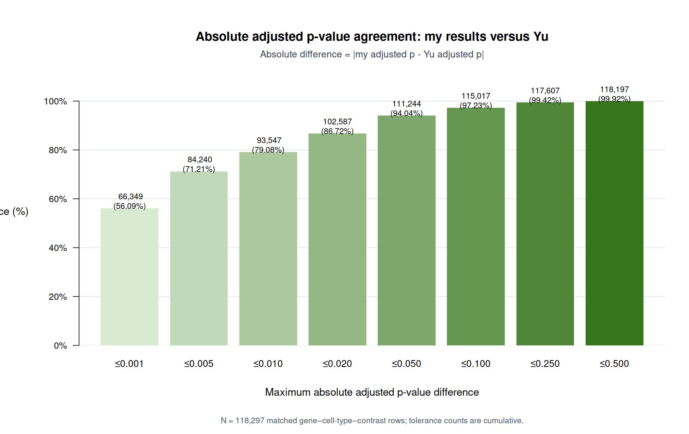
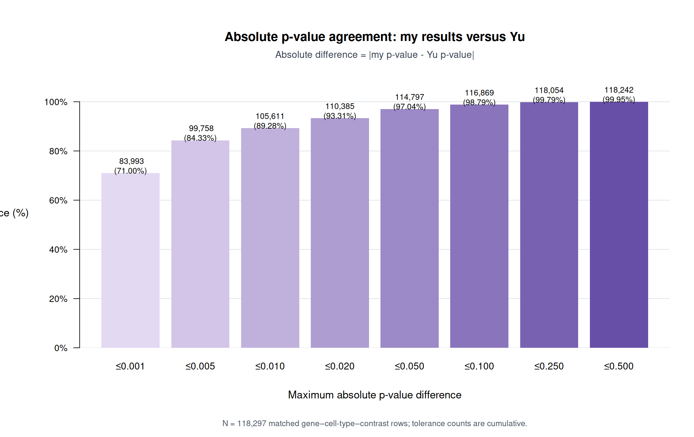

# DEG Difference Analysis Report

I have analyzed Vera Yu's differential expression gene (DEG) results reported in the `Table S1. DEGs` tab of `ALZ-22-e71463-s002.xlsx`, which is provided as one of the supplemental information of the paper. This tab contains 118,297 DEG data rows. Each row represents a gene–cell-type–contrast DEG result.

## Row number breakdown by contrast

| Contrast | Interpretation | Rows | Percent |
|---|---|---:|---:|
| `F_e2x_AD_vs_F_e2x_NCI` | Female, APOE ε2 carrier, AD vs NCI | 10,952 | 9.26% |
| `F_e33_AD_vs_F_e33_NCI` | Female, APOE ε3/ε3, AD vs NCI | 11,236 | 9.50% |
| `F_e4x_AD_vs_F_e4x_NCI` | Female, APOE ε4 carrier, AD vs NCI | 20,942 | 17.70% |
| `M_e2x_AD_vs_M_e2x_NCI` | Male, APOE ε2 carrier, AD vs NCI | 45,781 | 38.70% |
| `M_e33_AD_vs_M_e33_NCI` | Male, APOE ε3/ε3, AD vs NCI | 13,120 | 11.09% |
| `M_e4x_AD_vs_M_e4x_NCI` | Male, APOE ε4 carrier, AD vs NCI | 16,266 | 13.75% |
| **Total** |  | **118,297** | **100%** |

Yu's spreadsheet contains only DEG rows satisfying both of the following criteria:

- absolute fold change greater than 1.3 (`abs(avg_log2FC) > log2(1.3)`); and
- adjusted p-value less than 0.05 (`p_val_adj < 0.05`).

## Comparison with my DEG results

I can only compare my results with the DEG rows provided in Yu's spreadsheet. Because the spreadsheet does not include Yu's non-DEG results, a row absent from the spreadsheet cannot be compared directly at the raw-statistic level.

**In this comparison, “my side” includes only my DEG rows that meet the same thresholds: absolute fold change greater than 1.3 (`abs(logFC) > log2(1.3)`) and adjusted p-value less than 0.05 (`fdr_bh_within_contrast < 0.05`).** Rows were matched using the combination of cell type, contrast, and gene.

| Contrast | Yu DEG rows | My DEG rows | Overlapping rows | In Yu but missing from my side | Additional from my side |
|---|---:|---:|---:|---:|---:|
| `F_e2x_AD_vs_F_e2x_NCI` | 10,952 | 10,698 | 10,002 | 950 | 696 |
| `F_e33_AD_vs_F_e33_NCI` | 11,236 | 11,130 | 10,999 | 237 | 131 |
| `F_e4x_AD_vs_F_e4x_NCI` | 20,942 | 20,029 | 18,804 | 2,138 | 1,225 |
| `M_e2x_AD_vs_M_e2x_NCI` | 45,781 | 41,681 | 39,919 | 5,862 | 1,762 |
| `M_e33_AD_vs_M_e33_NCI` | 13,120 | 13,809 | 12,924 | 196 | 885 |
| `M_e4x_AD_vs_M_e4x_NCI` | 16,266 | 14,254 | 13,951 | 2,315 | 303 |
| **Total** | **118,297** | **111,601** | **106,599** | **11,698** | **5,002** |

“In Yu but missing from my side” means a DEG row reported by Yu that is not called as a DEG in my results. “Additional from my side” means a DEG row called in my results that is absent from Yu's DEG spreadsheet.

## Adjusted p-value comparison for all Yu DEG rows

All 118,297 rows in Yu's DEG spreadsheet have exactly one corresponding tested row in my Phase 08 results, matched by cell type, contrast, and gene. This comparison uses the adjusted p-value from every matched row on my side, including rows where my adjusted p-value does not pass the 0.05 DEG threshold.

| Yu DEG rows | Matched rows on my side | Missing adjusted p-values on my side | My adjusted `p < 0.05` | My adjusted `p >= 0.05` |
|---:|---:|---:|---:|---:|
| 118,297 | 118,297 | 0 | 106,599 | 11,698 |

### Absolute adjusted p-value difference

I calculated the absolute adjusted p-value difference for every matched row:

`absolute difference = abs(my adjusted p-value - Yu adjusted p-value)`

The absolute difference remains defined when either adjusted p-value is zero. The counts below are cumulative.

| Maximum absolute difference | Rows within tolerance | Percent of all 118,297 rows |
|---:|---:|---:|
| ≤0.001 | 66,349 | 56.09% |
| ≤0.005 | 84,240 | 71.21% |
| ≤0.010 | 93,547 | 79.08% |
| ≤0.020 | 102,587 | 86.72% |
| ≤0.050 | 111,244 | 94.04% |
| ≤0.100 | 115,017 | 97.23% |
| ≤0.250 | 117,607 | 99.42% |
| ≤0.500 | 118,197 | 99.92% |

The median absolute adjusted p-value difference is `0.000422`. The 75th percentile is `0.00699`, the 90th percentile is `0.0284`, and the maximum is `0.980`. Overall, 79.08% of matched rows differ by no more than 0.01 in absolute adjusted p-value and 86.72% differ by no more than 0.02.

*Figure 1. Number and percentage of the 118,297 matched Yu rows within each cumulative absolute adjusted p-value difference tolerance.*

## P-value comparison for all Yu DEG rows

All 118,297 rows in Yu's DEG spreadsheet have exactly one corresponding tested row with a finite raw p-value in my Phase 08 results. This comparison uses the raw p-value from every matched row on my side, including rows where my p-value does not pass 0.05.

| Yu DEG rows | Matched rows on my side | Missing p-values on my side | My `p < 0.05` | My `p >= 0.05` |
|---:|---:|---:|---:|---:|
| 118,297 | 118,297 | 0 | 113,668 | 4,629 |

### Absolute p-value difference

I calculated the absolute raw p-value difference for every matched row:

`absolute difference = abs(my p-value - Yu p-value)`

The counts below are cumulative.

| Maximum absolute difference | Rows within tolerance | Percent of all 118,297 rows |
|---:|---:|---:|
| ≤0.001 | 83,993 | 71.00% |
| ≤0.005 | 99,758 | 84.33% |
| ≤0.010 | 105,611 | 89.28% |
| ≤0.020 | 110,385 | 93.31% |
| ≤0.050 | 114,797 | 97.04% |
| ≤0.100 | 116,869 | 98.79% |
| ≤0.250 | 118,054 | 99.79% |
| ≤0.500 | 118,242 | 99.95% |

The median absolute p-value difference is `0.0000524`. The 75th percentile is `0.00162`, the 90th percentile is `0.0112`, and the maximum is `0.979`. Overall, 89.28% of matched rows differ by no more than 0.01 in absolute p-value and 93.31% differ by no more than 0.02.

*Figure 2. Number and percentage of the 118,297 matched Yu rows within each cumulative absolute raw p-value difference tolerance.*

## Source of the mismatch

The mismatch was resolved on 2026-07-22. The previous pipeline read
`ROSMAP_clinical.csv`, where 99 eligible donors had top-coded `90+` ages, and
converted every one of those ages to 90. Yu's code instead reads
`dataset_707_basic_02-08-2022.clean.txt`, which contains donor-specific exact
ages from 90.04 through 108.28.

Replacing only the age covariate with Yu's exact values reproduced every
Vasculature result. Across all 29 estimable comparisons:

| Metric | Corrected local pilot |
|---|---:|
| Yu DEG rows | 716 |
| Corrected Phase 08 DEG rows | 716 |
| Shared DEG rows | 716 |
| Recall | 100% |
| Precision | 100% |
| Median absolute raw-p difference | `8.47e-18` |
| Median absolute adjusted-p difference | `1.21e-15` |
| Raw-p Spearman correlation | 1.0 |

PMI differed only by text-rounding noise (maximum `3.33e-09`), while diagnosis,
sex, and APOE group matched for all 276 donors. A probe using Yu's exact ages
with the existing PMI values also reproduced all panel results, isolating exact
age at death as the cause.

### Ruled-out hypothesis: exact software environment

Yu reports Seurat version 5 but does not report the exact Seurat, MAST, R, Matrix, or supporting-package versions. My code used:

- R 4.3.3;
- Seurat 5.5.1;
- SeuratObject 5.4.0;
- MAST 1.28.0; and
- Matrix 1.6.5.

Differences in Seurat's MAST library version, MAST likelihood-ratio calculations, convergence handling, or supporting numerical libraries could change p-values and adjusted p-value while leaving log2FC unchanged.

## Controlled local software-version probe

On 2026-07-21, I tested the software-version hypothesis with the validated local
Vasculature normalized object. The probe held the cells, expression matrix,
covariates, `min.pct`, fold-change threshold, MAST call, and within-contrast BH
adjustment fixed. It used three contrasts selected before comparing candidates:

- End, female APOE-e33;
- Per, male APOE-e2; and
- End, female APOE-e4.

Together these contrasts contained 16,051 returned gene tests and 209 Yu DEG
rows. The current method produced 185 calls, of which 173 matched Yu (recall
82.78%, precision 93.51%). The median absolute raw-p difference from Yu was
`2.65e-05`; the median absolute adjusted-p difference was `0.00299`.

### Version results

| Environment change | Result relative to the current method |
|---|---|
| MAST 1.26.0, 1.28.0, 1.30.0, or 1.32.0 | Identical tested genes, DEG calls, overlap, and p-value agreement |
| Seurat/SeuratObject 5.0.1 instead of 5.5.1/5.4.0 | Identical tested genes, DEG calls, overlap, and p-value agreement |
| R 4.5.3/Matrix 1.7.4 instead of the stored R 4.3.3/Matrix 1.6.5 baseline | Median absolute p-value change `5.66e-15`; maximum `7.74e-12` |

The Seurat MAST wrapper is also functionally unchanged across the examined
Seurat 5 releases: it constructs the same `condition + latent variables`
formula, calls `MAST::zlm`, and performs the same likelihood-ratio test.

These results reject the tested package-version range as a material source of
the mismatch. Running the full 29 estimable Vasculature contrasts under every
candidate would repeat an unchanged model implementation and is not expected to
improve agreement.

### Follow-up implementation probes

Two plausible age-at-death encodings and two MAST fitting changes were also
tested on the same fixed panel:

| Variant | Calls | Shared | Recall | Precision | Median absolute raw-p difference |
|---|---:|---:|---:|---:|---:|
| Current defaults | 185 | 173 | 82.78% | 93.51% | `2.65e-05` |
| Encode `90+` as 92.5 | 182 | 172 | 82.30% | 94.51% | `3.33e-05` |
| Encode `90+` as 95 | 204 | 184 | 88.04% | 90.20% | `4.11e-05` |
| Use unregularized `glm` fitting | 195 | 179 | 85.65% | 91.79% | `2.46e-05` |
| Disable empirical-Bayes variance regularization | 548 | 204 | 97.61% | 37.23% | `4.14e-05` |

Encoding `90+` as 95 or disabling empirical Bayes increased recall by making
many more calls, but worsened precision, p-value correlation, and adjusted
p-value agreement. The unregularized `glm` fit emitted convergence warnings and
did not improve overall agreement. None is a defensible replacement for the
paper-specified Seurat `FindMarkers(..., test.use = "MAST")` default.

### Final interpretation

The mismatch was caused by age-data censoring, not Seurat, MAST, R, Matrix,
the MAST invocation, or BH adjustment. The corrected pipeline freezes Yu's
2022 clinical file by SHA-256, requires exact uncensored numeric ages, and
rejects a clinical source containing top-coded `+` ages.

Supporting files:

- `scripts/08_probe_mast_versions.R`
- `docs/debug/deg_mismatch/mast_version_probe_summary.tsv`
- `results/debug/deg_mismatch/version_matrix/probe/`
- `results/debug/deg_mismatch/version_matrix/full/yu_exact_2022_all_vasculature_overall.tsv`
