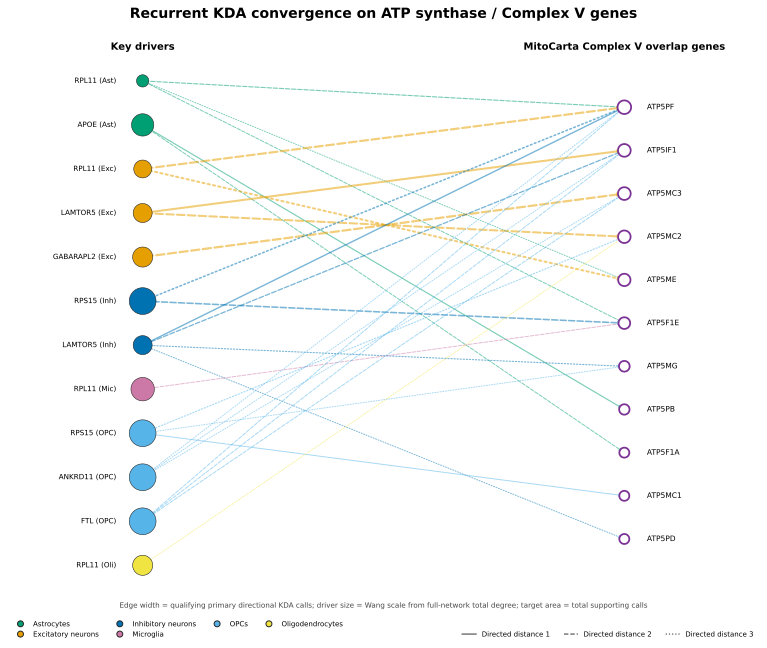

# Phase 12 ATP-synthase convergence figure explained

This figure is a focused summary of how repeatedly selected Phase 12 key
drivers connect to ATP synthase/Complex V genes across many KDA runs. Unlike
the Wang-style panels, it is not a literal subnetwork from one selected run.

## How to read the figure

### Left side: key drivers

Each filled circle is a key driver in a particular broad-cell-type Bayesian
network. The abbreviation identifies that network:

- `Ast`: astrocytes
- `Exc`: excitatory neurons
- `Inh`: inhibitory neurons
- `Mic`: microglia
- `OPC`: oligodendrocyte precursor cells
- `Oli`: oligodendrocytes

The same gene can appear more than once because it is evaluated in different
networks—for example, `RPL11 (Ast)`, `RPL11 (Exc)`, `RPL11 (Mic)`, and
`RPL11 (Oli)`.

Driver colors identify the network. Driver circle area represents the
driver's degree percentile within the complete corresponding network.
Therefore, a large driver is a highly connected network node; it is not
necessarily more significant or more recurrent.

### Right side: Complex V genes

The white circles with purple outlines are genes in the 26-gene MitoCarta ATP
synthase/Complex V set.

Only 11 appear in this focused map because these are the Complex V genes
connected to one of the seven prespecified driver families after filtering. A
larger target circle means that gene accumulated more supporting driver–target
calls across the displayed relationships.

For example, `ATP5PF` is especially large because it is repeatedly connected
to several drivers and networks.

### Edges

An arrow means that the Complex V gene appeared in the significant downstream
KDA overlap for that driver in at least one qualifying run.

Edge width increases with the number of distinct supporting KDA runs. It does
not represent an effect size or Bayesian-network edge confidence.

Line style records the shortest directed distance in the corresponding fixed
Bayesian network:

- Solid: direct driver → target edge
- Dashed: two-edge directed path
- Dotted: three-edge directed path

Thus, `LAMTOR5 (Exc) → ATP5IF1` is a direct relationship, while
`GABARAPL2 (Exc) → ATP5MC3` is connected through the two-edge path
`GABARAPL2 → CHCHD2 → ATP5MC3`.

The edge color matches the broad-cell-type network.

## Main recurrent relationships

The strongest relationships in the focused map are:

| Driver and network | Complex V target | Supporting runs | Up/down composition | Distance |
|---|---|---:|---|---:|
| `GABARAPL2` — excitatory | `ATP5MC3` | 15 | 4 AD-up, 11 AD-down | 2 |
| `RPL11` — excitatory | `ATP5PF` | 14 | 4 AD-up, 10 AD-down | 2 |
| `LAMTOR5` — excitatory | `ATP5IF1` | 12 | 4 AD-up, 8 AD-down | 1 |
| `LAMTOR5` — excitatory | `ATP5MC2` | 12 | 4 AD-up, 8 AD-down | 2 |
| `RPL11` — excitatory | `ATP5ME` | 12 | 1 AD-up, 11 AD-down | 3 |
| `RPS15` — inhibitory | `ATP5F1E` | 6 | 1 AD-up, 5 AD-down | 2 |
| `RPS15` — inhibitory | `ATP5PF` | 6 | 0 AD-up, 6 AD-down | 3 |
| `APOE` — astrocytes | `ATP5PB` | 2 | 0 AD-up, 2 AD-down | 1 |
| `APOE` — astrocytes | `ATP5F1A` | 1 | 0 AD-up, 1 AD-down | 2 |

For example, the `GABARAPL2–ATP5MC3` edge represents 15 distinct qualifying
runs spanning nine excitatory fine-cell types—not 15 Bayesian-network edges.

## Which KDA results are counted?

A Phase 12 result contributes only if it satisfies all of the following:

- It is a primary analysis.
- It uses a directional `AD_up_mito` or `AD_down_mito` signature.
- The driver is not mtDNA-encoded.
- The driver is not itself part of the overlap.
- The overall KDA overlap contains at least two genes.
- The mitochondrial signature contains at least ten genes.
- At least one overlap gene belongs to the 26-gene Complex V set.

Calls are deduplicated by KDA run ID for each broad-network–driver–target
combination.

## Biological interpretation

The principal result is that the ATP synthase signal is not restricted to one
illustrative KDA run. Several upstream systems repeatedly place Complex V
genes in their downstream mitochondrial neighborhoods, particularly:

- `LAMTOR5`, `GABARAPL2`, and `RPL11` in excitatory neurons
- `LAMTOR5` and `RPS15` in inhibitory neurons
- `APOE` in astrocytes
- `FTL`, `ANKRD11`, and `RPS15` in OPCs

This supports recurrent pathway-level convergence on Complex V across cell
types and sex/APOE contexts.

However, the figure combines AD-up and AD-down calls in the edge width. It
therefore demonstrates recurrence of network–pathway relationships, not a
universally shared disease direction. The runs also come from the same
underlying analysis resource and are not necessarily independent biological
replications.

The displayed figure contains 27 focused driver–target relationships. The
[complete supplement](../../../../../results/figures/analysis/phase12_kda/network_figures/phase12_kda_atp_convergence_complete.pdf)
contains all 93 qualifying combinations. Exact counts, directions, paths,
fine-cell-type coverage, and run IDs are available in
[`phase12_kda_atp_convergence_pairs.tsv`](../../../../../results/figures/analysis/phase12_kda/network_figures/phase12_kda_atp_convergence_pairs.tsv).

The filtering and plotting implementation is in
[`phase12_kda_network_figure_common.py`](../../../../../scripts/figures/analysis/phease12_kda/phase12_kda_network_figure_common.py).
