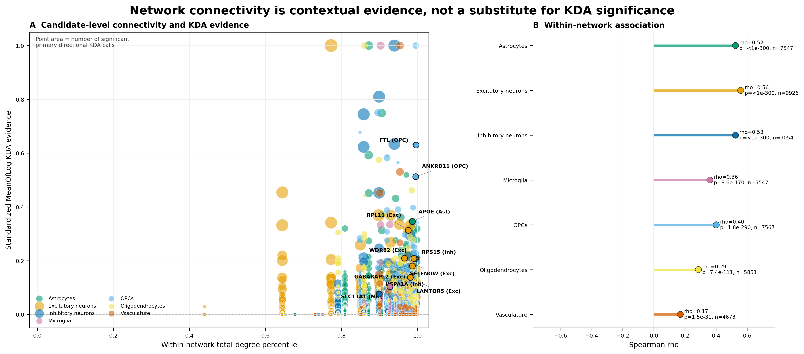

# Phase 12 connectivity-versus-KDA-evidence figure explained



## What question the figure addresses

This figure asks whether genes with stronger aggregate KDA evidence also tend
to be highly connected nodes in their complete broad-cell-type Bayesian
networks.

That is an important diagnostic because a highly connected node has a large
network neighborhood and may have more opportunities to overlap a query gene
set. Connectivity can therefore contribute to KDA ranking behavior. The figure
does not treat connectivity as an independent validation of a key driver.

The plotted universe contains 50,165 candidate-by-network records with at
least one eligible primary directional KDA ranking test. A gene can appear once
in each broad network in which it was tested.

## Panel A: candidate-level connectivity and KDA evidence

Each point represents one candidate gene in one broad-cell-type network.

### X-axis: within-network total-degree percentile

Total degree is the number of incoming plus outgoing connections for the gene
in the complete corresponding Bayesian network. It is not degree within one
of the small displayed subnetworks.

Degree is converted to a percentile separately within each broad network:

- a value near 1 identifies one of that network's most highly connected
  genes;
- a value near 0 identifies a relatively weakly connected gene;
- genes tied at the same degree receive the same upper-rank percentile.

For example, the `APOE` astrocyte value of 0.986 means its total degree of 13
is at approximately the 98.6th percentile of the astrocyte network.

### Y-axis: standardized MeanOfLog KDA evidence

For candidate (g) in broad network (n), the underlying MeanOfLog score is

\[
S_{n,g} = \frac{1}{K_{n,g}}
\sum_{r=1}^{K_{n,g}} -\log_{10}(p_{n,g,r}),
\]

where (p_{n,g,r}) is the raw KDA P value in eligible primary directional run
(r), and (K_{n,g}) is the number of runs in which that candidate could be
ranked. The included signatures are `AD_up_mito` and `AD_down_mito`; secondary
pooled analyses and the derived `AD_both_mito` signature are excluded.

The score is then divided by the largest MeanOfLog value in the same broad
network:

\[
S^{\mathrm{std}}_{n,g} =
\frac{S_{n,g}}{\max_g S_{n,g}}.
\]

Consequently:

- 1 is the largest MeanOfLog score in that network;
- 0.5 means half of that network's maximum score;
- the value is not a probability, combined P value, adjusted P value, or
  estimated biological effect size.

MeanOfLog is a ranking statistic based on the complete pre-significance
candidate-test matrix. Nonsignificant tests remain in the calculation, while
an implicit zero-overlap test contributes raw P = 1 and therefore
`−log10(1) = 0`.

Because standardization only divides all scores in a network by a positive
constant, it does not change their ranks or the within-network Spearman
correlation.

### Point color

Color identifies the broad-cell-type network:

- green: astrocytes;
- orange: excitatory neurons;
- dark blue: inhibitory neurons;
- pink: microglia;
- light blue: OPCs;
- yellow: oligodendrocytes;
- vermilion: vasculature.

### Point area

Point area increases with the number of primary directional runs in which the
candidate passed the adjusted KDA significance threshold:

```text
point_area = 18 + 38 * sqrt(number_of_significant_runs)
```

Point size therefore represents significant-run recurrence, not full-network
degree. Connectivity is encoded only on the x-axis in this figure. A point
with zero significant runs remains visible because of the 18-point baseline.

The labeled candidates are overplotted with a fixed black-bordered marker so
their positions are easy to find. Their actual significant-run counts should
be read from the accompanying data rather than inferred from the black outline.

### Why only selected genes are labeled

The labeled genes were prespecified:

`APOE`, `LAMTOR5`, `GABARAPL2`, `RPL11`, `RPS15`, `FTL`, `ANKRD11`,
`SELENOW`, `WDR82`, `SLC11A1`, and `HSPA1A`.

When a gene was present in more than one broad network, one context was chosen
for labeling by the following ordered rule:

1. most significant primary directional runs;
2. largest absolute standardized MeanOfLog score;
3. highest degree percentile.

The labels are therefore annotations of nominated genes, not an automated list
of the most extreme scatterplot points.

## Values for the seven central candidate systems

| Candidate and labeled network | Total degree | Degree percentile | Standardized MeanOfLog | Significant/ranking runs |
|---|---:|---:|---:|---:|
| `APOE` — astrocytes | 13 | 0.986 | 0.346 | 4/34 |
| `LAMTOR5` — excitatory neurons | 10 | 0.981 | 0.138 | 13/129 |
| `GABARAPL2` — excitatory neurons | 11 | 0.986 | 0.180 | 18/133 |
| `RPL11` — excitatory neurons | 9 | 0.976 | 0.313 | 24/133 |
| `RPS15` — inhibitory neurons | 18 | 0.995 | 0.207 | 14/92 |
| `FTL` — OPCs | 31 | 0.996 | 0.630 | 2/9 |
| `ANKRD11` — OPCs | 28 | 0.996 | 0.512 | 2/9 |

These candidates are all high-degree nodes, but their aggregate KDA scores
and recurrence counts differ substantially. In particular, the OPC values are
standardized against the OPC maximum and are based on only nine ranking runs,
whereas the excitatory-neuron candidates can have as many as 133 ranking runs.

## Panel B: within-network Spearman associations

Panel B calculates a separate Spearman rank correlation between degree
percentile and standardized MeanOfLog score within each broad network.
Spearman correlation measures monotonic rank association and does not require
a linear relationship or normally distributed variables.

| Broad network | Candidate records | Spearman rho | Nominal P value |
|---|---:|---:|---:|
| Astrocytes | 7,547 | 0.525 | <1 × 10⁻³⁰⁰ |
| Excitatory neurons | 9,926 | 0.559 | <1 × 10⁻³⁰⁰ |
| Inhibitory neurons | 9,054 | 0.525 | <1 × 10⁻³⁰⁰ |
| Microglia | 5,547 | 0.360 | 8.55 × 10⁻¹⁷⁰ |
| OPCs | 7,567 | 0.401 | 1.77 × 10⁻²⁹⁰ |
| Oligodendrocytes | 5,851 | 0.286 | 7.38 × 10⁻¹¹¹ |
| Vasculature | 4,673 | 0.170 | 1.54 × 10⁻³¹ |

The values stored as P = 0 for the first three networks are numerical
underflow, not literal zero probability; the figure reports them as
`P < 1e-300`.

The associations are positive in every network. They are moderate in
astrocytes and excitatory and inhibitory neurons, smaller in microglia and
OPCs, and weakest in oligodendrocytes and vasculature. The enormous candidate
counts make even the weak vasculature association highly significant, so rho
is more informative than the P value for judging magnitude.

## Main interpretation

The figure supports two related conclusions:

1. More highly connected genes tend to receive stronger aggregate KDA ranking
   evidence.
2. Connectivity does not determine the KDA score perfectly: all correlations
   are well below 1, and genes with similar degree percentiles show substantial
   vertical variation in MeanOfLog evidence.

The first conclusion is a warning against treating a large network node as
independent support for biological importance. The second shows that degree is
not a one-to-one substitute for cross-run KDA evidence.

However, this figure does **not** formally demonstrate that an individual
candidate has more evidence than expected after adjusting for degree. That
would require a prespecified degree-matched permutation analysis, regression,
or residual/rank comparison. The present correlations are descriptive hub-bias
diagnostics.

## Important limitations

- The Spearman P values are nominal and exploratory. No bootstrap confidence
  intervals are displayed, and the seven network correlations are not shown
  with a multiple-testing correction.
- Candidate nodes within a network are not guaranteed to be statistically
  independent: they share network structure and many of the same KDA query
  runs. Standard Spearman P values may therefore overstate precision.
- The y-axis uses raw KDA P values for ranking, while point area counts runs
  passing the adjusted KDA threshold. These are related but different
  quantities.
- Ranking coverage varies. Of 50,165 plotted records, 10,468 have coverage
  below 80% of eligible directional runs. Missing tests are not converted to
  P = 1, so a low-coverage candidate's score is an average over fewer observed
  runs. Coverage is retained in the TSV but is not encoded in the plot.
- Scores are normalized separately by network maxima. A y-value of 0.6 in one
  network is not the same absolute raw MeanOfLog evidence as 0.6 in another.
- The candidate universe includes mtDNA-encoded genes as well as nuclear
  genes. The plot is a complete ranking diagnostic, not a restricted display
  of the seven highlighted nuclear candidates.
- Correlation does not establish that connectivity causes KDA evidence or that
  any labeled candidate causally regulates disease biology.

## Supporting files

- [Vector figure](../../../../../results/figures/analysis/phase12_kda/network_figures/phase12_kda_connectivity_evidence.svg)
- [Complete plotted points](../../../../../results/figures/analysis/phase12_kda/network_figures/phase12_kda_connectivity_evidence_points.tsv)
- [Within-network correlations](../../../../../results/figures/analysis/phase12_kda/network_figures/phase12_kda_connectivity_evidence_correlations.tsv)
- [Labeled candidate records](../../../../../results/figures/analysis/phase12_kda/network_figures/phase12_kda_connectivity_evidence_labels.tsv)
- [Raw-degree diagnostic supplement](../../../../../results/figures/analysis/phase12_kda/network_figures/phase12_kda_connectivity_evidence_by_network.pdf)
- [Figure-generation implementation](../../../../../scripts/figures/analysis/phease12_kda/phase12_kda_network_figure_common.py)
