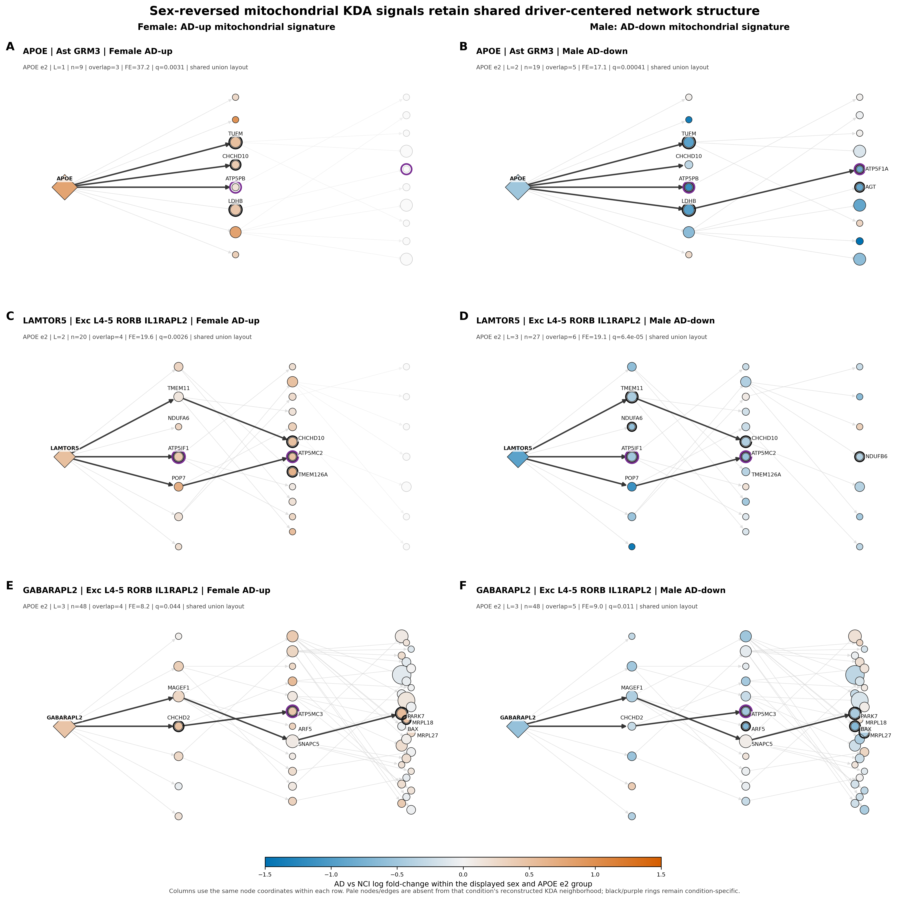

# Phase 12 sex-reversal networks explained

## What question the figure addresses

The figure asks whether three candidate-driver systems occupy mitochondrial
KDA neighborhoods in both female and male APOE-ε2 strata while the associated
AD-versus-NCI expression pattern changes direction:

- female APOE-ε2: an AD-up mitochondrial signature;
- male APOE-ε2: an AD-down mitochondrial signature.

The left and right panels in each row use the same fine cell type, driver,
broad-cell Bayesian network, node coordinates, node-size scale, and expression
color scale. This makes the female-to-male comparison visually direct.

Importantly, the Bayesian networks were not estimated separately by sex. The
same fixed broad-cell network is reused in both columns. Consequently, the
shared topology is a design feature of the comparison, not evidence that the
network edges were independently reproduced in females and males. The
empirical differences shown here are the expression colors, active KDA
neighborhoods, and KDA-overlap membership.

## Panel organization and KDA results

| Panels | Driver and fine cell type | Female APOE-ε2 AD-up | Male APOE-ε2 AD-down |
|---|---|---|---|
| A and B | `APOE`, Ast GRM3 | L1; 3/9 overlap; FE = 37.2; q = 0.0031 | L2; 5/19 overlap; FE = 17.1; q = 0.00041 |
| C and D | `LAMTOR5`, Exc L4-5 RORB IL1RAPL2 | L2; 4/20 overlap; FE = 19.6; q = 0.0026 | L3; 6/27 overlap; FE = 19.1; q = 6.4 × 10⁻⁵ |
| E and F | `GABARAPL2`, Exc L4-5 RORB IL1RAPL2 | L3; 4/48 overlap; FE = 8.2; q = 0.044 | L3; 5/48 overlap; FE = 9.0; q = 0.011 |

Here:

- **L** is the best downstream neighborhood layer for that KDA result.
- The overlap value is the number of mitochondrial signature genes divided by
  the complete neighborhood size.
- **FE** is fold enrichment of the mitochondrial signature in the complete
  driver neighborhood.
- **q** is the adjusted KDA P value.

The FE and q values apply to the complete enriched neighborhood. They do not
apply separately to an individual node, edge, or highlighted path.

## How to read the visual encodings

### Columns and shared layouts

The left column contains female AD-up runs and the right column contains male
AD-down runs. For each row, the displayed graph is the union of the female and
male reconstructed neighborhoods, and its coordinates are calculated once.
The exact positions are then reused in both panels.

Elements absent from the condition-specific reconstructed neighborhood are
faded. This is why panel A contains many pale nodes that become active in
panel B: the female `APOE` result uses a 9-node layer-1 neighborhood, whereas
the male result uses a 19-node layer-2 neighborhood. Similarly, panel C has 20
active nodes and panel D has 27. Panels E and F each have all 48 nodes active,
although their overlap membership differs.

### Node shape and size

- A diamond is the focal key driver: `APOE`, `LAMTOR5`, or `GABARAPL2`.
- Circles are other genes in the displayed union neighborhood.
- Node diameter represents total degree in the complete corresponding
  broad-cell network, not degree within the small displayed subgraph.
- The diameter follows `min(24, 7 + total_degree)` points; driver diamonds
  receive an additional 25% area enlargement.

A large node is therefore a broadly connected network node. It is not
automatically more differentially expressed, more significant, or more
strongly regulated.

### Node color

Node fill is the Phase 08 AD-versus-NCI log fold-change for the displayed fine
cell type, sex, and APOE-ε2 group:

- blue: lower expression in AD;
- orange: higher expression in AD;
- near-white: little change, unavailable expression data, or a node faded
  because it is inactive in that condition's reconstructed neighborhood.

All six panels use the same symmetric color range, from −1.5 to +1.5. The
color describes the gene's expression contrast; it does not give the sign or
strength of an outgoing Bayesian-network edge.

Also, “AD-up signature” and “AD-down signature” refer to the mitochondrial
gene set used as the KDA query. Those labels do not, by themselves, state that
the candidate driver is up- or downregulated.

### Rings

- A thick black ring marks a gene that belongs to that condition's significant
  KDA mitochondrial overlap.
- A purple ring identifies a MitoCarta ATP synthase/Complex V gene.

The black overlap rings can therefore change between the female and male
panels even when node positions are identical. Purple rings identify Complex V
membership independently of expression color or KDA-overlap status.

For example, the `APOE` female overlap is `CHCHD10`, `LDHB`, and `TUFM`, while
the male overlap is `AGT`, `ATP5F1A`, `ATP5PB`, `LDHB`, and `TUFM`.
`ATP5PB` is present in the female neighborhood and on a highlighted route, but
it lacks a female black overlap ring.

### Edges

Arrows show direction in the fixed Bayesian network. Pale gray edges provide
the rest of the reconstructed neighborhood. Dark edges are prespecified
shortest directed paths to selected mitochondrial or ATP-synthase targets:

- `APOE`: routes to `TUFM`, `CHCHD10`, and `ATP5PB`; the male panel also
  contains `APOE → LDHB → ATP5F1A`.
- `LAMTOR5`: `LAMTOR5 → ATP5IF1`,
  `LAMTOR5 → POP7 → ATP5MC2`, and
  `LAMTOR5 → TMEM11 → CHCHD10`.
- `GABARAPL2`: `GABARAPL2 → CHCHD2`,
  `GABARAPL2 → CHCHD2 → ATP5MC3`, and
  `GABARAPL2 → MAGEF1 → SNAPC5 → PARK7`.

A highlighted edge is an interpretive emphasis, not a larger effect, stronger
confidence, or separate statistical test. A directed Bayesian-network edge
also does not establish physical binding, activation, inhibition, or molecular
causality.

Only selected biologically relevant genes are labeled. Unlabeled nodes and
edges remain part of the displayed neighborhood.

## Quantitative expression reversal

The color reversal is supported by the matched log fold-change values:

| System | Gene | Female AD-up logFC | Male AD-down logFC |
|---|---|---:|---:|
| Astrocyte `APOE` | `APOE` | +0.785 | −0.506 |
|  | `TUFM` | +0.506 | −0.939 |
|  | `ATP5PB` | +0.153 | −1.151 |
|  | `ATP5F1A` | +0.280 | −0.816 |
| Excitatory `LAMTOR5` | `LAMTOR5` | +0.505 | −0.928 |
|  | `ATP5IF1` | +0.420 | −0.497 |
|  | `ATP5MC2` | +0.492 | −0.560 |
| Excitatory `GABARAPL2` | `GABARAPL2` | +0.463 | −0.573 |
|  | `ATP5MC3` | +0.430 | −0.491 |
|  | `PARK7` | +0.532 | −0.442 |

The female `ATP5F1A` value is retained for aligned topology and expression
comparison, but the node is inactive in the female layer-1 `APOE`
neighborhood and was not a paper-defined DEG. Its faded appearance preserves
those distinctions.

## Biological interpretation

Across all three systems, the focal driver and the highlighted mitochondrial
or Complex V genes are generally orange and positive in the female APOE-ε2
panels but blue and negative in the male APOE-ε2 panels. At the same time,
significant KDA enrichment is present on both sides of each comparison.

The strongest defensible interpretation is therefore:

> The same fixed driver-centered network framework links `APOE`, `LAMTOR5`,
> and `GABARAPL2` to mitochondrial or ATP-synthase genes in both APOE-ε2 sex
> strata, while matched AD-versus-NCI expression estimates show opposite
> descriptive directions.

This joins the Phase 08 expression reversal to Phase 12 KDA topology, but it
does not prove that the drivers cause the expression changes.

## Important limitations

- The comparison is descriptive. No formal AD-by-sex, AD-by-APOE, or
  three-way interaction was fitted for this figure.
- The male APOE-ε2 contrasts contain 7 AD and 6 NCI donors; the female
  contrasts contain 8 AD and 17 NCI donors. The small male groups require
  donor-level sensitivity analysis and cautious interpretation.
- The broad-cell network is reused across sexes, so the figure does not test
  whether network topology itself differs or is conserved by sex.
- KDA enrichment concerns a whole downstream neighborhood; the figure does
  not assign causal effects or statistical significance to individual edges.
- The two groups are not independent external replications and are derived
  from the same underlying study resource.

## Supporting files

- [Vector figure](../../../../../results/figures/analysis/phase12_kda/network_figures/phase12_kda_sex_reversal_networks.svg)
- [Panel node data](../../../../../results/figures/analysis/phase12_kda/network_figures/phase12_kda_sex_reversal_networks_nodes.tsv)
- [Panel edge data](../../../../../results/figures/analysis/phase12_kda/network_figures/phase12_kda_sex_reversal_networks_edges.tsv)
- [Highlighted paths](../../../../../results/figures/analysis/phase12_kda/network_figures/phase12_kda_sex_reversal_networks_paths.tsv)
- [Figure-generation implementation](../../../../../scripts/figures/analysis/phease12_kda/phase12_kda_network_figure_common.py)
