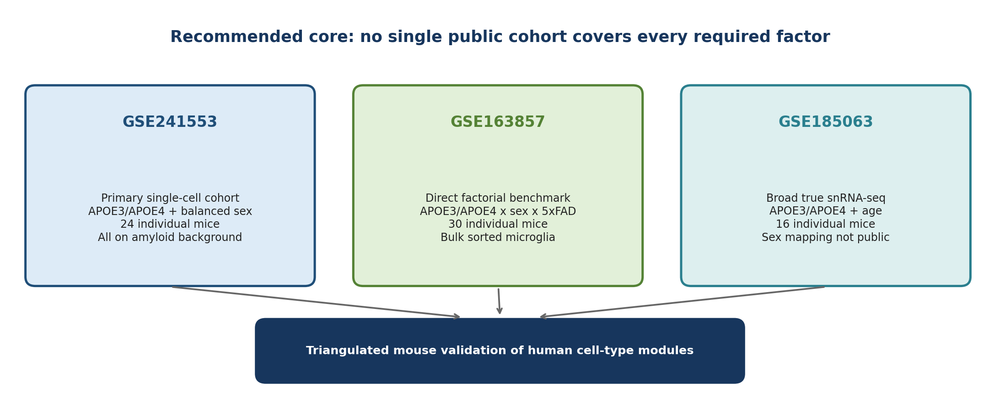

# Public Mouse Datasets

## Alzheimer-related mouse single-cell and single-nucleus RNA-seq datasets for APOE-by-sex validation

**Updated research report**  
Focus: human APOE isoforms, sex, disease background, independent biological replication, and cell-type breadth

| **Search cutoff**   | 22 August 2026                                                          |
|---------------------|-------------------------------------------------------------------------|
| **Primary sources** | NCBI GEO/SRA records and linked peer-reviewed papers                    |
| **Prior report**    | Reviewed and updated; key conclusions retained with ranking refinements |

> **Core conclusion:** No single publicly available dataset was identified that simultaneously provides human APOE isoforms, both sexes, matched AD-model and non-AD mice, true snRNA-seq, adequate independent-mouse replication in every factorial group, and broad brain cell-type coverage.

# Executive summary

The attached August 19 search reached the correct central conclusion: a complete public APOE x sex x AD/control single-cell or single-nucleus cohort was not found. This update re-audited the highest-value accessions, separated cell counts from independent-mouse replication, and distinguished strict snRNA-seq resources from scRNA-seq and bulk complements.

> **Recommended decision**
> Use a triangulated three-study core rather than forcing one imperfect cohort to answer every question: GSE241553 for the strongest sex-balanced single-cell APOE3/APOE4 comparison within an amyloid background; GSE163857 for the only direct APOE3/APOE4 x sex x 5xFAD/control interaction benchmark; and GSE185063 for true snRNA-seq localization across neuronal, glial, and vascular cell classes. Add GSE143758 as an optional matched 5xFAD/WT true snRNA-seq disease and astrocyte-state validation dataset. Treat these studies as complementary evidence and do not merge their expression matrices.

## What is available

- **Best sex-balanced single-cell near-match:** GSE241553, with 24 individual mice, four groups, six mice per group, and three males plus three females per group. It is scRNA-seq, all mice are on an amyloid-model background, and APOE expression is conditional in microglia/CNS-associated macrophages.

- **Best broad true snRNA-seq APOE resource:** GSE185063, with 16 mouse cortex samples and four mice per APOE-genotype-by-age group. It includes neurons, astrocytes, oligodendroglia, microglia, OPCs, and vascular populations. It has no AD background, and public sample-level sex mapping is unresolved.

- **Best direct factorial benchmark:** GSE163857, with all eight APOE3/APOE4 x female/male x 5xFAD/control combinations. It is bulk RNA-seq of sorted microglia, and the control groups are small and unbalanced.

- **Best matched AD/control true snRNA-seq complement without human APOE:** GSE143758, with 5xFAD and WT hippocampal nuclei, a broad seven-month all-cell atlas, and an astrocyte-focused age series. The main seven-month comparison has four mice per genotype, but only two females occur in the entire study and there is no APOE3/APOE4 experimental factor.

- **Best APOE2/APOE3/APOE4 AD immune atlas:** GSE225503/GSE239999, with 5xFAD mice, multiple ages, and CD45-positive brain immune cells. Sex is not exposed and there is no non-AD background.

## Strict snRNA-seq versus practical validation

<table>
<colgroup>
<col style="width: 50%" />
<col style="width: 50%" />
</colgroup>
<thead>
<tr class="header">
<th><strong>Strict snRNA-seq track</strong></th>
<th><strong>Practical validation track</strong></th>
</tr>
</thead>
<tbody>
<tr class="odd">
<td><ul>
<li>
GSE185063: broad cortex snRNA-seq; APOE3/APOE4; 16 mice; no AD model; sex mapping unavailable.
</li>
<li>
GSE213446: hippocampal snRNA-seq; APOE3/APOE4 x P301S tauopathy; one public library per condition and no exposed sex labels.
</li>
<li>
GSE143758: hippocampal 5xFAD/WT snRNA-seq with a broad seven-month all-nuclei matrix and an astrocyte-focused age series; no human APOE isoform factor and only two females.
</li>
<li>
Conclusion: no strict snRNA cohort is ready for a well-powered sex x APOE x disease interaction.
</li>
</ul></td>
<td><ul>
<li>
GSE241553: scRNA-seq; 24 mice; balanced sex; APOE3/APOE4; amyloid background.
</li>
<li>
GSE163857: bulk sorted microglia; exact APOE x sex x disease design.
</li>
<li>
GSE185063: snRNA-seq cell-type localization.
</li>
<li>
Conclusion: this combination supports a defensible triangulated validation.
</li>
</ul></td>
</tr>
</tbody>
</table>

**Figure 1. Recommended three-study core and the distinct role of each dataset.**

## What changed from the previous search

1.  GSE241553 is elevated to the primary single-cell cohort because its 24 GEO samples correspond to 24 mice and the design is explicitly sex-balanced. Its major caveat is not replication but the lack of a non-AD background and the conditional, microglia/CAM-restricted APOE design.

2.  GSE185063 is elevated as the strongest broad true snRNA-seq reference. The sample suffix "F" denotes flox/flox, not female; sex cannot be read from the sample names. Sex-specific use requires author metadata or a carefully verified sex assignment from X/Y-linked expression.

3.  GSE213446 and GSE127884/GSE127893 are downgraded for formal interaction testing. The former exposes one GEO library per condition; the latter exposes thousands of cell/well records, which must not be mistaken for thousands of biological replicates.

4.  GSE143758 is added as the strongest APOE-independent matched 5xFAD/WT snRNA-seq disease complement. It is useful for broad seven-month cell-type localization, disease-associated astrocytes, and age progression, but it cannot test APOE isoform effects and its two-female design does not support sex inference.

# 1. Evaluation criteria and interpretation

A dataset was considered an exact match only if it met all of the following. Partial matches remain useful, but they answer narrower questions.

| **Criterion**              | **Operational interpretation**                                                                              |
|----------------------------|-------------------------------------------------------------------------------------------------------------|
| **Human APOE isoforms**    | At minimum APOE3 versus APOE4; APOE2 is desirable for a full three-isoform validation.                      |
| **Sex**                    | Female and male labels must be available for each independent mouse or recoverable with high confidence.    |
| **Disease contrast**       | An AD-related model and a matched non-AD background should be present within the same study.                |
| **Modality**               | True snRNA-seq is preferred; scRNA-seq can be used as a near-match; bulk data are supporting evidence only. |
| **Biological replication** | Independent mice, not cells, wells, or nuclei, determine inferential sample size.                           |
| **Cell-type breadth**      | Neurons, astrocytes, oligodendrocytes/OPCs, microglia, and vascular cells are preferred.                    |
| **Public usability**       | Processed data, raw data, and enough metadata to reconstruct mouse-level groups should be available.        |

> **Replication rule**
> Large cell counts do not compensate for small mouse counts. Pseudobulk or mixed-model analyses must retain mouse or independently prepared library as the biological unit. A pooled library is one experimental unit unless individual animals were separately tagged and demultiplexed.

# 2. Dataset coverage matrix

Ratings describe fitness for the requested APOE-by-sex Alzheimer validation, not overall scientific quality.

| **Dataset**               | **Modality**           | **Human APOE**         | **Sex metadata**                            | **AD / matched control**                                | **Independent replication**                                        | **Cell types**                                               | **Best role**                                      | **Primary limitation**                                           |
|---------------------------|------------------------|------------------------|---------------------------------------------|---------------------------------------------------------|--------------------------------------------------------------------|--------------------------------------------------------------|----------------------------------------------------|------------------------------------------------------------------|
| **GSE241553**             | scRNA-seq              | E3 / E4                | Strong: 3F + 3M per group                   | Partial: amyloid only; Ctrl/TAM is induction            | Strong: 24 mice; 6/group                                           | Glial, immune, vascular; limited neurons                     | Primary sex x APOE single-cell test within amyloid | Not snRNA; no non-AD; conditional microglial/CAM APOE            |
| **GSE185063**             | snRNA-seq              | E3 / E4                | Unclear: both sexes used, sample map absent | No: APOE-only background                                | Strong: 16 mice; 4/genotype-age group                              | Broad neuronal, glial, OPC, vascular                         | Broad cell-type APOE localization                  | Cannot test sex cleanly without metadata; no AD model            |
| **GSE163857**             | Bulk sorted microglia  | E3 / E4                | Strong                                      | Strong: 5xFAD / targeted-replacement control            | Partial: 30 mice, but n=1-3 in several controls                    | Microglia only                                               | Direct APOE x sex x disease benchmark              | Not single-cell; imbalanced factorial cells                      |
| **GSE213446**             | snRNA-seq              | E3 / E4                | Unclear / not exposed                       | Partial: P301S tauopathy / non-tau                      | Limited: one GEO library per condition                             | Hippocampal nuclei                                           | Descriptive APOE x tau cell-state localization     | No replicate-aware inference from public design; tau not amyloid |
| **GSE212606**             | EasySci scRNA + scATAC | E4 only in LOAD model  | Strong: both sexes                          | Strong for 5xFAD/WT; LOAD model bundles E4 + TREM2 R47H | Unclear from 3 aggregate GEO entries; animal manifest needed       | \>300 brain cell subtypes                                    | Broad sex x disease localization                   | No APOE3 comparator; APOE4 confounded with TREM2                 |
| **GSE143758**             | snRNA-seq              | No human APOE          | Weak: mostly male; 1F WT + 1F 5xFAD         | Strong: 5xFAD / WT; multiple ages                       | Moderate: main 7m atlas 8 mice; hemisphere libraries are technical | Broad at 7m; age/cortex processed matrices mostly astrocytes | Independent AD cell-type, DAA, and age validation  | No APOE isoform factor; sex interaction unsupported              |
| **GSE225503 / GSE239999** | scRNA + multiome       | E2 / E3 / E4           | No public sex field                         | No: all 5xFAD                                           | Partial: n=3-6 animals/age-genotype; HTO at young ages             | CD45+ immune cells, mainly microglia                         | APOE allele and age immune-state validation        | No sex; no non-AD; incomplete allele-by-age grid                 |
| **GSE127884 / GSE127893** | Microglial scRNA-seq   | Mouse Apoe / Apoe-null | Strong: female and male                     | Strong: AppNL-G-F / age-matched control                 | Unclear until pool/mouse manifest is audited                       | Microglia only                                               | Sex x amyloid microglial concordance               | Not human APOE isoforms; GEO sample count is cells/wells         |
| **GSE212317 / GSE213391** | scRNA / spatial        | E3 / E4                | No: female only                             | Partial and age-confounded                              | Limited: pooled n=3 mice/library                                   | Glia-enriched non-neuronal cells                             | Descriptive metabolic/glial comparison             | No sex contrast; pooling; disease/age confounding                |

**Table 1. Public dataset coverage and inferential suitability. F=female; M=male; HTO=hashtag oligonucleotide demultiplexing.**

# 3. Detailed dataset profiles

## 3.1 GSE241553 - best sex-balanced single-cell APOE cohort

[**GSE241553**](https://www.ncbi.nlm.nih.gov/geo/query/acc.cgi?acc=GSE241553) - mouse cortex scRNA-seq associated with Liu et al., Nature Immunology 2023. [Linked paper](https://pubmed.ncbi.nlm.nih.gov/37857825/)

| **Item**            | **Assessment**                                                                                                                                                                                          |
|---------------------|---------------------------------------------------------------------------------------------------------------------------------------------------------------------------------------------------------|
| **Design**          | Amyloid-model mice carrying conditional apoE3 or apoE4 constructs in microglia/CNS-associated macrophages, with vehicle control or tamoxifen induction.                                                 |
| **Replication**     | 24 mice total; four groups; n=6 per group; three females and three males per group. The 24 GEO samples are separate mouse libraries.                                                                    |
| **Best comparison** | Within tamoxifen-induced mice, compare APOE3 versus APOE4 by sex. This yields n=3 in each sex-by-APOE cell. A full model can include induction, but induction must not be labeled as AD versus control. |
| **Cell types**      | Strongest for microglia/CAMs and supporting glial/vascular populations. Neuronal coverage is limited relative to a whole-brain nuclei atlas.                                                            |
| **Strength**        | This is the cleanest public resource for a mouse-level sex x APOE interaction in an Alzheimer amyloid context.                                                                                          |
| **Limitation**      | It is scRNA-seq rather than snRNA-seq; all animals are on an amyloid background; APOE expression is conditional and cell-restricted rather than a whole-body targeted-replacement allele.               |

**Recommended model:** within the induced amyloid subset, fit a per-mouse pseudobulk or module-level model such as score ~ sex \* APOE. With n=3 per factorial cell, treat genome-wide interaction discovery as exploratory; pre-specified pathway/module effects and confidence intervals are more defensible.

## 3.2 GSE185063 - strongest broad true snRNA-seq APOE reference

[**GSE185063**](https://www.ncbi.nlm.nih.gov/geo/query/acc.cgi?acc=GSE185063) - 10x single-nucleus RNA-seq of APOE3 and APOE4 knock-in mouse cortex. [Linked paper](https://pubmed.ncbi.nlm.nih.gov/36040482/)

| **Item**        | **Assessment**                                                                                                                                                                |
|-----------------|-------------------------------------------------------------------------------------------------------------------------------------------------------------------------------|
| **Design**      | APOE3 versus APOE4 knock-in mice at approximately 2-3 months and 9-12 months; no amyloid or tau disease transgene.                                                            |
| **Replication** | 16 mice total; four mice per genotype-by-age group.                                                                                                                           |
| **Cell types**  | Excitatory and inhibitory neurons, astrocytes, oligodendrocytes, OPCs, microglia, and vascular populations including endothelial and pericyte-like nuclei.                    |
| **Sex status**  | The paper reports use of both sexes, but the public GEO record does not expose a reliable per-sample sex map or balance. The sample suffix "F" denotes flox/flox, not female. |
| **Strength**    | Best public dataset for mapping APOE3/APOE4 effects across the cell classes most relevant to human snRNA-seq findings.                                                        |
| **Limitation**  | No AD disease background; sex-specific inference should wait for author metadata or a carefully validated expression-based sex assignment.                                    |

**Recommended use:** first fit APOE x age models by cell type. Add sex only after obtaining a mouse-level sex key. If sex is inferred computationally, use multiple markers (for example Xist together with Ddx3y, Kdm5d, and Uty), inspect ambiguous samples, and seek author confirmation before publication.

## 3.3 GSE163857 - direct APOE x sex x disease benchmark in microglia

[**GSE163857**](https://www.ncbi.nlm.nih.gov/geo/query/acc.cgi?acc=GSE163857) - bulk RNA-seq of FACS-sorted microglia from human APOE targeted-replacement mice on control or 5xFAD backgrounds. [Linked publication](https://pubmed.ncbi.nlm.nih.gov/34746703/)

The mouse portion contains 30 independent samples and all eight factorial combinations. Exact counts reconstructed from GEO sample titles are shown below.

| **Sex**    | **APOE** | **Disease background** | **Mouse n** |
|------------|----------|------------------------|-------------|
| **Female** | APOE3    | Control/TR             | 2           |
| **Female** | APOE3    | 5xFAD                  | 5           |
| **Female** | APOE4    | Control/TR             | 2           |
| **Female** | APOE4    | 5xFAD                  | 5           |
| **Male**   | APOE3    | Control/TR             | 1           |
| **Male**   | APOE3    | 5xFAD                  | 7           |
| **Male**   | APOE4    | Control/TR             | 3           |
| **Male**   | APOE4    | 5xFAD                  | 5           |

**Table 2. GSE163857 mouse sample counts reconstructed from GEO sample names.**

**Recommended model:** expression or pre-specified module score ~ sex \* APOE \* disease. Report the three-way and two-way interaction estimates with confidence intervals, but do not interpret a non-significant three-way term as strong negative evidence because several control cells contain only one to three mice.

**Role in the validation package:** use this study to establish whether the human APOE-by-sex direction depends on amyloid disease background in microglia, then use single-cell datasets to localize related programs to microglial states.

## 3.4 GSE213446 - true hippocampal snRNA-seq with APOE and tauopathy

[**GSE213446**](https://www.ncbi.nlm.nih.gov/geo/query/acc.cgi?acc=GSE213446) - hippocampal nuclei from APOE3/APOE4 mice with or without P301S tauopathy and with water or antibiotic treatment.

- **Advantages:** true snRNA-seq, human APOE3/APOE4, and a disease versus non-tau contrast within one experimental system.

- **Critical limitation:** GEO exposes one library for each listed condition, and sample-level sex is not exposed. Unless the underlying library contains separately tagged mice, ordinary replicate-aware pseudobulk testing is not supported.

- **Interpretive limitation:** P301S tauopathy is not interchangeable with 5xFAD or AppNL-G-F amyloid pathology.

**Recommended role:** descriptive cell-state and module-direction validation, or a higher-priority dataset only after the authors provide mouse-level sex, pooling, and replicate metadata.

## 3.5 GSE212606 - broadest sex-aware Alzheimer cell atlas

[**GSE212606**](https://www.ncbi.nlm.nih.gov/geo/query/acc.cgi?acc=GSE212606) - EasySci single-cell RNA-seq and ATAC-seq across mouse age, genotype, and both sexes. [Linked paper](https://www.nature.com/articles/s41588-023-01572-y)

- **Scale and breadth:** approximately 1.5 million transcriptomes and more than 300 cell subtypes across whole brain, with both sexes represented.

- **Disease models:** early-onset 5xFAD and a late-onset model combining APOE4 with TREM2 R47H.

- **Main limitation for this question:** there is no clean APOE3 comparator for the APOE4/TREM2 model, so APOE4 cannot be separated from TREM2 R47H. The three GEO entries are aggregate records, not a biological sample count.

**Recommended role:** broad cell-type validation of sex x disease effects and localization of mitochondrial or stress modules to neurons, astrocytes, oligodendroglia, microglia, and vascular cells. Do not present it as an APOE isoform comparison.

## 3.6 GSE143758 - matched 5xFAD/WT snRNA-seq disease and astrocyte reference

[**GSE143758**](https://www.ncbi.nlm.nih.gov/geo/query/acc.cgi?acc=GSE143758) - hippocampal single-nucleus RNA-seq from 5xFAD and WT mice, associated with Habib et al., Nature Neuroscience 2020. [Linked paper](https://pubmed.ncbi.nlm.nih.gov/32341542/)

| **Item**        | **Assessment**                                                                                                                                                                                                                                                                                    |
|-----------------|---------------------------------------------------------------------------------------------------------------------------------------------------------------------------------------------------------------------------------------------------------------------------------------------------|
| **Design**      | 5xFAD versus WT hippocampal snRNA-seq across several ages. The public processed data include a broad seven-month all-nuclei matrix, an astrocyte-focused hippocampal age series, and cortical astrocyte matrices at seven and ten months.                                                         |
| **Replication** | The main seven-month atlas contains eight biological mice (4 WT and 4 5xFAD). Ten libraries were generated because left and right hemispheres from some mice were processed separately; hemisphere libraries must not be counted as independent mice.                                             |
| **Sex status**  | The study is overwhelmingly male. One female WT and one female 5xFAD mouse were included, so the female data support only qualitative confirmation that the disease-associated astrocyte state can occur in both sexes.                                                                           |
| **Cell types**  | The seven-month all-nuclei matrix covers excitatory and inhibitory neurons, astrocytes, microglia, oligodendrocytes, OPCs, endothelial/pericyte populations, ependymal or progenitor populations, and fibroblast-like cells. Processed age-course and cortex files are largely astrocyte-focused. |
| **Strength**    | True snRNA-seq with a within-study 5xFAD/WT contrast and age progression. It is a strong independent resource for AD-related cell-type localization, disease-associated astrocytes, and pathway or module concordance.                                                                            |
| **Limitation**  | No human APOE3/APOE4 factor and a severely underpowered sex design. It cannot estimate APOE, sex, or APOE x sex x disease interactions.                                                                                                                                                           |

**Recommended model:** for the seven-month all-nuclei atlas, aggregate hemisphere-derived libraries to mouse and fit a mouse-level disease contrast such as module ~ disease within each cell type. For the astrocyte age series, use module or state frequency ~ disease \* age with careful handling of uneven age/genotype strata. Treat sex descriptively. Use this dataset to validate AD-related cell-type, astrocyte-state, and age-dependent effects, not APOE isoform or sex interactions.

## 3.7 GSE225503 / GSE239999 - APOE2/APOE3/APOE4 immune atlas

[**GSE225503**](https://www.ncbi.nlm.nih.gov/geo/query/acc.cgi?acc=GSE225503) - subseries of [GSE239999](https://www.ncbi.nlm.nih.gov/geo/query/acc.cgi?acc=GSE239999), profiling CD45-positive cells from cortical and hippocampal tissue of 5xFAD mice carrying human APOE2, APOE3, or APOE4. [Linked paper](https://pubmed.ncbi.nlm.nih.gov/38159571/)

- **Strengths:** all three common human APOE isoforms, multiple ages, public processed RDS objects, and reported n=3-6 animals per age/genotype.

- **Cellular scope:** brain immune cells, with microglia as the principal validation target; it is not a broad neuronal/glial atlas.

- **Design gaps:** all mice are 5xFAD; sex is not exposed; the age-by-allele grid is incomplete (for example, the oldest and intermediate ages do not all contain E2/E3/E4).

**Recommended role:** if APOE2 is central to the human result, use this dataset for allele-ordering and pathway/state validation in microglia, but do not use it for sex-specific claims.

## 3.8 GSE127884 / GSE127893 - sex x amyloid microglial reference

[**GSE127884**](https://www.ncbi.nlm.nih.gov/geo/query/acc.cgi?acc=GSE127884) / [GSE127893](https://www.ncbi.nlm.nih.gov/geo/query/acc.cgi?acc=GSE127893) - microglia from female and male AppNL-G-F mice across amyloid stages and age-matched controls. [Linked paper](https://pubmed.ncbi.nlm.nih.gov/31018141/)

- **Strength:** strong sex x amyloid design and well-characterized microglial activation trajectories.

- **Mismatch:** the study uses mouse Apoe/Apoe-null biology rather than human APOE3/APOE4 isoforms.

- **Replication warning:** the thousands of GEO sample records are cell/well identifiers, not thousands of mice. Pooling and mouse identity must be reconstructed before any inferential analysis.

**Recommended role:** test whether a frozen human-derived microglial module shows the same sex-by-amyloid direction, without interpreting it as an APOE isoform replication.

## 3.9 GSE212317 / GSE213391 - lower-priority metabolic/glial complement

[**GSE212317**](https://www.ncbi.nlm.nih.gov/geo/query/acc.cgi?acc=GSE212317) / [GSE213391](https://www.ncbi.nlm.nih.gov/geo/query/acc.cgi?acc=GSE213391) - APOE3/APOE4 scRNA/spatial data with glial and metabolic relevance.

- **Female-only**, so it cannot validate a sex interaction.

- **Each scRNA library** pools tissue from approximately three mice, eliminating independent mouse replication at the library level.

- **Age and amyloid-model status** are not cleanly crossed, so disease effects are confounded with age/modality.

**Recommended role:** descriptive pathway or cell-state comparison only, especially for lipid and immunometabolic programs.

# 4. Recommended validation strategy

## 4.1 Core package

| **Priority**     | **Dataset** | **Question answered**                                               | **Recommended analysis**                                                                                     |
|------------------|-------------|---------------------------------------------------------------------|--------------------------------------------------------------------------------------------------------------|
| **1**            | GSE241553   | Primary single-cell sex x APOE test within amyloid                  | Per-mouse pseudobulk/module analysis in induced APOE3 versus APOE4 mice; n=3 per sex-by-APOE cell.           |
| **2**            | GSE163857   | Direct APOE x sex x AD/control test in microglia                    | Factorial bulk model with effect sizes and confidence intervals; acknowledge sparse controls.                |
| **3**            | GSE185063   | Broad snRNA cell-type localization                                  | APOE x age by cell type; add sex only after metadata verification.                                           |
| **4 (AD snRNA)** | GSE143758   | Matched 5xFAD/WT snRNA disease, astrocyte-state, and age validation | Seven-month mouse-level pseudobulk ~ disease; astrocyte module/state ~ disease \* age; sex descriptive only. |
| **5 (optional)** | GSE212606   | Broad sex x disease localization                                    | Use for cell-type convergence; do not attribute effects specifically to APOE.                                |
| **6 (APOE2)**    | GSE225503   | APOE2/E3/E4 immune-state validation                                 | Allele and age comparisons in microglia; no sex claim.                                                       |

**Table 3. Recommended dataset package and division of inferential responsibilities.**

## 4.2 Claim-to-dataset mapping

| **Validation claim**                                                                              | **Best dataset** | **Strength and boundary**                                                                  |
|---------------------------------------------------------------------------------------------------|------------------|--------------------------------------------------------------------------------------------|
| **Sex modifies APOE3 versus APOE4 effects in an amyloid context**                                 | GSE241553        | Moderate: balanced independent mice, but n=3/cell and no non-AD background                 |
| **APOE x sex effects differ between AD model and control**                                        | GSE163857        | Direct but microglia-only and underpowered in several control strata                       |
| **The same APOE program occurs in neurons, astrocytes, oligodendroglia, OPCs, or vascular cells** | GSE185063        | Strong cell-type breadth; no AD and unresolved sex mapping                                 |
| **AD-associated astrocyte and broad cell-type programs recur in matched 5xFAD/WT snRNA-seq**      | GSE143758        | Strong for disease, cell-state, and age concordance; no human APOE and sex is underpowered |
| **Sex-by-disease programs recur broadly across brain cell types**                                 | GSE212606        | Strong atlas; not an APOE isoform test                                                     |
| **APOE2, APOE3, and APOE4 order microglial states or pathways differently**                       | GSE225503        | Useful for allele comparison; no sex and all 5xFAD                                         |
| **Sex-by-amyloid microglial direction is conserved**                                              | GSE127884/893    | Useful complementary evidence; mouse Apoe rather than human isoforms                       |

## 4.3 Minimum defensible workflow

**1.** Freeze the human signatures before examining mouse outcomes. Define genes, direction, cell type, and scoring method in advance.

**2.** Map human genes to one-to-one mouse orthologs and preserve the frozen map across all datasets. Report genes that fail mapping.

**3.** Create a mouse-level metadata table containing mouse_id, library_id, pool_id, sex, age, APOE allele, disease background, treatment, tissue, chemistry, and cell count.

**4.** Perform quality control and cell annotation within each study. Harmonize only the broad homologous cell labels needed for the validation.

**5.** Aggregate counts to mouse-by-cell-type pseudobulk whenever independent mouse identities are available. Do not use cells or nuclei as biological replicates.

**6.** Estimate pre-specified gene-set/module effects first. Use gene-level differential expression as secondary evidence, with multiple-testing correction.

**7.** Compare effect directions and standardized estimates across studies. Do not integrate all studies into one batch-corrected expression matrix for inference.

**8.** Classify evidence as direct factorial replication, within-AD sex x APOE support, cell-type localization, or cross-model pathway concordance.

# 5. Statistical analysis blueprint

## 5.1 Models by dataset

| **Dataset**   | **Model**                                                                 | **Interpretation**                                                                                           |
|---------------|---------------------------------------------------------------------------|--------------------------------------------------------------------------------------------------------------|
| **GSE241553** | Induced amyloid subset: module ~ sex \* APOE                              | Primary within-AD sex x APOE estimate. Optional full model includes induction, but induction is not disease. |
| **GSE163857** | expression/module ~ sex \* APOE \* disease                                | Direct three-way model; use shrinkage, effect sizes, and uncertainty because of imbalance.                   |
| **GSE185063** | expression/module ~ APOE \* age                                           | Add sex and interactions only after per-mouse sex metadata are verified.                                     |
| **GSE213446** | Descriptive contrasts only unless biological replicate IDs are recovered  | One public library per condition prevents ordinary replicate-level testing.                                  |
| **GSE212606** | module ~ sex \* disease within a defined model/age stratum                | Do not infer APOE3 versus APOE4; late-onset genotype bundles APOE4 and TREM2 R47H.                           |
| **GSE143758** | 7m: module ~ disease; astrocytes: module/state frequency ~ disease \* age | Aggregate hemisphere libraries to mouse; sex is descriptive only; no APOE term is estimable.                 |
| **GSE225503** | module/state frequency ~ APOE \* age                                      | Use available allele-age strata; sex unavailable; account for multiplexing and mouse IDs.                    |

## 5.2 Sample-size interpretation

The available cohorts are better suited to targeted validation than discovery of small cell-type-specific interactions. As a planning heuristic, n=3 independent mice per factorial cell is exploratory, n=4-5 is still modest, and at least 5-6 mice per cell is a more credible starting point for pre-specified module-level effects. Exact requirements should be refined through simulation using observed mouse-level pseudobulk dispersion and the expected effect size.

- **GSE241553:** n=3 per sex-by-APOE cell within the induced subset; suitable for effect-direction and module-level tests, not a definitive genome-wide interaction scan.

- **GSE163857:** all eight cells exist, but control cells range from n=1 to n=3 in several strata; the three-way interaction has limited power.

- **GSE185063:** four mice per genotype-by-age cell before any sex split; a balanced sex split would be too small for a robust three-factor analysis.

- **GSE143758:** the main seven-month all-nuclei atlas has eight mice (4 WT and 4 5xFAD) despite ten hemisphere-derived libraries. The wider astrocyte age series is uneven across age/genotype strata, and only two females occur in the entire study; formal sex testing is not supported.

- **Pooled or one-library-per-condition studies** should be used descriptively unless individual animals were independently tagged and recoverable.

## 5.3 Cell-state and composition outcomes

In addition to gene or module expression, test whether APOE and sex alter cell-state abundance. For each mouse, calculate the proportion of nuclei/cells in pre-defined states, then use a replicate-aware beta-binomial, Dirichlet-multinomial, or logistic mixed model as appropriate. Avoid testing cell proportions with each cell as an independent observation. For GSE143758, the disease-associated astrocyte fraction is a natural pre-defined mouse-level outcome; aggregate hemisphere-derived libraries to the animal before testing.

## 5.4 Cross-study concordance

For each homologous cell class, create a table containing the mouse-study estimate, standard error or confidence interval, direction, and validation tier. A pathway is stronger when the direct factorial microglia estimate, the within-amyloid sex x APOE estimate, and the broad cell-type localization point in compatible directions. Do not average incompatible models (for example P301S tauopathy and 5xFAD) without explicitly modeling model type.

# 6. Special considerations for mitochondrial validation

> **Important modality caveat**
> snRNA-seq captures nuclear RNA and generally under-represents cytoplasmic and mitochondrially encoded transcripts. A failure to reproduce a single mitochondrial gene such as Mt-nd2 is therefore weaker evidence than failure of a pre-specified nuclear-encoded mitochondrial or oxidative-phosphorylation module.

- **Prioritize** one-to-one orthologs for nuclear-encoded mitochondrial genes, respiratory-chain assembly, mitochondrial translation, lipid metabolism, oxidative stress, and mitochondrial quality-control pathways.

- **Use module scores** or pseudobulk pathway estimates, not mitochondrial read fraction, as the primary validation endpoint. Mitochondrial read fraction is heavily affected by tissue handling and quality control.

- **Separate expression change** from composition change. A bulk or pseudobulk mitochondrial signal can arise because a reactive microglial state expands rather than because every microglial cell changes expression.

- **For broad APOE cell-type localization,** GSE185063 is the strongest resource. For matched 5xFAD/WT neuronal and astrocyte disease localization, add GSE143758; for broader whole-brain sex x disease localization, use GSE212606. For microglial findings, GSE241553, GSE163857, GSE225503, and GSE127884/893 provide complementary evidence.

- **Keep the human-derived gene set frozen**. Re-selecting genes after seeing mouse results converts validation into exploratory analysis.

# 7. Required metadata audit before download-scale analysis

| **Field**                                         | **Why it matters**                                                                                  |
|---------------------------------------------------|-----------------------------------------------------------------------------------------------------|
| **mouse_id**                                      | Unique biological animal; must not be replaced by cell barcode or well ID.                          |
| **library_id**                                    | Sequencing library; determine whether one mouse, multiple mice, or repeated libraries.              |
| **pool_id / HTO tag**                             | Needed to recover independence in multiplexed or pooled experiments.                                |
| **sex**                                           | Explicit field preferred; otherwise obtain from authors and only secondarily infer from expression. |
| **APOE allele and expression context**            | E2/E3/E4; whole-body targeted replacement versus conditional cell-specific expression.              |
| **disease model**                                 | 5xFAD, AppNL-G-F, P301S, WT/control, or combined APOE4/TREM2 model.                                 |
| **age and treatment**                             | Age can confound disease and APOE effects; include antibiotic, tamoxifen, or other interventions.   |
| **tissue and dissociation/nuclei protocol**       | Cortex, hippocampus, whole brain; scRNA and snRNA have different cell recovery biases.              |
| **cell type/state**                               | Retain original fine labels and define a frozen broad-label crosswalk.                              |
| **usable cell/nucleus count per mouse-cell type** | Set a minimum threshold for stable pseudobulk estimates.                                            |

## Author-data requests that could materially improve the analysis

- **GSE185063:** request the per-GSM sex mapping, sex balance within each genotype-by-age cell, and confirmation that every GSM represents one mouse.

- **GSE213446:** request the number of mice contributing to each library, whether mice were pooled or multiplexed, the sex of each contributing mouse, and any cell-level mouse tag.

- **GSE212606:** request or locate the animal-level manifest linking EasySci barcodes to mouse, sex, age, genotype, and experimental batch.

- **GSE225503:** inspect the processed RDS metadata for HTO-derived mouse identity and sex; the GEO series-level record does not expose sex.

- **GSE143758:** reconstruct the complete library-to-mouse and hemisphere mapping and verify the two female mouse identifiers from the supplementary metadata. Public GEO characteristics do not expose sex, and hemisphere libraries must not be treated as independent animals.

# 8. Main risks and claims to avoid

| **Risk**                            | **Consequence**                                                                                                                              |
|-------------------------------------|----------------------------------------------------------------------------------------------------------------------------------------------|
| **Pseudoreplication**               | Treating cells, wells, or nuclei as independent mice will produce anti-conservative P values.                                                |
| **Cross-study disease confounding** | An AD-only study cannot be paired with an unrelated control-only study to estimate disease effects; laboratory and disease are inseparable.  |
| **Model substitution**              | 5xFAD, AppNL-G-F, and P301S capture different pathology and should not be described as equivalent AD replicates.                             |
| **APOE context**                    | Conditional microglial APOE expression, targeted replacement, and APOE4/TREM2 double-mutant models estimate different biological effects.    |
| **Sex inference**                   | Expression-based sex calls are useful for audit but should not silently replace missing experimental metadata.                               |
| **Modality mismatch**               | scRNA-seq and snRNA-seq differ in recovered cell populations and transcript localization; compare pathways and effect directions cautiously. |
| **Underpowered interactions**       | A non-significant interaction in n=1-3 factorial cells is not strong evidence that the interaction is absent.                                |
| **Post-selection**                  | Choosing genes or cell types after viewing mouse results invalidates the interpretation as independent validation.                           |

# 9. If a definitive public dataset is required but unavailable

A newly generated cohort or author-obtained unpublished cohort is the only route to a clean broad-cell-type APOE x sex x AD/control interaction. A reasonable starting design is shown below; final n should be refined through pilot-based power simulation.

| **Scope**               | **Design**                          | **Starting total** | **Comment**                                                         |
|-------------------------|-------------------------------------|--------------------|---------------------------------------------------------------------|
| **APOE3 vs APOE4 only** | 2 APOE x 2 sex x 2 disease x 6 mice | 48 mice            | Minimum practical factorial design for pre-specified module effects |
| **APOE2, APOE3, APOE4** | 3 APOE x 2 sex x 2 disease x 6 mice | 72 mice            | Supports the full three-isoform question                            |

- **Use one brain region** per primary experiment or pre-specify region as an additional factor; otherwise region and batch can dominate the design.

- **Randomize** sex, APOE, and disease groups across nuclei-isolation and library batches; avoid confounding one genotype with one processing day.

- **Target sufficient nuclei** per mouse in each priority cell type, but increase mouse n rather than sequencing depth once cell-type counts are adequate.

- **Pre-register** the frozen human modules, primary cell types, and interaction contrasts before processing mouse data.

# 10. Final recommendation

> **Recommended publication framing**
> Describe the mouse work as triangulated external validation, not as one definitive replication cohort. Use GSE241553 for the primary sex x APOE single-cell result within amyloid disease, GSE163857 for the direct disease-interaction benchmark in microglia, and GSE185063 for broad APOE-related snRNA-seq cell-type localization. Add GSE143758 for independent matched 5xFAD/WT snRNA-seq validation of AD-related cell types, disease-associated astrocytes, and age progression. Add GSE225503 when APOE2 is essential and GSE212606 when broad sex x disease localization is needed.

For the current project, the most efficient next step is to download and audit GSE241553 and GSE163857 immediately, while requesting the missing sex key for GSE185063. Add GSE143758 early when the frozen human result involves astrocytes, reactive glial states, or a general AD-versus-control program. This sequence produces an early microglial validation result, a direct factorial check, an independent 5xFAD/WT snRNA-seq disease check, and then a broader neuronal/glial interpretation without waiting for every metadata gap to be resolved.

# References and public accessions

**1.** NCBI Gene Expression Omnibus. GSE241553: Cell-autonomous effects of APOE4 in restricting microglial response in brain homeostasis and Alzheimer disease. [GEO](https://www.ncbi.nlm.nih.gov/geo/query/acc.cgi?acc=GSE241553)

**2.** Liu C-C et al. Cell-autonomous effects of APOE4 in restricting microglial response in brain homeostasis and Alzheimer disease. Nature Immunology. 2023;24:1854-1866. PMID 37857825. [PubMed](https://pubmed.ncbi.nlm.nih.gov/37857825/)

**3.** NCBI Gene Expression Omnibus. GSE185063: APOE4 cell-specific mechanisms underlying cerebrovascular disorder precede neuronal and synaptic dysfunction and cognitive deficits in mice. [GEO](https://www.ncbi.nlm.nih.gov/geo/query/acc.cgi?acc=GSE185063)

**4.** Barisano G et al. A multi-omics analysis of blood-brain barrier and synaptic dysfunction in APOE4 mice. Journal of Experimental Medicine. 2022;219:e20221137. PMID 36040482. [PubMed](https://pubmed.ncbi.nlm.nih.gov/36040482/)

**5.** NCBI Gene Expression Omnibus. GSE163857: sex and APOE4 interaction in sorted mouse microglia on targeted-replacement control or 5xFAD backgrounds. [GEO](https://www.ncbi.nlm.nih.gov/geo/query/acc.cgi?acc=GSE163857) \| [PubMed 34746703](https://pubmed.ncbi.nlm.nih.gov/34746703/)

**6.** NCBI Gene Expression Omnibus. GSE213446: hippocampal snRNA-seq in APOE3/APOE4 and P301S tauopathy mice with microbiota perturbation. [GEO](https://www.ncbi.nlm.nih.gov/geo/query/acc.cgi?acc=GSE213446)

**7.** NCBI Gene Expression Omnibus. GSE212606: EasySci atlas of aging and Alzheimer pathogenesis-associated cell population dynamics in mammalian brain. [GEO](https://www.ncbi.nlm.nih.gov/geo/query/acc.cgi?acc=GSE212606) \| [Paper](https://www.nature.com/articles/s41588-023-01572-y)

**8.** NCBI Gene Expression Omnibus. GSE225503 / GSE239999: brain immune-cell scRNA-seq and multiome across human APOE alleles in 5xFAD mice. [GSE225503](https://www.ncbi.nlm.nih.gov/geo/query/acc.cgi?acc=GSE225503) \| [GSE239999](https://www.ncbi.nlm.nih.gov/geo/query/acc.cgi?acc=GSE239999)

**9.** Millet A, Ledo JH, Tavazoie SF. An exhausted-like microglial population accumulates in aged and APOE4 genotype Alzheimer brains. Immunity. 2024;57:153-170.e6. PMID 38159571. [PubMed](https://pubmed.ncbi.nlm.nih.gov/38159571/)

**10.** NCBI Gene Expression Omnibus. GSE127884 / GSE127893: age, sex, amyloid and Apoe effects on mouse microglial states. [GSE127884](https://www.ncbi.nlm.nih.gov/geo/query/acc.cgi?acc=GSE127884) \| [GSE127893](https://www.ncbi.nlm.nih.gov/geo/query/acc.cgi?acc=GSE127893) \| [PubMed 31018141](https://pubmed.ncbi.nlm.nih.gov/31018141/)

**11.** NCBI Gene Expression Omnibus. GSE212317 / GSE213391: APOE3/APOE4 glial single-cell and spatial resources. [GSE212317](https://www.ncbi.nlm.nih.gov/geo/query/acc.cgi?acc=GSE212317) \| [GSE213391](https://www.ncbi.nlm.nih.gov/geo/query/acc.cgi?acc=GSE213391)

**12.** NCBI Gene Expression Omnibus. GSE143758: Single nuclei RNA-seq of brain of mouse Alzheimer disease model. [GEO](https://www.ncbi.nlm.nih.gov/geo/query/acc.cgi?acc=GSE143758)

**13.** Habib N et al. Disease-associated astrocytes in Alzheimer's disease and aging. Nature Neuroscience. 2020;23:701-706. PMID 32341542. [PubMed](https://pubmed.ncbi.nlm.nih.gov/32341542/)

## Search limitations

This report prioritizes public records whose design can be audited through GEO/SRA and linked primary papers. Failure to identify an exact public cohort is not proof that no unpublished, controlled-access, or incompletely indexed cohort exists. The conclusion should therefore be read as: no exact, openly auditable cohort was identified in this search as of 22 August 2026.
